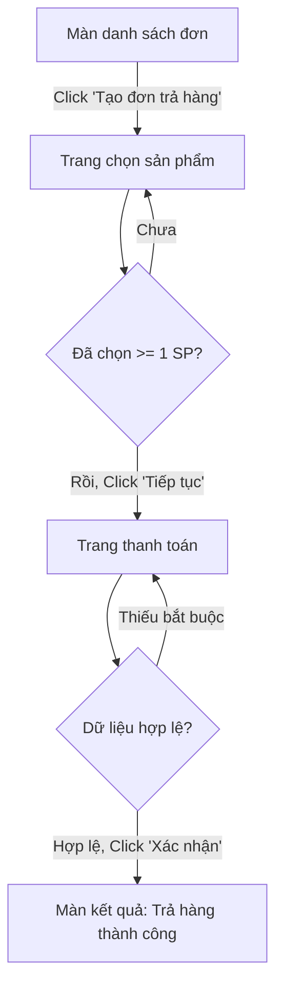

# Workflow: Khám Phá Website & Sinh Requirements Chuẩn BA Theo Luồng Thao Tác (Không Giới Hạn)

> **SKILL BỔ TRỢ (khuyến nghị nạp nếu có):**
> - `/requirements-analyzer` — chuẩn định dạng tài liệu Requirements (Field Specs, Business Rules).
> - `/ui-debug-agent` — inspect DOM, xác định element ổn định.
> - `/generate-locator` — nếu cần ghi locator cho các thao tác đã khám phá.
> Nếu các skill trên không có sẵn, skill này VẪN chạy độc lập được (đã nhúng đủ chuẩn output bên dưới).

Workflow này giúp agent **tự động khám phá toàn bộ một web app/module bằng cách THỰC SỰ TƯƠNG TÁC** (không chỉ đọc DOM tĩnh), **đi hết mọi luồng thao tác** — kể cả luồng phức tạp trải dài nhiều trang — và biên soạn tài liệu **Requirements cấp BA (Business Analyst), tổ chức theo từng luồng thao tác** thay vì theo từng trang rời rạc, đủ chất lượng làm đầu vào để **thiết kế và phát triển phần mềm chuyên nghiệp**.

> **Mục tiêu chất lượng:** tài liệu đầu ra phải "developer-ready" và "tester-ready" — mỗi requirement có **mã định danh**, **tiêu chí chấp nhận kiểm thử được**, **truy vết ngược về quan sát thực tế**, và **rõ nghiệp vụ** để một team không tiếp cận hệ thống vẫn hiểu và code được.

---

## ⚠️ Nguyên tắc thực thi (Execution Principles)

- **Toàn bộ output bằng Tiếng Việt** có dấu, rõ ràng, chuyên nghiệp.
- **KHÔNG đoán** — mọi field, button, validation, luồng phải được **quan sát trực tiếp** trên hệ thống thật qua browser MCP. Nếu không nhìn thấy → không viết, mà đưa vào mục "Câu hỏi làm rõ".
- **KHÔNG GIỚI HẠN THAO TÁC (chế độ mặc định của skill này):** phải cố gắng đi hết **mọi** element tương tác, **mọi** nhánh rẽ, **mọi** modal/dropdown/tab/pagination, và **thực hiện trọn vẹn** các luồng đi qua nhiều trang. Không dừng lại ở một tập thao tác định sẵn.
- **Bám luồng, không bám trang:** khi một chức năng trải dài nhiều trang (VD: Thêm đơn → Chọn sản phẩm → Thanh toán → Xác nhận), phải **đi hết chuỗi cho tới trạng thái kết thúc** rồi mới coi luồng đó là "đã khám phá".
- **Có trạng thái & tránh lặp vô hạn:** duy trì tập `visited` (theo URL + chữ ký DOM/tên action) để không lặp lại; luôn tiến về phía có element chưa khám phá.

### 🔴 Tiền điều kiện BẮT BUỘC về an toàn dữ liệu
Skill chạy ở chế độ **"không giới hạn tuyệt đối"** — tức **sẽ thực hiện cả thao tác ghi/sửa/xóa dữ liệu thật, submit form thật**. Vì vậy:

1. **CHỈ chạy trên môi trường TEST/STAGING**, tuyệt đối không chạy trên Production.
2. **CHỈ dùng tài khoản TEST chuyên dụng** (loại "không giới hạn thao tác" như user đã cấu hình).
3. Trước khi bắt đầu, **xác nhận 1 lần** với user: *"Skill sẽ thực hiện mọi thao tác kể cả tạo/sửa/xóa dữ liệu thật trên `<URL>` bằng tài khoản `<user>`. Đây có phải môi trường test không?"* — chỉ tiếp tục khi user xác nhận.
4. Với mỗi thao tác phá hủy (Xóa/Hủy/Reset), **ghi lại dữ liệu bị tác động** vào ma trận coverage để có thể khôi phục/đối chiếu.

---

## Đầu vào (Inputs)

| Thông tin | Bắt buộc | Ghi chú |
|---|---|---|
| Website URL | ✅ | Trang/màn khởi đầu để khám phá |
| Thông tin đăng nhập | Nếu cần | dạng `user/role/pass`, VD: `thientester/admin/12345678` |
| Module Name | ✅ | Tên module/phạm vi cần tập trung (VD: Return Order) |
| Đường đi tới module | Nên có | VD: "Vào Thu ngân → Menu Trả Hàng" |
| Mô tả hệ thống | Tùy | Bối cảnh nghiệp vụ ngắn gọn |
| Scope loại trừ | Tùy | Khu vực KHÔNG được đụng tới (nếu có) |

> Nếu thiếu URL hoặc credentials → **hỏi user trước khi bắt đầu**.

---

## Công cụ khám phá (Tooling)

Ưu tiên theo thứ tự:
1. **Playwright MCP / Browser MCP** (`browser_navigate`, `browser_snapshot`, `browser_click`, `browser_type`, `browser_select_option`, `browser_press_key`, `browser_take_screenshot`...) — **bắt buộc** cho việc tương tác thật.
2. **Chrome MCP** (`mcp__claude-in-chrome__*`) nếu Playwright không có.
3. `WebFetch` **chỉ** dùng để đọc bổ sung nội dung tĩnh — **không** thay thế được việc tương tác.

> Luôn set viewport desktop `1920x1080` (`browser_resize`) và chụp `browser_snapshot` (accessibility tree) làm nguồn chân lý về DOM.

---

## Các bước thực hiện

### Bước 1 — Tiếp nhận, xác nhận an toàn & đăng nhập
1. Thu thập Inputs ở trên; nếu thiếu → hỏi.
2. **Xác nhận tiền điều kiện an toàn** (mục 🔴). Chờ user đồng ý mới đi tiếp.
3. Mở browser → `browser_navigate` tới URL → đăng nhập bằng tài khoản test.
4. Điều hướng tới đúng module khởi đầu theo "Đường đi tới module".
5. `browser_snapshot` + `browser_take_screenshot` màn khởi đầu làm mốc.

### Bước 2 — Khám phá KHÔNG GIỚI HẠN (Deep Crawl)
Thực hiện thuật toán duyệt có trạng thái, **ưu tiên đi hết chiều sâu của từng luồng**:

1. **Liệt kê mọi element tương tác** trên màn hiện tại từ snapshot: `button`, `a`, `input`, `select`, `textarea`, `checkbox`, `radio`, `tab`, icon-action, menu item, row-action trong bảng, nút phân trang, nút mở modal.
2. Đưa các element **chưa khám phá** vào hàng đợi `frontier`. Duy trì `visited` = {chữ ký element} với chữ ký = `URL + role + tên/label + vị trí ngữ cảnh`.
3. Lặp cho tới khi `frontier` rỗng:
   - Lấy 1 element chưa khám phá → **tương tác thật** (click / nhập test data hợp lệ / chọn option).
   - Sau mỗi tương tác, `browser_snapshot` lại để **phát hiện thay đổi trạng thái**: modal mở ra, toast/validation hiện lên, điều hướng sang trang mới, bảng đổi dữ liệu, field mới enable.
   - **Ghi nhận** kết quả (xem Bước 5 & 6).
   - Nếu xuất hiện **màn/modal/trang mới** → thêm toàn bộ element mới của nó vào `frontier` (đây là cách "không giới hạn" lan tới mọi ngóc ngách).
4. **Khám phá cả nhánh lỗi (negative):** với mỗi form, thử ít nhất: bỏ trống trường bắt buộc, sai định dạng, vượt giới hạn ký tự, để lộ các **validation message** — đây là nguồn Business Rules quan trọng.
5. **Không bỏ sót thao tác ẩn:** hover-menu, right-click menu (nếu có), trạng thái empty/loading, phân trang trang 2+, sort/filter, các tab phụ.
6. **Điều kiện dừng của 1 nhánh:** khi mọi element trên trạng thái hiện tại đã ∈ `visited`. Sau đó `browser_navigate_back` hoặc đóng modal để quay lại và tiếp tục nhánh khác.

> Chống lặp vô hạn: nếu một thao tác chỉ dẫn tới trạng thái đã có trong `visited` → đánh dấu đã khám phá và bỏ qua, không đi lại.

### Bước 2b — PLAYBOOK theo Archetype UI (checklist bắt buộc theo mẫu màn hình)

Khi nhận diện màn hình thuộc một **archetype** dưới đây, PHẢI chạy đúng checklist tương ứng để không bỏ sót thao tác/quy tắc. Một màn có thể lai nhiều archetype (VD: bảng CRUD có filter) → chạy gộp các checklist liên quan.

#### A. Bảng dữ liệu + CRUD (Data Table / List + Create-Read-Update-Delete)
- **Đọc cấu trúc bảng:** liệt kê tên cột, kiểu dữ liệu từng cột, cột nào sort được, cột nào có action.
- **Row actions:** mở từng action trên 1 dòng (Xem/Sửa/Xóa/Nhân bản/Đổi trạng thái…) và ghi kết quả.
- **Bulk actions:** chọn nhiều dòng (checkbox header "chọn tất cả") → thử action hàng loạt.
- **Trạng thái đặc biệt:** bảng rỗng (empty state), 1 dòng, nhiều trang; loading/skeleton.
- **CRUD trọn vòng:** Create → thấy record xuất hiện; Update → thấy đổi; Delete → có confirm dialog + record biến mất (ghi vào coverage là **đã ghi/xóa dữ liệu thật**).
- **Ghi Business Rule:** ràng buộc unique, không cho xóa khi đang dùng, xác nhận trước khi xóa…

#### B. Form / Modal nhập liệu
- Với **mỗi trường**: đọc label, kiểu UI, required (dấu *), placeholder, giá trị mặc định, maxlength, pattern, đơn vị, trạng thái disabled/readonly.
- **Trường phụ thuộc:** field chỉ hiện/enable khi field khác có giá trị (conditional fields) → ghi rõ điều kiện.
- **Negative bắt buộc:** bỏ trống required, sai định dạng, quá maxlength, giá trị biên (0, số âm, ngày quá khứ/tương lai) → thu **đúng nguyên văn** validation message.
- **Nút submit:** điều kiện enable/disable, chống double-submit, trạng thái loading, thông báo thành công (toast/redirect).
- **Hủy/đóng:** Cancel/X có cảnh báo mất dữ liệu chưa lưu không.

#### C. Wizard / Multi-step (nhiều bước nối tiếp)
- Đi **hết mọi step** tới bước cuối; ghi lại điều kiện để "Next" enable ở từng step.
- Thử **quay lại (Back)** — dữ liệu bước trước còn giữ không.
- Thử **nhảy step** qua breadcrumb/stepper nếu cho phép.
- Xác định **điểm không thể hoàn tác** (point of no return) và bước xác nhận cuối.

#### D. Master–Detail (danh sách chọn → panel chi tiết)
- Chọn nhiều item master khác nhau → detail cập nhật đúng theo item.
- Thao tác trong detail (sửa/lưu) có phản ánh ngược lại master không.
- Trạng thái "chưa chọn item" của panel detail.

#### E. Search / Filter / Sort / Pagination
- Từng bộ lọc: giá trị hợp lệ, không có kết quả (no-result state), reset lọc.
- Tổ hợp nhiều filter cùng lúc; filter có lưu qua reload/URL param không.
- Sort tăng/giảm từng cột; phân trang trang 2+, đổi page size.
- Tìm kiếm: khớp một phần, không phân biệt hoa thường, ký tự đặc biệt, debounce.

#### F. Auth / Phân quyền (nếu chạm tới)
- Ghi lại thao tác **bị chặn theo role** (nút mờ/ẩn, thông báo "không có quyền") — đây là Business Rule phân quyền quan trọng, KHÔNG bỏ qua.

> Mỗi mục quan sát được trong playbook đều phải kết tinh thành một dòng trong **Ma trận coverage** (Bước 6) và/hoặc một **Business Rule có mã** (Bước 5).

### Bước 3 — Theo dấu LUỒNG THAO TÁC (Flow Tracing), gồm luồng đa trang
Đây là phần cốt lõi — **tổ chức những gì đã khám phá thành các luồng thao tác end-to-end**:

1. **Nhận diện điểm bắt đầu luồng:** mỗi action tạo/mở một tác vụ nghiệp vụ (VD: "Tạo đơn trả hàng", "Tìm & lọc", "Xóa dòng").
2. **Đi trọn chuỗi tới trạng thái kết thúc.** Nếu chức năng **trải dài nhiều trang/nhiều màn**, PHẢI thực hiện **hết tất cả các bước** cho tới khi đạt trạng thái cuối (thành công *hoặc* bị chặn bởi validation), **không dừng giữa chừng**.
   - Ghi lại từng **Bước** = (Màn/Trang) + (Thao tác) + (Dữ liệu nhập) + (Kết quả/Chuyển tiếp).
3. **Ghi lại mọi nhánh rẽ** của luồng: đường thành công (happy), đường lỗi (negative), đường hủy/quay lại, các điều kiện enable/disable nút.
4. **Ghi phụ thuộc giữa các bước/màn** (VD: "Nút Thanh toán chỉ enable khi giỏ có ≥ 1 sản phẩm"; "Trang Xác nhận chỉ tới được sau khi hoàn tất trang Chọn sản phẩm").
5. Đặt **mã luồng** dạng `FLOW-<MODULE>-<NN>` và tên rõ nghĩa cho mỗi luồng.

### Bước 4 — Sinh SƠ ĐỒ LUỒNG (Mermaid)
Với **mỗi** luồng, vẽ một `flowchart` Mermaid thể hiện các bước, nhánh rẽ và trạng thái kết thúc. Quy ước:
- Node chữ nhật = màn/bước; node thoi `{...}` = điểm rẽ nhánh/điều kiện.
- Nhãn cạnh ghi điều kiện ("hợp lệ", "thiếu bắt buộc", "Hủy"...).
- Với luồng đa trang: mỗi trang là một `subgraph` để thấy rõ ranh giới trang.

Mẫu:


### Bước 5 — Biên soạn REQUIREMENTS chuẩn BA (theo luồng)
Biên soạn tài liệu theo cấu trúc ở mục **"Cấu trúc tài liệu đầu ra"** bên dưới, trong đó **Functional Requirements được nhóm theo từng LUỒNG** (mỗi luồng = 1 mục), không rải rạc theo trang. Áp dụng **chuẩn Business Analyst** sau:

1. **Mã hóa & truy vết định danh (bắt buộc):**
   - Functional Requirement: `FR-<MODULE>-<NN>` · Business Rule: `BR-<MODULE>-<NN>` · Non-Functional: `NFR-<NN>` · Use case: `UC-<MODULE>-<NN>` · Luồng: `FLOW-<MODULE>-<NN>`.
   - Mọi mã phải **duy nhất** và được tham chiếu chéo trong RTM (Bước 6b).
2. **User Story chuẩn INVEST** cho mỗi luồng: `Là một <role>, tôi muốn <mục tiêu> để <giá trị nghiệp vụ>.` — độc lập, kiểm thử được, đủ nhỏ.
3. **Acceptance Criteria dạng Gherkin** (Given / When / Then) — mỗi tiêu chí **quan sát được & kiểm thử được**, phủ cả happy path lẫn nhánh lỗi:
   ```gherkin
   Scenario: Trả hàng hợp lệ
     Given tôi đang ở màn "Chọn sản phẩm" với >= 1 sản phẩm trong đơn
     When tôi nhập lý do trả và bấm "Xác nhận"
     Then hệ thống hiển thị "Trả hàng thành công" và tạo phiếu trả với mã tự sinh
   ```
4. **Business Rules tách bạch khỏi UI:** mỗi rule ghi `<Điều kiện> → <Hành vi/Thông báo nguyên văn>`, gắn mã `BR-*`, và **nguồn quan sát** (luồng/màn/screenshot).
5. **Non-Functional Requirements (quan sát được):** chỉ ghi những gì thực sự thấy — thời gian phản hồi rõ rệt, phân trang/giới hạn tải, thông báo timeout, hành vi responsive, ràng buộc bảo mật (mask mật khẩu, phân quyền), i18n/định dạng số-ngày-tiền tệ. KHÔNG bịa chỉ số.
6. **Độ ưu tiên MoSCoW** cho mỗi FR/luồng: `Must / Should / Could / Won't` — suy từ mức cốt lõi của chức năng với module.
7. **Data Dictionary / Glossary:** thuật ngữ nghiệp vụ, thực thể dữ liệu và trường chính (tên, kiểu, ràng buộc) — để dev hiểu mô hình dữ liệu.
8. **Use Case Specification** cho các luồng phức tạp/đa trang: Actor, Tiền điều kiện, Hậu điều kiện, Luồng chính, Luồng thay thế, Luồng ngoại lệ.
9. **Nguyên tắc chất lượng câu chữ:** mỗi requirement phải *rõ ràng, đơn nghĩa, khả thi, kiểm thử được, không mâu thuẫn*. Câu suy đoán/không quan sát được → chuyển sang "Câu hỏi làm rõ", không viết như sự thật.

### Bước 6 — Lập MA TRẬN COVERAGE THAO TÁC
Lập bảng liệt kê **mọi action đã khám phá** để chứng minh độ phủ (xem template bên dưới). Mỗi dòng = 1 thao tác đã thực hiện thật, kèm kết quả quan sát được.

### Bước 6b — Lập MA TRẬN TRUY VẾT YÊU CẦU (RTM)
Lập bảng nối **Luồng ↔ FR ↔ BR ↔ Acceptance Criteria ↔ Bằng chứng (màn/screenshot)** để chứng minh mọi requirement đều có gốc quan sát thực tế và không có requirement "mồ côi". Đây là công cụ chuẩn BA để đảm bảo tính đầy đủ & truy vết.

### Bước 7 — Kiểm chứng & Đóng gói (Verification)
1. **Đối chiếu độ phủ:** so số element phát hiện ở Bước 2 với số dòng trong Ma trận coverage → mọi element phải xuất hiện, hoặc được giải thích lý do bỏ qua (VD: nằm trong scope loại trừ).
2. **Kiểm tra luồng đa trang:** mỗi `FLOW-*` phải đạt trạng thái kết thúc rõ ràng, không có luồng "đứt giữa chừng".
3. **Validate cú pháp Mermaid** (mọi node có nhãn, mọi cạnh hợp lệ).
4. **Kiểm tra tính toàn vẹn BA:** mọi `FR-*`/`BR-*`/`NFR-*`/`UC-*` có mã duy nhất; mỗi FR có ≥1 Acceptance Criteria; mỗi dòng RTM đều có bằng chứng; không có requirement thiếu mã hoặc thiếu truy vết.
5. **Rà soát "không tự suy diễn":** mọi Business Rule phải truy vết được về một quan sát thực tế; phần suy đoán → chuyển vào "Câu hỏi làm rõ".
6. Xuất file Markdown `requirements/requirements_<module_name>.md` và trình bày cho user (dùng Artifact nếu dài).

---

## Cấu trúc tài liệu đầu ra (Output Format)

Xuất **Markdown**: `requirements/requirements_<module_name>.md`

```markdown
# Tài liệu Đặc tả Yêu cầu (SRS) — <Tên Module>

## 1. Tổng quan (Overview)
- Mục đích module, phạm vi khám phá (in-scope) & loại trừ (out-of-scope), URL, tài khoản/role đã dùng.
- Ngày khám phá, môi trường (test/staging), phiên bản/tag (nếu thấy).
- **Actor & Vai trò:** liệt kê các role tham gia module và quyền chính.

## 2. Thuật ngữ & Từ điển dữ liệu (Glossary & Data Dictionary)
- **Glossary:** | Thuật ngữ | Định nghĩa nghiệp vụ |
- **Thực thể dữ liệu chính:** | Thực thể | Trường chính | Kiểu | Ràng buộc | Ghi chú |

## 3. Bản đồ luồng thao tác (Flow Map)
| Mã luồng | Tên luồng | Actor | Số bước | Số trang liên quan | MoSCoW |

## 4. Chi tiết Functional Requirements — THEO TỪNG LUỒNG
> Lặp lại khối này cho mỗi FLOW-*:

### FLOW-<MODULE>-<NN>: <Tên luồng>  ·  Ưu tiên: <Must/Should/Could/Won't>
- **User Story (INVEST):** "Là một <role>, tôi muốn <mục tiêu> để <giá trị nghiệp vụ>."
- **FR liên quan:** `FR-<MODULE>-<NN>`, ... (mỗi FR một câu, đơn nghĩa, kiểm thử được)
- **Trang/màn liên quan:** (liệt kê, đánh dấu luồng đa trang)
- **Sơ đồ luồng:** (chèn Mermaid flowchart)
- **Use Case Spec** (cho luồng phức tạp/đa trang):
  - Tiền điều kiện · Hậu điều kiện · Luồng chính · Luồng thay thế · Luồng ngoại lệ.
- **Các bước (Happy Path):**
  | # | Màn/Trang | Thao tác | Dữ liệu nhập | Kết quả/Chuyển tiếp |
- **Nhánh rẽ & ngoại lệ (Negative/Alternate):** liệt kê điều kiện lỗi, hủy, quay lại.
- **Acceptance Criteria (Gherkin):**
  ```gherkin
  Scenario: <tên>
    Given <bối cảnh quan sát được>
    When <thao tác>
    Then <kết quả/thông báo nguyên văn>
  ```
- **Phụ thuộc (Dependencies):** điều kiện enable/disable, thứ tự bắt buộc giữa các màn.

## 5. Đặc tả trường dữ liệu (Field Specifications)
Bảng cho mỗi form đã gặp:
| Tên trường (Label) | Loại UI | Bắt buộc | Ràng buộc (maxlength/pattern/default/đơn vị) | Điều kiện hiển thị/enable | Ghi chú |

## 6. Quy tắc nghiệp vụ & Validation (Business Rules)
Liệt kê CHÍNH XÁC các validation message quan sát được và điều kiện kích hoạt.
| Mã | Điều kiện | Thông báo/Hành vi quan sát được (nguyên văn) | Nguồn (luồng/màn/screenshot) |
| BR-<MODULE>-01 | ... | ... | ... |

## 7. Yêu cầu phi chức năng (Non-Functional Requirements)
Chỉ ghi những gì QUAN SÁT ĐƯỢC — không bịa chỉ số.
| Mã | Loại (Hiệu năng/Bảo mật/Khả dụng/i18n...) | Mô tả quan sát được | Nguồn |
| NFR-01 | ... | ... | ... |

## 8. Ma trận Coverage Thao tác (Action Coverage Matrix)
| # | Màn/Trang | Element (label) | Loại | Thao tác đã thực hiện | Kết quả quan sát | Luồng liên quan | Ghi chú (VD: đã ghi/xóa dữ liệu thật) |

## 9. Ma trận Truy vết Yêu cầu (RTM)
| Mã luồng | FR | BR liên quan | Acceptance Criteria | Bằng chứng (màn/screenshot) |

## 10. Câu hỏi làm rõ với PO/User
Những logic không suy ra được từ UI, cần xác nhận nghiệp vụ (đánh số để tiện trả lời).
```

---

## Ràng buộc bắt buộc (Strict Rules)
- **Tiếng Việt**, không bịa dữ liệu/field không nhìn thấy.
- **Functional Requirements phải nhóm theo LUỒNG**, không theo trang rời rạc.
- **Luồng đa trang phải đi trọn** tới trạng thái kết thúc.
- **Chạy đúng Playbook archetype** (Bước 2b) cho mọi màn phù hợp — không bỏ sót row-action, bulk-action, conditional field, no-result state, phân trang.
- **Chuẩn BA bắt buộc:** mọi FR/BR/NFR/UC có **mã định danh duy nhất**; mỗi FR/luồng có **User Story INVEST** + **Acceptance Criteria dạng Gherkin** kiểm thử được + **độ ưu tiên MoSCoW**.
- Mỗi luồng **phải** có sơ đồ Mermaid; toàn tài liệu **phải** có Ma trận coverage **và** RTM (truy vết Luồng↔FR↔BR↔bằng chứng).
- **Data Dictionary/Glossary** bắt buộc khi module có thực thể/thuật ngữ nghiệp vụ rõ rệt.
- Mọi Business Rule **phải** truy vết được về quan sát thật (kèm nguồn màn/screenshot); phần suy đoán → "Câu hỏi làm rõ", tuyệt đối không viết như sự thật.
- Tôn trọng **scope loại trừ** và **tiền điều kiện an toàn** (chỉ test/staging + tài khoản test).
