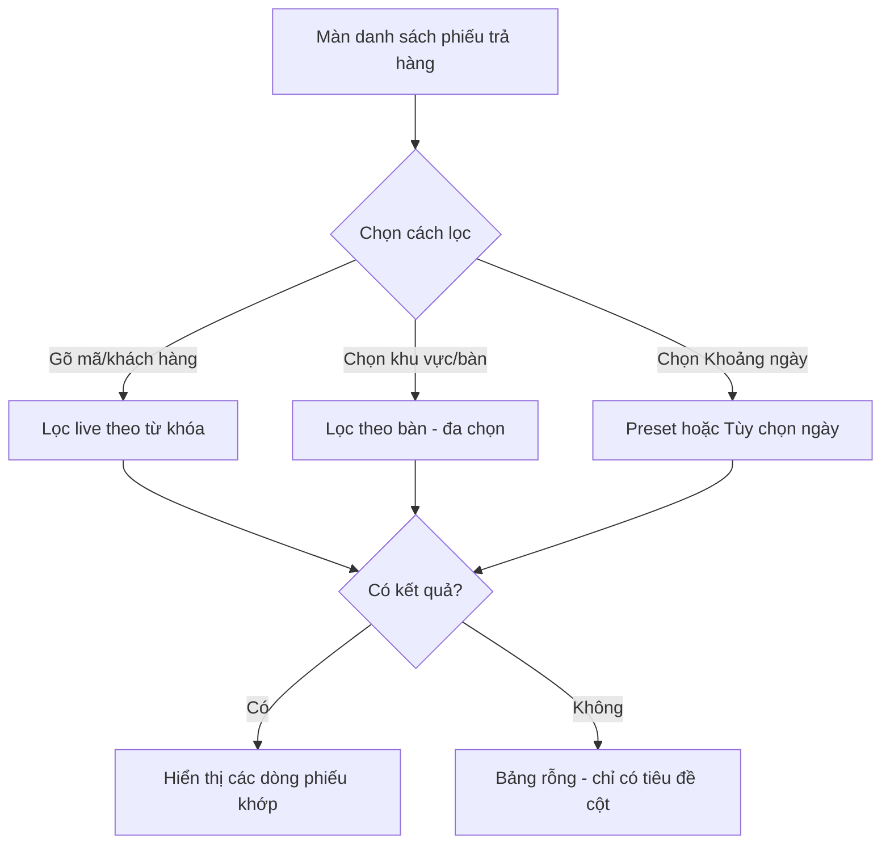
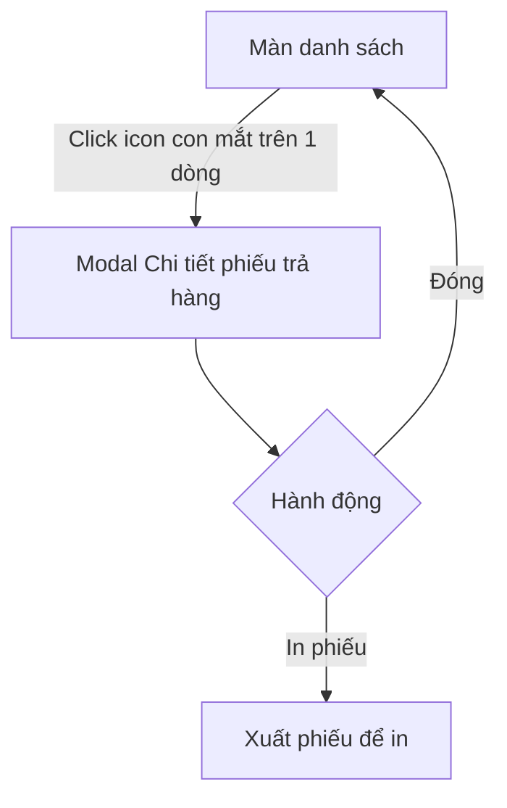
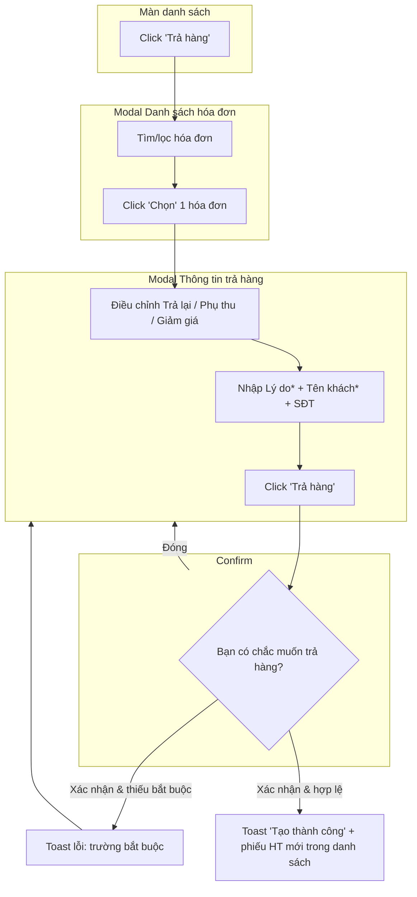
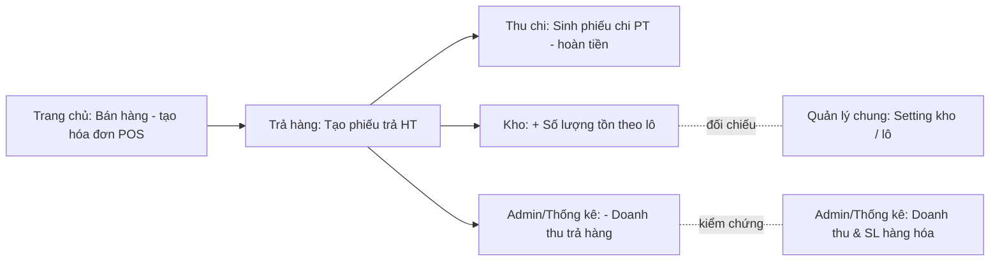
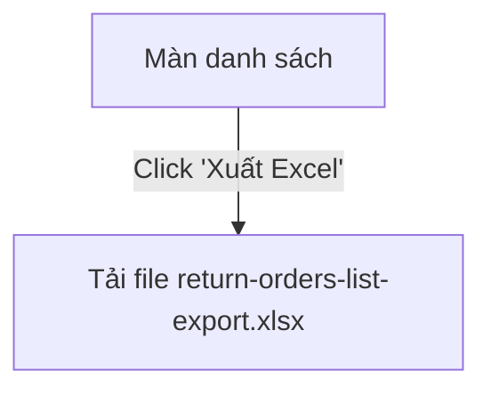

# Tài liệu Đặc tả Yêu cầu (SRS) — Module Trả hàng (Return Order)

> Sản phẩm: **NASYS ORDER** (hệ thống ERP order/thu ngân nhà hàng).
> Tài liệu được biên soạn theo phương pháp **khám phá tương tác thật trên hệ thống** (Playwright/Browser MCP), tổ chức Functional Requirements **theo luồng thao tác**.

---

## 1. Tổng quan (Overview)

- **Mục đích module:** Cho phép thu ngân tra cứu và **tạo phiếu trả hàng** (hoàn trả món/hoàn tiền) cho các hóa đơn (POS) đã thanh toán; xem lại chi tiết phiếu trả và in phiếu.
- **Phạm vi khám phá (in-scope):**
  - Màn danh sách phiếu trả hàng + bộ lọc (tìm kiếm, khu vực bàn, bàn, khoảng ngày, xuất Excel).
  - Xem chi tiết phiếu trả (modal read-only).
  - Luồng tạo phiếu trả hàng đa bước (chọn hóa đơn → nhập thông tin trả → xác nhận → thành công).
  - Nhánh negative (validation trường bắt buộc), điều chỉnh số lượng trả, reset danh sách, trạng thái rỗng.
- **Ngoài phạm vi (out-of-scope):** các module Trang chủ, Lịch sử, Đặt bàn, Điều phối ca, Thu chi, CRM (chỉ ghi nhận sự tồn tại ở thanh điều hướng); chức năng **In phiếu** (không kích hoạt để tránh mở hộp thoại in của trình duyệt).
- **URL khám phá:** `https://table1.klkim.com/v2/order/cashier/return-order`
- **Môi trường:** TEST (được người dùng xác nhận cho phép thao tác tạo/sửa/xóa dữ liệu thật).
- **Ngày khám phá:** 11-07-2026.
- **Tài khoản/role đã dùng:** `Admin master` (role admin). Chi nhánh dữ liệu quan sát: **TESTER**; khu vực bàn: **Ẩm Thực 86**.

### Actor & Vai trò

| Actor | Vai trò chính trong module |
|---|---|
| Thu ngân / Admin (Admin master) | Tra cứu phiếu trả, tạo phiếu trả hàng cho hóa đơn đã thanh toán, xem chi tiết, in phiếu, xuất Excel |

> **Ghi chú phân quyền:** Chỉ quan sát được với 1 role (admin master). Sự khác biệt quyền theo role khác **không quan sát được** → xem mục 10.

---

## 2. Thuật ngữ & Từ điển dữ liệu (Glossary & Data Dictionary)

### 2.1 Glossary

| Thuật ngữ | Định nghĩa nghiệp vụ (quan sát được) |
|---|---|
| Phiếu trả hàng (mã `HTxxxxxx`) | Chứng từ ghi nhận việc hoàn trả món của một hóa đơn đã bán; mã tự sinh tăng dần (HT000001, HT000002…) |
| Hóa đơn / Đơn hàng (mã `POSxxxxxxxxCN2`) | Hóa đơn bán hàng POS đã thanh toán, là nguồn để tạo phiếu trả |
| Mã phiếu chi (mã `PTxxxxxxxxCN2`) | Phiếu chi tiền phát sinh khi trả hàng (hoàn tiền cho khách) |
| Khu vực bàn (VD: Ẩm Thực 86) | Khu vực/phòng chứa các bàn trong chi nhánh |
| Bàn (VD: BÀN 1, Bàn mang về) | Vị trí phục vụ gắn với hóa đơn |
| Trả lại | Số lượng của từng món sẽ được hoàn trả trong phiếu |
| Tổng tiền trả lại | Số tiền thực hoàn cho khách của phiếu trả (đã gồm VAT, ± phụ thu/giảm giá) |

### 2.2 Thực thể dữ liệu chính

| Thực thể | Trường chính | Kiểu | Ràng buộc/Ghi chú (quan sát được) |
|---|---|---|---|
| Phiếu trả hàng | Mã phiếu trả hàng | Text | Tự sinh `HTxxxxxx`, tăng dần |
| | Thời gian trả hàng | Datetime | Định dạng `dd-mm-yyyy HH:MM:SS`, hệ thống tự gán |
| | Trạng thái phiếu | Text | Quan sát giá trị "Đã trả" |
| | Mã đơn (hóa đơn nguồn) | Text | Tham chiếu `POS…CN2` |
| | Chi nhánh | Text | VD: "TESTER" |
| | Mã phiếu chi | Text | Tham chiếu `PT…CN2` |
| | Khách hàng | Text | Có thể trống |
| | Người nhận | Text | VD: "155515" |
| | Lý do trả hàng | Text | Bắt buộc khi tạo |
| | Tổng số lượng | Số | Tổng SL món trả |
| | Tổng tiền trả hàng | Tiền (đ) | VD: 207,016 đ / 24,200 đ |
| Dòng món trả | Mã hàng hóa | Text | VD: `PRO…CN2` |
| | Tên món | Text | VD: "Salad cá ngừ" |
| | Số lượng | Số | SL đã mua trên hóa đơn |
| | Trả lại | Số | SL hoàn trả (≤ SL đã mua) |
| | Đơn giá / Giá bán | Tiền (đ) | |
| | Thành tiền | Tiền (đ) | = Đơn giá × Trả lại |

---

## 3. Bản đồ luồng thao tác (Flow Map)

| Mã luồng | Tên luồng | Actor | Số bước | Số trang/màn liên quan | MoSCoW |
|---|---|---|---|---|---|
| FLOW-RETURN-01 | Tra cứu & lọc danh sách phiếu trả hàng | Thu ngân | 1–2 | 1 (danh sách + bộ lọc) | Must |
| FLOW-RETURN-02 | Xem chi tiết phiếu trả hàng | Thu ngân | 2 | 1 màn + 1 modal | Must |
| FLOW-RETURN-03 | Tạo phiếu trả hàng (đa bước) | Thu ngân | 4–6 | 1 màn + 2 modal + 1 confirm | Must |
| FLOW-RETURN-04 | Xuất danh sách phiếu trả ra Excel | Thu ngân | 1 | 1 | Should |
| FLOW-RETURN-05 | In phiếu trả hàng | Thu ngân | 2 | 1 modal | Could (chưa kiểm chứng — xem M10) |

> **Tiền điều kiện ngoài phạm vi module:** để có hóa đơn trả, cần **bán hàng trước từ Trang chủ (màn bán hàng)**. Sau khi tạo phiếu trả, hệ thống phát sinh hiệu ứng **liên module** (phiếu chi ở Thu chi, cộng tồn kho theo lô, giảm doanh thu) — chi tiết & điểm kiểm chứng tại **Mục 6b**.

---

## 4. Chi tiết Functional Requirements — THEO TỪNG LUỒNG

### FLOW-RETURN-01: Tra cứu & lọc danh sách phiếu trả hàng · Ưu tiên: Must

- **User Story (INVEST):** *Là một thu ngân, tôi muốn tra cứu và lọc danh sách phiếu trả hàng theo mã/khách hàng, khu vực, bàn và khoảng thời gian để nhanh chóng tìm đúng phiếu cần xử lý.*
- **FR liên quan:**
  - `FR-RETURN-01`: Hệ thống hiển thị danh sách phiếu trả hàng dạng bảng với các cột: STT, Bàn, Mã phiếu trả hàng, Thời gian trả hàng, Khách hàng, Đã trả, Hành động.
  - `FR-RETURN-02`: Hệ thống cung cấp ô tìm kiếm theo **Mã phiếu trả hàng | Khách hàng**, lọc **ngay khi nhập** (không cần bấm nút).
  - `FR-RETURN-03`: Hệ thống cho lọc theo **Khu vực bàn** (đơn chọn) và **Bàn** (đa chọn, dạng chip xóa được).
  - `FR-RETURN-04`: Hệ thống cho lọc theo **Khoảng ngày** với preset **Hôm nay / Hôm qua / Tùy chọn** (Từ ngày – Đến ngày qua lịch).
  - `FR-RETURN-05`: Khi không có phiếu khớp bộ lọc, bảng hiển thị **chỉ phần tiêu đề cột, không có dòng dữ liệu** (empty state).
- **Trang/màn liên quan:** Màn danh sách `/return-order` (đơn trang).
- **Sơ đồ luồng:**

- **Các bước (Happy Path):**
  | # | Màn/Trang | Thao tác | Dữ liệu nhập | Kết quả/Chuyển tiếp |
  |---|---|---|---|---|
  | 1 | Danh sách | Gõ vào ô tìm kiếm | "HT000001" | Bảng lọc còn đúng 1 dòng HT000001 |
  | 2 | Danh sách | Chọn Khoảng ngày → Tùy chọn | 01-07-2026 → 11-07-2026 | Bảng hiển thị các phiếu trong khoảng (HT000002, HT000001) |
  | 3 | Danh sách | Chọn Bàn | "BÀN 10" | Bảng rỗng (không có phiếu ở BÀN 10) |
- **Nhánh rẽ & ngoại lệ:** Lọc theo bàn không có phiếu → empty state; gỡ chip bàn (×) → khôi phục danh sách; khoảng ngày mặc định khi mở màn ≈ đầu tháng đến ngày hiện tại.
- **Acceptance Criteria (Gherkin):**
```gherkin
Scenario: Tìm kiếm phiếu trả hàng theo mã
  Given tôi đang ở màn danh sách phiếu trả hàng có phiếu "HT000001"
  When tôi gõ "HT000001" vào ô "Mã phiếu trả hàng | Khách hàng"
  Then bảng chỉ hiển thị dòng phiếu có mã "HT000001"

Scenario: Lọc theo bàn không có phiếu trả
  Given tôi đang ở màn danh sách phiếu trả hàng
  When tôi chọn "BÀN 10" ở bộ lọc bàn
  Then bảng hiển thị phần tiêu đề cột và không có dòng dữ liệu nào

Scenario: Lọc theo khoảng ngày tùy chọn
  Given tôi đang ở màn danh sách phiếu trả hàng
  When tôi chọn "Tùy chọn" và đặt Từ ngày 01-07-2026, Đến ngày 11-07-2026
  Then bảng hiển thị các phiếu trả có thời gian nằm trong khoảng đã chọn
```
- **Phụ thuộc:** Bộ lọc bàn phụ thuộc khu vực bàn đang chọn (khu vực "Ẩm Thực 86").

---

### FLOW-RETURN-02: Xem chi tiết phiếu trả hàng · Ưu tiên: Must

- **User Story (INVEST):** *Là một thu ngân, tôi muốn mở chi tiết một phiếu trả hàng để kiểm tra thông tin phiếu, danh sách món đã trả và tổng tiền hoàn.*
- **FR liên quan:**
  - `FR-RETURN-06`: Bấm biểu tượng **con mắt** ở cột Hành động của một dòng mở modal **"Chi tiết phiếu trả hàng"**.
  - `FR-RETURN-07`: Modal chi tiết hiển thị **read-only** các thông tin: Mã phiếu trả hàng, Thời gian trả hàng, Trạng thái phiếu, Mã đơn, Chi nhánh, Mã phiếu chi, Khách hàng, Người nhận, Lý do trả hàng.
  - `FR-RETURN-08`: Modal hiển thị bảng **Đơn hàng** (STT, Mã hàng hóa, Tên món, Số lượng, Giá bán) kèm **Tổng số lượng** và **Tổng tiền trả hàng**.
  - `FR-RETURN-09`: Modal có nút **Đóng** và **In phiếu**.
- **Trang/màn liên quan:** Màn danh sách + modal chi tiết.
- **Use Case Spec:**
  - **Actor:** Thu ngân. **Tiền điều kiện:** tồn tại ≥1 phiếu trả. **Hậu điều kiện:** không thay đổi dữ liệu (chỉ đọc).
  - **Luồng chính:** Mở danh sách → bấm con mắt → xem chi tiết → Đóng.
  - **Luồng ngoại lệ:** Không có (read-only).
- **Sơ đồ luồng:**

- **Các bước (Happy Path):**
  | # | Màn/Trang | Thao tác | Dữ liệu | Kết quả |
  |---|---|---|---|---|
  | 1 | Danh sách | Click con mắt dòng HT000001 | — | Mở modal chi tiết |
  | 2 | Modal | Xem thông tin & bảng món | — | Hiển thị 2 món (Salad cá ngừ 138,000đ; Gỏi bò bóp thấu 169,000đ), Tổng SL 2, Tổng tiền 207,016đ |
  | 3 | Modal | Bấm Đóng | — | Về màn danh sách |
- **Acceptance Criteria (Gherkin):**
```gherkin
Scenario: Xem chi tiết phiếu trả hàng
  Given tôi đang ở màn danh sách và có phiếu "HT000001"
  When tôi bấm biểu tượng con mắt ở cột Hành động của phiếu đó
  Then hệ thống mở modal "Chi tiết phiếu trả hàng" hiển thị đúng thông tin phiếu, danh sách món trả và tổng tiền trả hàng
  And tất cả trường thông tin ở dạng chỉ đọc
```
- **Phụ thuộc:** Cần tồn tại phiếu trả trong danh sách.

---

### FLOW-RETURN-03: Tạo phiếu trả hàng (đa bước) · Ưu tiên: Must

- **User Story (INVEST):** *Là một thu ngân, tôi muốn tạo phiếu trả hàng từ một hóa đơn đã thanh toán, chọn món và số lượng cần trả, nhập lý do và thông tin khách để hoàn trả chính xác cho khách.*
- **FR liên quan:**
  - `FR-RETURN-10`: Nút **"Trả hàng"** mở modal **"Danh sách hóa đơn"** để chọn hóa đơn nguồn.
  - `FR-RETURN-11`: Modal chọn hóa đơn có tìm kiếm theo **Đơn hàng**, lọc **Từ ngày/Đến ngày**, bảng (STT, Mã hóa đơn, Ngày tạo, Khách hàng, Bàn, Nhân viên, Tổng tiền), **phân trang** nhiều trang, nút **Chọn** mỗi dòng.
  - `FR-RETURN-12`: Chọn 1 hóa đơn mở modal **"Thông tin trả hàng"** hiển thị header hóa đơn (Khách hàng, Phòng/bàn, Mã hóa đơn, Số lượng, Thời gian thanh toán, Phương thức thanh toán).
  - `FR-RETURN-13`: Bảng món trả cho phép điều chỉnh **Trả lại** bằng stepper (−/+); nút **+ bị vô hiệu** khi số trả = số đã mua (không trả vượt số lượng bán).
  - `FR-RETURN-14`: Giảm **Trả lại** của một món về **0** sẽ **loại món đó khỏi danh sách trả**; "Tổng cộng" và khối "Số tiền trả hàng" **tự tính lại** theo lựa chọn hiện tại.
  - `FR-RETURN-15`: Nút **"Danh sách mặc định"** khôi phục lại toàn bộ món của hóa đơn về trạng thái trả đầy đủ.
  - `FR-RETURN-16`: Khối **"Số tiền trả hàng"** cho nhập **Phụ thu, Giảm giá, Tích điểm**; **Tổng tiền trả lại** được tính lại (bao gồm VAT 10%).
  - `FR-RETURN-17`: Form thu thập **Phương thức thanh toán** (Tiền mặt/Chuyển khoản), **Lý do trả hàng*** (bắt buộc), **Tên khách hàng*** (bắt buộc), **Số điện thoại** (tùy chọn).
  - `FR-RETURN-18`: Bấm **"Trả hàng"** hiển thị hộp thoại **xác nhận** "Bạn có chắc muốn trả hàng ?" (Đóng/Xác nhận).
  - `FR-RETURN-19`: Khi **Xác nhận** mà thiếu trường bắt buộc, hệ thống **chặn tạo phiếu** và hiển thị thông báo lỗi (xem BR).
  - `FR-RETURN-20`: Khi hợp lệ, hệ thống tạo phiếu, hiển thị toast **"Tạo thành công."** và thêm phiếu mới (mã `HTxxxxxx` tự sinh) vào danh sách.
- **Trang/màn liên quan (ĐA MODAL):** Màn danh sách → modal "Danh sách hóa đơn" → modal "Thông tin trả hàng" → confirm dialog → danh sách (cập nhật).
- **Use Case Spec:**
  - **Actor:** Thu ngân.
  - **Tiền điều kiện:** Tồn tại hóa đơn POS **đã bán & đã thanh toán** — hóa đơn này được tạo trước đó từ **Trang chủ (màn bán hàng)**. Không có hóa đơn nguồn thì không thể tạo phiếu trả.
  - **Hậu điều kiện (thành công):** (1) Tạo 1 **phiếu trả hàng** mới (mã HT tự sinh); (2) **Sinh phiếu chi** hoàn tiền cho khách (mã `PT…CN2`); (3) **Cộng lại số lượng tồn kho** của các món được trả; (4) **Trừ doanh thu** (ghi nhận doanh thu trả hàng). Xem BR-RETURN-11…14 và Mục 6b.
  - **Luồng chính:** Trả hàng → chọn hóa đơn → điều chỉnh món/số lượng trả → nhập lý do + tên khách → Trả hàng → Xác nhận → Thành công.
  - **Luồng thay thế:** Điều chỉnh Trả lại/Phụ thu/Giảm giá; đổi phương thức thanh toán; "Danh sách mặc định" reset.
  - **Luồng ngoại lệ:** Thiếu trường bắt buộc → toast lỗi, ở lại form; Đóng/hủy ở bất kỳ modal nào → không tạo phiếu.
- **Sơ đồ luồng:**

- **Các bước (Happy Path — đã thực hiện thật):**
  | # | Màn/Trang | Thao tác | Dữ liệu nhập | Kết quả/Chuyển tiếp |
  |---|---|---|---|---|
  | 1 | Danh sách | Click "Trả hàng" | — | Mở modal "Danh sách hóa đơn" |
  | 2 | Modal hóa đơn | Click "Chọn" | Hóa đơn POS00000119CN2 (BÀN 1, 24,200đ) | Mở modal "Thông tin trả hàng" (2 món: Heineken bạc lùn 22,000đ, Thịt 0đ) |
  | 3 | Modal trả hàng | Nhập form | Lý do="Khách trả hàng - khám phá QA tự động"; Tên khách="QA Auto Test"; SĐT="0900000001" | Trường hợp lệ |
  | 4 | Modal trả hàng | Click "Trả hàng" | — | Hiện confirm "Bạn có chắc muốn trả hàng ?" |
  | 5 | Confirm | Click "Xác nhận" | — | Toast **"Tạo thành công."**; tạo phiếu **HT000002** (24,200đ) hiển thị trong danh sách |
- **Nhánh rẽ & ngoại lệ (đã kiểm chứng):**
  - Submit khi trống Lý do + Tên khách → toast **"Trường Tên khách hàng là bắt buộc." / "Trường Lí do trả hàng là bắt buộc."**, không tạo phiếu.
  - Giảm "Trả lại" của Heineken về 0 → món bị loại khỏi danh sách, "Tổng cộng" và "Tổng tiền trả lại" về 0đ.
  - Nút "Danh sách mặc định" → khôi phục cả 2 món, Tổng cộng 22,000đ.
- **Acceptance Criteria (Gherkin):**
```gherkin
Scenario: Tạo phiếu trả hàng hợp lệ
  Given tôi đã chọn hóa đơn "POS00000119CN2" trong modal "Danh sách hóa đơn"
  And tôi đang ở modal "Thông tin trả hàng" với ít nhất 1 món có số lượng trả > 0
  When tôi nhập "Lý do trả hàng" và "Tên khách hàng" rồi bấm "Trả hàng"
  And tôi bấm "Xác nhận" ở hộp thoại xác nhận
  Then hệ thống hiển thị thông báo "Tạo thành công."
  And một phiếu trả hàng mới với mã "HT…" tự sinh xuất hiện trong danh sách

Scenario: Chặn tạo phiếu khi thiếu trường bắt buộc
  Given tôi đang ở modal "Thông tin trả hàng" với "Lý do trả hàng" và "Tên khách hàng" để trống
  When tôi bấm "Trả hàng" rồi bấm "Xác nhận"
  Then hệ thống hiển thị thông báo "Trường Tên khách hàng là bắt buộc." và "Trường Lí do trả hàng là bắt buộc."
  And không có phiếu trả hàng nào được tạo

Scenario: Không cho trả vượt số lượng đã mua
  Given tôi đang ở modal "Thông tin trả hàng", một món có số lượng mua là 1 và số trả là 1
  Then nút "+" tăng số lượng trả của món đó bị vô hiệu hóa

Scenario: Loại món khỏi phiếu khi số trả về 0
  Given một món đang có số lượng trả là 1
  When tôi bấm nút "-" để giảm số lượng trả về 0
  Then món đó bị loại khỏi danh sách trả và "Tổng tiền trả lại" được tính lại
```
- **Phụ thuộc:** Modal "Thông tin trả hàng" chỉ mở sau khi **chọn hóa đơn** ở modal trước; nút "Trả hàng" (submit) chỉ hoàn tất sau bước **Xác nhận**; món có Đơn giá 0đ không ảnh hưởng tổng tiền. **Phụ thuộc liên module:** hóa đơn nguồn phải được **bán trước từ Trang chủ**; sau khi tạo thành công, phiếu trả kéo theo **phiếu chi (Thu chi)**, **cộng tồn kho** và **giảm doanh thu** (xem Mục 6b).
- **Sơ đồ vòng đời liên module (do User/PO cung cấp):**


---

### FLOW-RETURN-04: Xuất danh sách phiếu trả ra Excel · Ưu tiên: Should

- **User Story (INVEST):** *Là một thu ngân, tôi muốn xuất danh sách phiếu trả hàng ra Excel để lưu trữ/đối chiếu ngoài hệ thống.*
- **FR liên quan:** `FR-RETURN-21`: Nút **"Xuất Excel"** tải về tệp `return-orders-list-export.xlsx`.
- **Sơ đồ luồng:**

- **Acceptance Criteria (Gherkin):**
```gherkin
Scenario: Xuất Excel danh sách phiếu trả
  Given tôi đang ở màn danh sách phiếu trả hàng
  When tôi bấm "Xuất Excel"
  Then trình duyệt tải về tệp "return-orders-list-export.xlsx"
```
- **Phụ thuộc:** Chưa xác định được nội dung file có tuân theo bộ lọc đang áp dụng hay không → xem M10.

---

### FLOW-RETURN-05: In phiếu trả hàng · Ưu tiên: Could

- **User Story (INVEST):** *Là một thu ngân, tôi muốn in phiếu trả hàng để giao cho khách/lưu chứng từ.*
- **FR liên quan:** `FR-RETURN-22`: Modal chi tiết phiếu trả có nút **"In phiếu"**.
- **Trạng thái kiểm chứng:** **Chưa kích hoạt** trong khám phá (tránh mở hộp thoại in trình duyệt) → hành vi cụ thể xem M10.

---

## 5. Đặc tả trường dữ liệu (Field Specifications)

### 5.1 Bộ lọc màn danh sách

| Tên trường (Label) | Loại UI | Bắt buộc | Ràng buộc/Hành vi | Điều kiện hiển thị | Ghi chú |
|---|---|---|---|---|---|
| Mã phiếu trả hàng \| Khách hàng | Textbox (search) | Không | Lọc live khi gõ | Luôn hiển thị | Tìm theo mã phiếu hoặc khách hàng |
| Chọn khu vực bàn | Combobox (đơn chọn, search) | Không | Chỉ quan sát 1 giá trị "Ẩm Thực 86" | Luôn | Khu vực/phòng bàn |
| Chọn bàn | Combobox (đa chọn, chip, search) | Không | Chọn nhiều bàn; chip có nút × để gỡ | Luôn | Danh mục: 8386, Anh Phú/Tuấn/Đức, BÀN 1–35, Bàn mang về, LỘC PHÁT |
| Khoảng ngày | Nút mở dropdown lịch | Không | Preset Hôm nay/Hôm qua/Tùy chọn; Từ ngày–Đến ngày | Luôn | Tháng/năm tương lai bị vô hiệu trong lịch |

### 5.2 Modal "Danh sách hóa đơn" (chọn hóa đơn nguồn)

| Tên trường (Label) | Loại UI | Bắt buộc | Ràng buộc/Hành vi | Ghi chú |
|---|---|---|---|---|
| Đơn hàng | Textbox (search) | Không | Tìm theo mã đơn | Placeholder "Đơn hàng" |
| Từ ngày | Textbox ngày | Không | Mặc định đầu tháng (01-07-2026) | |
| Đến ngày | Textbox ngày | Không | Mặc định ngày hiện tại (11-07-2026) | |
| (nút Chọn mỗi dòng) | Button | — | Chọn hóa đơn → sang bước tiếp | Bảng có phân trang (quan sát 12 trang) |

### 5.3 Modal "Thông tin trả hàng" (form tạo phiếu)

| Tên trường (Label) | Loại UI | Bắt buộc | Ràng buộc/Hành vi | Điều kiện hiển thị/enable | Ghi chú |
|---|---|---|---|---|---|
| Trả lại (mỗi món) | Stepper (−/số/+) | — | 0 ≤ trả lại ≤ số lượng mua; +vô hiệu khi = số mua; =0 loại món | Theo từng dòng món | |
| Phụ thu (Số tiền trả hàng) | Textbox số | Không | Mặc định 0; ảnh hưởng Tổng tiền trả lại | Luôn | |
| Giảm giá (Số tiền trả hàng) | Textbox số | Không | Mặc định 0; ảnh hưởng Tổng tiền trả lại | Luôn | |
| Tích điểm (Số tiền trả hàng) | Textbox số | Không | Mặc định 0 | Luôn | |
| Phương thức thanh toán | Combobox | Không | Giá trị: Tiền mặt (mặc định), Chuyển khoản | Luôn | |
| Lý do trả hàng | Textarea | **Có (*)** | Bắt buộc — chặn tạo nếu trống | Luôn | Thông báo: "Trường Lí do trả hàng là bắt buộc." |
| Tên khách hàng | Textbox | **Có (*)** | Bắt buộc — chặn tạo nếu trống | Luôn | Thông báo: "Trường Tên khách hàng là bắt buộc." |
| Số điện thoại | Textbox | Không | — | Luôn | |

> **Trường chỉ đọc quan sát tự tính:** Tổng tiền hàng, VAT (10%), Tổng tiền thanh toán, Tổng tiền trả lại, Tổng cộng — không nhập tay.

### 5.4 Modal "Chi tiết phiếu trả hàng" (read-only)

| Nhóm | Trường | Ghi chú |
|---|---|---|
| Thông tin | Mã phiếu trả hàng, Thời gian trả hàng, Trạng thái phiếu, Mã đơn, Chi nhánh, Mã phiếu chi, Khách hàng, Người nhận, Lý do trả hàng | Tất cả read-only |
| Đơn hàng | STT, Mã hàng hóa, Tên món, Số lượng, Giá bán | Bảng |
| Tổng | Tổng số lượng, Tổng tiền trả hàng | read-only |

---

## 6. Quy tắc nghiệp vụ & Validation (Business Rules)

| Mã | Điều kiện | Thông báo/Hành vi quan sát được (nguyên văn) | Nguồn (luồng/màn/bằng chứng) |
|---|---|---|---|
| BR-RETURN-01 | Bấm "Trả hàng" → "Xác nhận" khi **Tên khách hàng** trống | Toast: **"Trường Tên khách hàng là bắt buộc."** — không tạo phiếu | FLOW-RETURN-03, modal Thông tin trả hàng, return-06/07 |
| BR-RETURN-02 | Tương tự khi **Lý do trả hàng** trống | Toast: **"Trường Lí do trả hàng là bắt buộc."** — không tạo phiếu | FLOW-RETURN-03, return-06/07 |
| BR-RETURN-03 | Số lượng "Trả lại" của một món = số lượng đã mua | Nút **"+"** bị **vô hiệu hóa** (không trả vượt số đã bán) | FLOW-RETURN-03, bảng món trả |
| BR-RETURN-04 | Giảm "Trả lại" của một món về **0** | Món bị **loại khỏi danh sách trả**; Tổng cộng & Tổng tiền trả lại tính lại | FLOW-RETURN-03, return snapshot stepper |
| BR-RETURN-05 | Bấm "Danh sách mặc định" | **Khôi phục** toàn bộ món về trạng thái trả đầy đủ (Tổng cộng 22,000đ) | FLOW-RETURN-03 |
| BR-RETURN-06 | Tạo phiếu trả thành công | Toast **"Tạo thành công."**; sinh **mã HT tự tăng** (HT000002 nối tiếp HT000001) | FLOW-RETURN-03, return-08 |
| BR-RETURN-07 | Bấm "Trả hàng" (submit) | Luôn hiển thị **hộp thoại xác nhận** "Bạn có chắc muốn trả hàng ?" trước khi ghi | FLOW-RETURN-03, return-05 |
| BR-RETURN-08 | Tính VAT trên tiền hàng | VAT = **10%** tiền hàng (VD 22,000đ → VAT 2,200đ → 24,200đ) | console log `value_vat 10`, khối tổng tiền |
| BR-RETURN-09 | Chọn ngày trong bộ lọc "Khoảng ngày" | **Tháng/năm tương lai bị vô hiệu** trong lịch (không chọn được ngày tương lai) | FLOW-RETURN-01, return-09 (tháng 8–12 disabled, năm ≤ 2026) |
| BR-RETURN-10 | Lọc bàn không có phiếu trả | Bảng hiển thị **empty state** (chỉ tiêu đề cột) | FLOW-RETURN-01, return-11 |
| BR-RETURN-11 | Tiền điều kiện tạo phiếu trả | Chỉ trả được hóa đơn **đã bán từ Trang chủ (màn bán hàng)** và đã thanh toán; không có hóa đơn nguồn → không tạo được phiếu trả | *User/PO cung cấp* — xem Mục 6b |
| BR-RETURN-12 | Tạo phiếu trả thành công | Hệ thống **tự sinh 1 phiếu chi** (mã `PT…CN2`) để hoàn tiền cho khách; kiểm chứng tại **menu Thu chi** | *User/PO cung cấp* — modal chi tiết có trường "Mã phiếu chi" (PT00000001CN2) xác nhận mối liên kết; hiệu ứng đầy đủ chưa kiểm chứng tại Thu chi |
| BR-RETURN-13 | Tạo phiếu trả thành công | **Cộng lại số lượng tồn kho** của các món được trả; kiểm chứng số lượng hàng hóa tại **trang Admin → Thống kê** và đối chiếu **cộng đúng theo lô** với **setting kho ở Quản lý chung** | *User/PO cung cấp* — chưa kiểm chứng trực tiếp |
| BR-RETURN-14 | Tạo phiếu trả thành công | **Trừ doanh thu** (ghi nhận khoản doanh thu trả hàng làm giảm doanh thu thuần); kiểm chứng tại **trang Admin → Thống kê (doanh thu)** | *User/PO cung cấp* — chưa kiểm chứng trực tiếp |

---

## 6b. Ảnh hưởng liên module & Điểm kiểm chứng chéo (do User/PO cung cấp)

> Các hiệu ứng dưới đây **nằm ngoài UI module Trả hàng** nên không quan sát trực tiếp trong phiên khám phá; được **User/PO cung cấp** như tri thức nghiệp vụ. Mỗi mục kèm **điểm kiểm chứng** để QA xác minh khi có quyền truy cập các module liên quan.

| # | Hiệu ứng nghiệp vụ khi tạo phiếu trả | Module/Trang kiểm chứng | Cách kiểm chứng (đề xuất) | Trạng thái |
|---|---|---|---|---|
| INT-01 | Phải có hóa đơn bán trước đó | **Trang chủ (màn bán hàng)** | Bán 1 hóa đơn từ Trang chủ → hóa đơn xuất hiện trong "Danh sách hóa đơn" của luồng trả hàng | Chưa kiểm chứng |
| INT-02 | Sinh **phiếu chi** hoàn tiền (`PT…CN2`) | **Menu Thu chi** | Sau khi tạo phiếu trả, mở Thu chi → tìm phiếu chi tương ứng đúng số tiền hoàn (VD Tổng tiền trả lại) | Một phần: có trường "Mã phiếu chi" trong chi tiết phiếu trả |
| INT-03 | **+ Số lượng tồn kho** các món trả | **Admin → Thống kê (số lượng hàng hóa)** | So tồn kho trước/sau khi trả: tồn tăng đúng số lượng trả của từng món | Chưa kiểm chứng |
| INT-04 | Tồn kho cộng **đúng theo lô** | **Quản lý chung → setting kho** + Admin → Thống kê | Đối chiếu số lượng cộng lại có gán đúng **lô** theo cấu hình kho (FIFO/lô cụ thể) trong Quản lý chung | Chưa kiểm chứng |
| INT-05 | **− Doanh thu** (doanh thu trả hàng) | **Admin → Thống kê (doanh thu)** | So doanh thu trước/sau: doanh thu thuần giảm đúng bằng giá trị hàng trả | Chưa kiểm chứng |

**Acceptance Criteria (Gherkin) — kiểm chứng chéo:**
```gherkin
Scenario: Phiếu trả sinh phiếu chi tương ứng
  Given tôi vừa tạo phiếu trả hàng thành công với "Tổng tiền trả lại" là T
  When tôi mở menu "Thu chi"
  Then tồn tại một phiếu chi (mã PT...) hoàn tiền đúng số tiền T gắn với phiếu trả

Scenario: Trả hàng cộng lại tồn kho đúng theo lô
  Given một món có tồn kho ban đầu là Q và thuộc lô L theo setting kho ở Quản lý chung
  When tôi tạo phiếu trả hàng trả n đơn vị của món đó
  Then tại Admin → Thống kê, tồn kho của món tăng thành Q + n
  And phần tăng được ghi nhận đúng vào lô L theo cấu hình kho

Scenario: Trả hàng làm giảm doanh thu
  Given doanh thu thuần hiện tại là R
  When tôi tạo phiếu trả hàng có giá trị hàng trả là V
  Then tại Admin → Thống kê (doanh thu), doanh thu thuần giảm còn R - V
```

---

## 7. Yêu cầu phi chức năng (Non-Functional Requirements)

| Mã | Loại | Mô tả quan sát được | Nguồn |
|---|---|---|---|
| NFR-01 | Ngôn ngữ/i18n | Toàn bộ UI Tiếng Việt; có nút chọn ngôn ngữ (cờ "vi") ở header | Header |
| NFR-02 | Định dạng | Tiền tệ định dạng `xx,xxx đ`; ngày giờ `dd-mm-yyyy HH:MM:SS` | Bảng danh sách/chi tiết |
| NFR-03 | Khả dụng (UX) | Lọc tìm kiếm phản hồi **ngay khi gõ** (không cần submit) | FLOW-RETURN-01 |
| NFR-04 | Khả dụng (UX) | Thao tác ghi dữ liệu (tạo phiếu) yêu cầu **bước xác nhận** trước khi thực thi | BR-RETURN-07 |
| NFR-05 | Tính toàn vẹn dữ liệu | Không cho trả vượt số lượng đã bán (nút + vô hiệu) | BR-RETURN-03 |
| NFR-06 | Ràng buộc thời gian | Không cho chọn ngày lọc trong tương lai | BR-RETURN-09 |
| NFR-07 | Tương thích | Bố cục hoạt động tốt ở viewport desktop 1920×1080 | Cấu hình khám phá |
| NFR-08 | Xuất dữ liệu | Hỗ trợ xuất danh sách ra Excel (`.xlsx`) | FLOW-RETURN-04 |

---

## 8. Ma trận Coverage Thao tác (Action Coverage Matrix)

| # | Màn/Trang | Element (label) | Loại | Thao tác đã thực hiện | Kết quả quan sát | Luồng | Ghi chú |
|---|---|---|---|---|---|---|---|
| 1 | Danh sách | Icon con mắt (dòng HT000001) | Icon-action | Click | Mở modal chi tiết | FLOW-02 | — |
| 2 | Modal chi tiết | Đóng | Button | Click | Đóng modal | FLOW-02 | — |
| 3 | Danh sách | Trả hàng | Button | Click | Mở modal "Danh sách hóa đơn" | FLOW-03 | — |
| 4 | Modal hóa đơn | Chọn (dòng POS00000119CN2) | Button | Click | Mở modal "Thông tin trả hàng" | FLOW-03 | — |
| 5 | Modal trả hàng | Trả hàng (submit) — trống bắt buộc | Button | Click → Xác nhận | Toast lỗi bắt buộc, không tạo phiếu | FLOW-03 | Negative — **không** ghi dữ liệu |
| 6 | Modal trả hàng | Stepper "-" (Heineken) | Button | Click | Món bị loại, Tổng cộng 0đ | FLOW-03 | — |
| 7 | Modal trả hàng | Danh sách mặc định | Button | Click | Khôi phục 2 món, 22,000đ | FLOW-03 | — |
| 8 | Modal trả hàng | Lý do/Tên khách/SĐT | Textbox | Nhập | Điền hợp lệ | FLOW-03 | — |
| 9 | Modal trả hàng | Trả hàng → Xác nhận (hợp lệ) | Button | Click | Toast "Tạo thành công" | FLOW-03 | **⚠ ĐÃ GHI DỮ LIỆU THẬT: tạo phiếu HT000002 cho hóa đơn POS00000119CN2, 24,200đ, khách "QA Auto Test"** |
| 10 | Danh sách | Khoảng ngày | Button/Dropdown | Click, chọn Tùy chọn, nhập 01→11/07 | Danh sách lọc theo khoảng | FLOW-01 | — |
| 11 | Danh sách | Ô tìm kiếm | Textbox | Gõ "HT000001" | Lọc còn 1 dòng | FLOW-01 | — |
| 12 | Danh sách | Chọn bàn | Combobox đa chọn | Chọn "BÀN 10" | Bảng rỗng (empty state) | FLOW-01 | — |
| 13 | Danh sách | Chip BÀN 10 (×) | Button | Click Remove | Gỡ filter, khôi phục | FLOW-01 | — |
| 14 | Danh sách | Xuất Excel | Button | Click | Tải `return-orders-list-export.xlsx` | FLOW-04 | Read-only |
| 15 | Modal chi tiết | In phiếu | Button | **Chưa click** | — | FLOW-05 | Bỏ qua để tránh hộp thoại in |

> **Thao tác phá hủy/ghi dữ liệu:** Mục #9 đã **tạo mới 1 phiếu trả hàng thật (HT000002)** trên môi trường TEST theo sự đồng ý của user. Không có thao tác xóa/hủy dữ liệu hiện có.

---

## 9. Ma trận Truy vết Yêu cầu (RTM)

| Mã luồng | FR | BR liên quan | Acceptance Criteria | Bằng chứng (màn/screenshot) |
|---|---|---|---|---|
| FLOW-RETURN-01 | FR-01…FR-05 | BR-09, BR-10 | AC tìm kiếm/lọc/khoảng ngày | return-01, return-09, return-10, return-11 |
| FLOW-RETURN-02 | FR-06…FR-09 | — | AC xem chi tiết | return-02 |
| FLOW-RETURN-03 | FR-10…FR-20 | BR-01…BR-08 | AC tạo phiếu / validation / stepper | return-03, return-04, return-05, return-06, return-07, return-08 |
| FLOW-RETURN-04 | FR-21 | — | AC xuất Excel | download `return-orders-list-export.xlsx` |
| FLOW-RETURN-05 | FR-22 | — | (chưa kiểm chứng) | return-02 (nút "In phiếu") |

---

## 10. Câu hỏi làm rõ với PO/User

1. **In phiếu:** Nút "In phiếu" trong modal chi tiết xuất ra định dạng gì (khổ giấy nhiệt/PDF), và có gọi máy in trực tiếp không? (chưa kích hoạt khi khám phá).
2. **Xuất Excel:** File `return-orders-list-export.xlsx` có tuân theo bộ lọc đang áp dụng (khoảng ngày/bàn/khách) hay xuất toàn bộ? Gồm những cột nào?
3. **Phụ thu / Giảm giá / Tích điểm** ở khối "Số tiền trả hàng": quy tắc nghiệp vụ khi thu ngân nhập các giá trị này là gì (có giới hạn trên/dưới, có được âm không, ảnh hưởng công thức Tổng tiền trả lại ra sao)?
4. **Trả một phần (partial return):** Hệ thống có cho tạo **nhiều phiếu trả** trên cùng một hóa đơn cho các lần trả khác nhau không? Có kiểm soát tổng số lượng đã trả không vượt số đã bán qua nhiều phiếu không?
5. **Trạng thái phiếu:** Ngoài "Đã trả", còn trạng thái nào khác (VD: Chờ duyệt, Đã hủy)? Có luồng duyệt/hủy phiếu trả không?
6. **Phương thức thanh toán hoàn tiền:** Khi hóa đơn gốc thanh toán "Chuyển khoản" nhưng chọn hoàn "Tiền mặt" — có ràng buộc nghiệp vụ nào không?
7. **Khu vực bàn:** Bộ lọc "Chọn khu vực bàn" chỉ thấy 1 giá trị ("Ẩm Thực 86"). Với chi nhánh nhiều khu vực, hành vi lọc & phụ thuộc "Bàn" theo "Khu vực" cụ thể ra sao?
8. **Phân quyền:** Những role nào được phép tạo/hủy/xem phiếu trả hàng? (chỉ khám phá được với role Admin master).
9. **Số điện thoại:** Trường SĐT có validation định dạng/độ dài không? (nhập tự do khi khám phá, chưa thấy chặn).
10. **Giới hạn thời gian trả hàng:** Có giới hạn số ngày sau khi bán mà hóa đơn còn được phép tạo phiếu trả không?

---

> **Ghi chú phương pháp:** Tài liệu dựa trên khám phá tương tác thật ngày 11-07-2026 với `browser_snapshot` làm nguồn chân lý DOM; mọi Business Rule đều truy vết về quan sát trực tiếp. Các suy đoán không quan sát được đã đưa vào Mục 10 thay vì khẳng định.
