# Tài liệu Đặc tả Yêu cầu (SRS) — Module Điều phối ca (Cashier Shift)

> Tài liệu được biên soạn theo phương pháp khám phá tương tác thật trên hệ thống (exploratory, BA-grade), tổ chức theo **luồng thao tác**. Mọi yêu cầu đều truy vết được về quan sát thực tế trên UI. Các suy luận chưa kiểm chứng được đưa vào Mục 10 — "Câu hỏi làm rõ".

---

## 1. Tổng quan (Overview)

### 1.1. Mục đích module
Module **Điều phối ca** (đường dẫn `…/order/cashier/shift`) thuộc phân hệ **Thu ngân (Cashier)** của hệ thống ERP/POS. Module cho phép nhân viên thu ngân/quản lý **quản lý ca làm việc bán hàng tại quầy**: xem thông tin ca đang mở, theo dõi toàn bộ giao dịch phát sinh trong ca (bán hàng, trả hàng, phiếu thu, phiếu chi), đối soát tiền mặt và **đóng ca** (kết ca) có kèm nhập số tiền thực đếm và tính chênh lệch. Module cũng cung cấp tra cứu **lịch sử ca** theo thời gian và nhân viên.

> ⚠️ Đây KHÔNG phải module xếp lịch/phân ca nhân sự (roster). Trong hệ thống này, "Điều phối ca" = **quản lý & kết ca thu ngân (cash register shift)**.

### 1.2. Phạm vi
- **In-scope (đã khám phá):** màn hình Điều phối ca gồm — thông tin ca hiện tại, bộ lọc lịch sử ca (thời gian + nhân viên), thẻ chi tiết ca (chỉ tiêu tài chính + breakdown theo phương thức thanh toán), bảng giao dịch trong ca (lọc loại/tìm kiếm/lọc trạng thái), luồng Đóng ca / Đóng và in phiếu, mở màn hình phụ.
- **Chạm tới nhưng ngoài phạm vi (out-of-scope, chỉ ghi nhận điều hướng):** màn hình đơn hàng POS (`/order/cashier/menu`), Trả hàng (`/return-order`), Thu chi (`/income-expense`), Lịch sử (`/history`), CRM, Quản lý menu/hàng hóa. Các màn này mở ra khi bấm vào dòng giao dịch tương ứng — được liệt kê ở FLOW-DPC-06 nhưng KHÔNG đặc tả chi tiết.

### 1.3. Thông tin phiên khám phá
| Hạng mục | Giá trị |
|---|---|
| URL khởi đầu | `https://table1.klkim.com/v2/order/cashier/shift` |
| Môi trường | TEST (được user xác nhận) |
| Tài khoản | ID cửa hàng `account1` / Tên đăng nhập `admin` / hiển thị **Admin master** |
| Chi nhánh | CN2 (mã ca hậu tố `CN2`); màn chọn phương thức có CN1–CN4 |
| Ngày khám phá | 16-07-2026 |
| Công cụ | Playwright MCP (viewport 1920×1080), `browser_snapshot` làm nguồn chân lý |
| Ngôn ngữ UI | Tiếng Việt (hỗ trợ vi/en/kr) |

### 1.4. Nguồn bằng chứng
- **Chính (live 16-07-2026):** snapshot accessibility + ảnh chụp `shift-01-overview.png` của ca đang mở `SCR00000004CN2` (Admin master, mở 15-07-2026 10:06:46, 22 giao dịch).
- **Bổ trợ (đối chiếu cấu trúc, cùng UI, phiên trước — lưu tại repo):** `dpc_tmp_hist.md`, `dpc_tmp_picker.md`, `dpc_tmp_scr008.md`, `dpc_tmp_txfilter.md` — dùng để xác nhận cấu trúc danh sách lịch sử ca đa-ca, nút In phiếu/Chi tiết ca, phân trang, bộ chọn ngày. Dữ liệu ví dụ trong các file này thuộc phiên trước (khác giá trị hiện tại) và được đánh dấu rõ khi trích dẫn.

### 1.5. Actor & Vai trò
Từ màn "Phương thức đăng nhập" (`/login-methods`), hệ thống có 4 vai trò truy cập: **Nhân viên**, **Thu ngân**, **Bếp/Bar**, **Quản lý**. Module Điều phối ca nằm trong không gian **Thu ngân**.

| Actor | Mô tả | Quyền quan sát được trong module |
|---|---|---|
| Thu ngân (Cashier) | Người trực tiếp mở/đóng ca, xử lý giao dịch quầy | Xem ca, lọc lịch sử, đóng ca, xem giao dịch |
| Quản lý / Admin master | Tài khoản quản trị (phiên này) | Toàn quyền thao tác đã thấy |
| Nhân viên trong danh sách phân công | Admin master, staff, cashier, thien (bộ lọc "Nhân viên") | Là đối tượng để lọc lịch sử ca theo người |

> Phân quyền chi tiết theo từng vai trò chưa kiểm chứng trực tiếp (chỉ đăng nhập bằng Admin master) → xem Mục 10.

---

## 2. Thuật ngữ & Từ điển dữ liệu (Glossary & Data Dictionary)

### 2.1. Glossary
| Thuật ngữ | Định nghĩa nghiệp vụ |
|---|---|
| Ca (Shift) | Phiên làm việc bán hàng của một thu ngân tại quầy, có thời điểm mở và đóng, gắn với toàn bộ giao dịch phát sinh trong khoảng đó. |
| Mã ca | Định danh ca, dạng `SCR` + số thứ tự + mã chi nhánh (VD `SCR00000004CN2`). |
| Người mở | Nhân viên thực hiện mở ca. |
| Đóng ca / Kết ca | Hành động chốt ca: đối soát tiền mặt thực đếm với tiền dự kiến, ghi chênh lệch, ghi chú, kết thúc ca. |
| Tiền mặt đầu ca | Số tiền mặt có trong két khi bắt đầu ca. |
| Tổng tiền mặt trong ca | Tiền mặt ròng phát sinh/hiện có trong ca (có thể âm). |
| Chênh lệch | Sai lệch giữa tiền thực đếm và tiền mặt dự kiến trong ca. |
| Phiếu bán hàng | Chứng từ ghi nhận một đơn bán (mã `POS…`). |
| Phiếu trả hàng | Chứng từ ghi nhận trả hàng/hoàn tiền (mã `HT…`). |
| Phiếu thu | Chứng từ thu tiền (mã `PC…`). |
| Phiếu chi | Chứng từ chi tiền (mã `PT…`). |
| Màn hình phụ (Secondary screen) | Màn hình phụ trợ mở theo `shift_id` (suy đoán: màn hiển thị hướng về phía khách). |

### 2.2. Thực thể dữ liệu chính
**Thực thể: Ca (Shift)**
| Trường | Kiểu | Ràng buộc/Ghi chú (quan sát) |
|---|---|---|
| Mã ca | Chuỗi | Tự sinh, `SCR########` + chi nhánh; duy nhất |
| Nhân viên | Tham chiếu nhân viên | Người phụ trách ca |
| Người mở | Tham chiếu nhân viên | Có thể trùng "Nhân viên" |
| Giờ mở ca | Datetime | `DD-MM-YYYY HH:mm:ss` |
| Giờ đóng ca | Datetime \| "Đang mở" | Rỗng/"Đang mở" khi chưa kết ca |
| Tiền mặt đầu ca | Tiền tệ (đ) | VD 0đ / 500,000đ |
| Trạng thái | Enum | Đang mở / (Đã đóng) |
| Tổng tiền mặt (trong ca) | Tiền tệ (đ) | Có thể âm (VD -500,000đ) |
| Chênh lệch | Tiền tệ (đ) | Chỉ có khi đóng ca; = thực đếm − dự kiến |
| Ghi chú đóng ca | Văn bản | Bộ đếm hiển thị `x/200` |

**Thực thể: Giao dịch trong ca (Transaction)**
| Trường | Kiểu | Ràng buộc/Ghi chú (quan sát) |
|---|---|---|
| STT | Số | Thứ tự hiển thị |
| Mã chứng từ | Chuỗi | Tiền tố theo loại: `POS`/`HT`/`PC`/`PT` |
| Loại giao dịch | Enum | Phiếu bán hàng / Phiếu trả hàng / Phiếu thu / Phiếu chi |
| Số tiền | Tiền tệ (đ) | Định dạng phân tách hàng nghìn |
| Phương thức thanh toán | Enum | Tiền mặt / Chuyển khoản / Quẹt Thẻ / QR Tự động / Công nợ |
| Trạng thái | Enum | Đã thanh toán (quan sát); lọc theo Hoàn thành / Đã hủy |

**Thực thể: Chỉ tiêu tài chính ca (Shift KPI)** — nhóm 4 khối: Bán hàng (Đơn hàng, Tổng tiền bán hàng, Công nợ), Trả hàng, Phiếu thu, Phiếu chi; mỗi khối có breakdown theo phương thức thanh toán (Tiền mặt, Chuyển khoản, Quẹt Thẻ, QR Tự động, Công nợ).

---

## 3. Bản đồ luồng thao tác (Flow Map)

| Mã luồng | Tên luồng | Actor | Số bước | Số trang liên quan | MoSCoW |
|---|---|---|---|---|---|
| FLOW-DPC-01 | Xem thông tin ca hiện tại đang mở | Thu ngân | 2 | 1 | Must |
| FLOW-DPC-02 | Lọc & tra cứu lịch sử ca (thời gian + nhân viên) | Thu ngân | 3 | 1 | Must |
| FLOW-DPC-03 | Chọn & xem chi tiết một ca trong lịch sử | Thu ngân | 2 | 1 | Must |
| FLOW-DPC-04 | Xem breakdown chỉ tiêu tài chính theo phương thức | Thu ngân | 2 | 1 | Should |
| FLOW-DPC-05 | Lọc / tìm kiếm / lọc trạng thái giao dịch trong ca | Thu ngân | 2–3 | 1 | Must |
| FLOW-DPC-06 | Mở chi tiết một chứng từ giao dịch (điều hướng liên module) | Thu ngân | 2 | 2 (đa trang) | Should |
| FLOW-DPC-07 | Đóng ca (nhập tiền thực đếm → chênh lệch → ghi chú → xác nhận) | Thu ngân | 4–5 | 1 (modal) | Must |
| FLOW-DPC-08 | Đóng ca và in phiếu | Thu ngân | 4–5 | 1 (modal) | Should |
| FLOW-DPC-09 | In phiếu / Xem chi tiết một ca đã đóng | Thu ngân | 2 | 1–2 | Should |
| FLOW-DPC-10 | Mở màn hình phụ (Secondary screen) | Thu ngân | 1 | 1 (tab mới) | Could |

Sơ đồ tổng quan module:

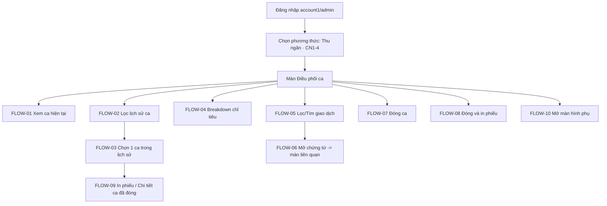

---

## 4. Chi tiết Functional Requirements — THEO TỪNG LUỒNG

### FLOW-DPC-01: Xem thông tin ca hiện tại đang mở · Ưu tiên: Must
- **User Story (INVEST):** Là một **thu ngân**, tôi muốn **xem nhanh thông tin ca đang mở của mình** để **biết mã ca, giờ mở, người mở và trạng thái hiện tại**.
- **FR liên quan:**
  - `FR-DPC-01`: Hệ thống hiển thị bảng thông tin ca hiện tại gồm: Nhân viên, Người mở, Mã ca, Giờ mở ca, Giờ đóng ca (hiển thị "Đang mở" nếu chưa kết ca).
  - `FR-DPC-02`: Với ca đang mở, hệ thống cung cấp liên kết "Mở màn hình phụ" gắn `shift_id` của ca.
- **Trang/màn liên quan:** Màn Điều phối ca (khối trên-trái).
- **Sơ đồ luồng:**
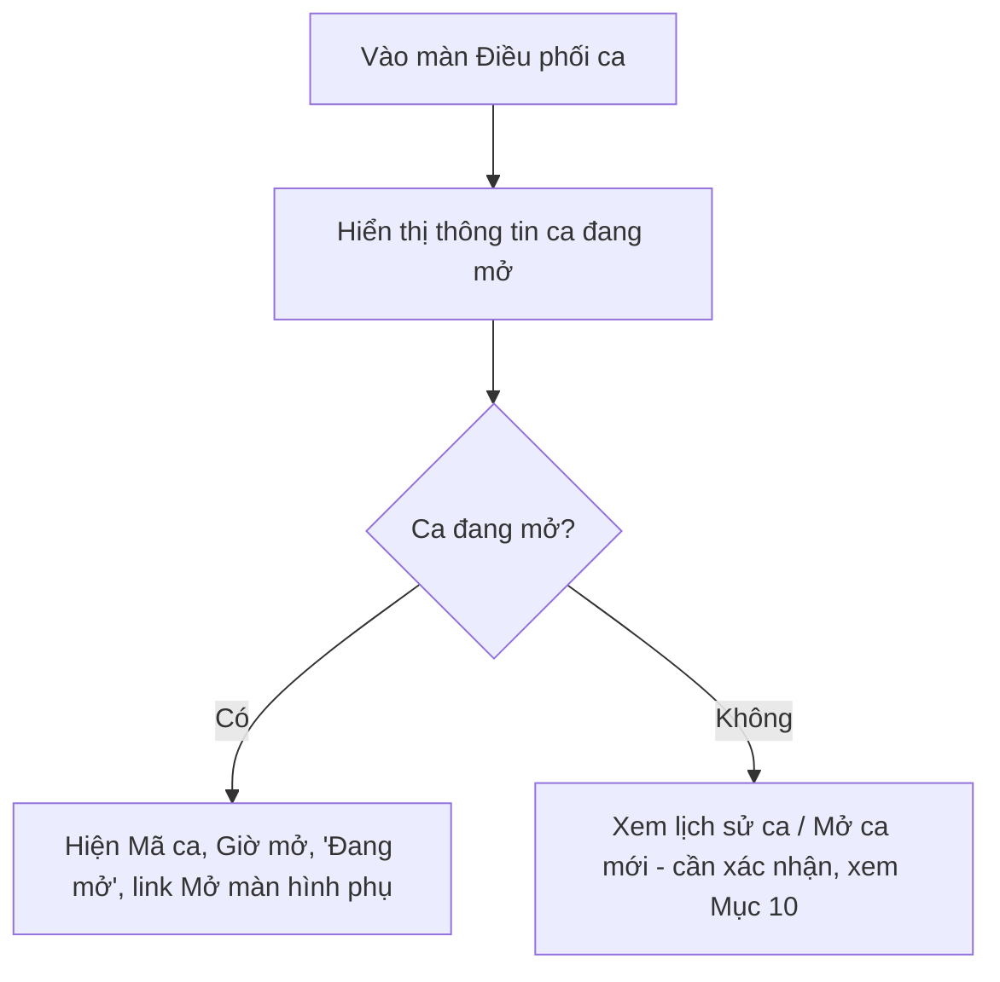
- **Các bước (Happy Path):**
  | # | Màn/Trang | Thao tác | Dữ liệu nhập | Kết quả/Chuyển tiếp |
  |---|---|---|---|---|
  | 1 | Điều phối ca | Mở màn hình | — | Hiển thị ca `SCR00000004CN2`, Người mở "Admin master", Giờ mở 15-07-2026 10:06:46, Giờ đóng "Đang mở" |
  | 2 | Điều phối ca | Đọc thông tin | — | Có link "Mở màn hình phụ" (`/secondary-screen?shift_id=4`) |
- **Acceptance Criteria (Gherkin):**
```gherkin
Scenario: Hiển thị ca đang mở
  Given tôi đã đăng nhập vai trò Thu ngân và có một ca đang mở
  When tôi mở màn hình "Điều phối ca"
  Then hệ thống hiển thị Mã ca, Người mở, Giờ mở ca và trạng thái "Đang mở"
  And hiển thị liên kết "Mở màn hình phụ" gắn với shift_id của ca
```
- **Phụ thuộc:** Liên kết "Mở màn hình phụ" chỉ có ý nghĩa khi tồn tại ca đang mở.

---

### FLOW-DPC-02: Lọc & tra cứu lịch sử ca · Ưu tiên: Must
- **User Story (INVEST):** Là một **thu ngân/quản lý**, tôi muốn **lọc lịch sử ca theo khoảng thời gian và theo nhân viên** để **tra cứu các ca đã/đang làm việc**.
- **FR liên quan:**
  - `FR-DPC-03`: Hệ thống cung cấp bộ lọc **Thời gian** dạng khoảng ngày-giờ (`DD-MM-YYYY HH:mm - DD-MM-YYYY HH:mm`), mặc định là ngày hiện tại (`00:00–23:59`).
  - `FR-DPC-04`: Bộ chọn thời gian mở lịch (calendar) có chọn năm (1950–2026), tháng, ngày (tiêu đề thứ: CN, Hai, Ba, Tư, Năm, Sáu, Bảy) và giờ (0–23) : phút (00–59); có nút "Áp dụng" và "Hủy".
  - `FR-DPC-05`: Hệ thống cung cấp bộ lọc **Nhân viên** (danh sách: Tất cả, Admin master, staff, cashier, thien) để giới hạn lịch sử ca theo người.
  - `FR-DPC-06`: Khi khoảng thời gian bao trùm nhiều ca, hệ thống hiển thị **danh sách các thẻ ca** trong khu "Lịch sử ca", có **phân trang** (`…/shift/list?page=N`).
- **Trang/màn liên quan:** Màn Điều phối ca (khu "Lịch sử ca").
- **Sơ đồ luồng:**
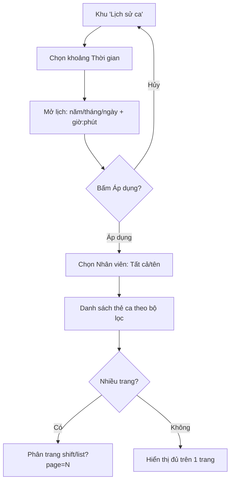
- **Các bước (Happy Path):**
  | # | Màn/Trang | Thao tác | Dữ liệu nhập | Kết quả/Chuyển tiếp |
  |---|---|---|---|---|
  | 1 | Điều phối ca | Bấm ô "Chọn thời gian" | — | Mở bộ chọn lịch (calendar + giờ:phút) |
  | 2 | Bộ chọn lịch | Chọn khoảng ngày rồi "Áp dụng" | VD 01-06-2026 → 16-07-2026 | Lịch sử ca tải theo khoảng đã chọn |
  | 3 | Điều phối ca | Chọn "Nhân viên" | VD staff | Danh sách thẻ ca lọc theo người |
- **Nhánh rẽ & ngoại lệ:** Bấm "Hủy" trong lịch → giữ nguyên khoảng cũ. Không có ca trong khoảng → danh sách rỗng (trạng thái empty — cần xác nhận nội dung, Mục 10).
- **Acceptance Criteria (Gherkin):**
```gherkin
Scenario: Lọc lịch sử ca theo khoảng thời gian nhiều ngày
  Given tôi ở khu "Lịch sử ca"
  When tôi chọn khoảng thời gian bao trùm nhiều ca và bấm "Áp dụng"
  Then hệ thống hiển thị danh sách các thẻ ca nằm trong khoảng đó
  And nếu vượt quá 1 trang thì hiển thị điều hướng phân trang

Scenario: Lọc theo nhân viên
  Given danh sách nhân viên gồm Tất cả, Admin master, staff, cashier, thien
  When tôi chọn một nhân viên cụ thể
  Then danh sách ca chỉ còn các ca của nhân viên đó
```
- **Phụ thuộc:** Hai bộ lọc (thời gian, nhân viên) áp dụng đồng thời lên danh sách lịch sử ca.

---

### FLOW-DPC-03: Chọn & xem chi tiết một ca trong lịch sử · Ưu tiên: Must
- **User Story (INVEST):** Là một **thu ngân/quản lý**, tôi muốn **chọn một ca trong danh sách lịch sử** để **xem chi tiết chỉ tiêu và giao dịch của ca đó** ở panel bên phải.
- **FR liên quan:**
  - `FR-DPC-07`: Mỗi thẻ ca trong lịch sử hiển thị: Nhân viên, Người mở, Mã ca, Giờ mở ca, Giờ đóng ca; với ca đã đóng còn hiển thị "Tổng tiền mặt" và nút **"In phiếu"**, **"Chi tiết ca"**.
  - `FR-DPC-08`: Bấm chọn một thẻ ca sẽ nạp chi tiết ca đó vào panel chi tiết (chỉ tiêu + bảng giao dịch).
- **Trang/màn liên quan:** Màn Điều phối ca (danh sách thẻ ca ↔ panel chi tiết) — mẫu **Master–Detail**.
- **Sơ đồ luồng:**
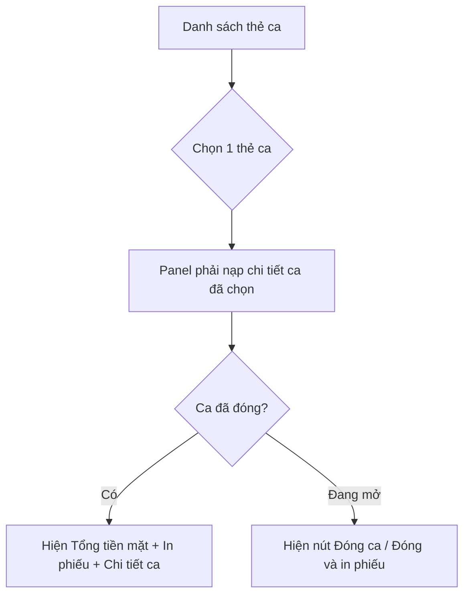
- **Các bước (Happy Path):**
  | # | Màn/Trang | Thao tác | Dữ liệu nhập | Kết quả/Chuyển tiếp |
  |---|---|---|---|---|
  | 1 | Lịch sử ca | Bấm một thẻ ca (đã đóng) | — | Panel phải hiển thị chi tiết ca đó |
  | 2 | Panel chi tiết | Đọc chỉ tiêu + giao dịch | — | Ca đã đóng: có "Tổng tiền mặt", nút "In phiếu"/"Chi tiết ca" |
- **Acceptance Criteria (Gherkin):**
```gherkin
Scenario: Xem chi tiết một ca đã đóng
  Given danh sách lịch sử có các thẻ ca đã đóng
  When tôi bấm chọn một thẻ ca đã đóng
  Then panel chi tiết hiển thị chỉ tiêu và giao dịch của ca đó
  And thẻ ca hiển thị "Tổng tiền mặt" cùng nút "In phiếu" và "Chi tiết ca"
```
- **Phụ thuộc:** Nút "In phiếu"/"Chi tiết ca" chỉ xuất hiện với ca đã đóng (bằng chứng phiên trước — cần xác nhận với dữ liệu hiện tại, Mục 10).

---

### FLOW-DPC-04: Xem breakdown chỉ tiêu tài chính theo phương thức · Ưu tiên: Should
- **User Story (INVEST):** Là một **thu ngân**, tôi muốn **mở rộng từng chỉ tiêu (Bán hàng/Trả hàng/Phiếu thu/Phiếu chi)** để **xem chi tiết theo từng phương thức thanh toán**.
- **FR liên quan:**
  - `FR-DPC-09`: Panel chi tiết ca hiển thị 4 khối chỉ tiêu: **Bán hàng** (Đơn hàng, Tổng tiền bán hàng, Công nợ), **Trả hàng**, **Phiếu thu**, **Phiếu chi**; và dòng tổng **"Tổng tiền mặt trong ca"**.
  - `FR-DPC-10`: Mỗi khối chỉ tiêu có nút mở rộng để hiển thị breakdown theo phương thức thanh toán: Tiền mặt, Chuyển khoản, Quẹt Thẻ, QR Tự động (và Công nợ ở khối Bán hàng).
  - `FR-DPC-11`: "Tiền mặt đầu ca" hiển thị số tiền mặt lúc bắt đầu ca.
- **Sơ đồ luồng:**
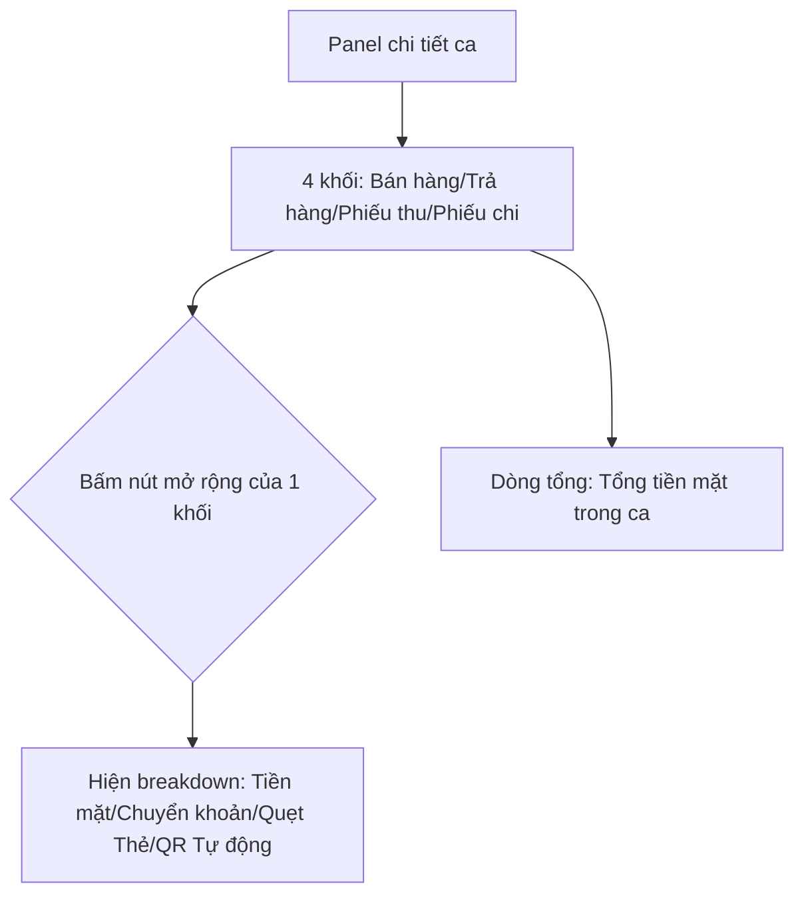
- **Dữ liệu quan sát (ca `SCR00000004CN2`, live 16-07-2026):**
  - Tiền mặt đầu ca: 0đ
  - Bán hàng: Đơn hàng 5 · Tổng tiền bán hàng 3,140,000đ · Công nợ 0đ
  - Trả hàng: Tiền mặt 3,640,000đ (Chuyển khoản 0đ, Quẹt Thẻ 0đ, QR Tự động 0đ)
  - Phiếu thu: Tiền mặt 3,140,000đ (các phương thức khác 0đ)
  - Phiếu chi: Tiền mặt 3,640,000đ (các phương thức khác 0đ)
  - Tổng tiền mặt trong ca: **-500,000đ**
- **Acceptance Criteria (Gherkin):**
```gherkin
Scenario: Mở breakdown chỉ tiêu theo phương thức thanh toán
  Given panel chi tiết ca hiển thị khối "Trả hàng"
  When tôi bấm nút mở rộng của khối "Trả hàng"
  Then hệ thống hiển thị số tiền theo từng phương thức: Tiền mặt, Chuyển khoản, Quẹt Thẻ, QR Tự động
```
- **Phụ thuộc:** Giá trị các chỉ tiêu phụ thuộc dữ liệu giao dịch của ca đang chọn.

---

### FLOW-DPC-05: Lọc / tìm kiếm / lọc trạng thái giao dịch trong ca · Ưu tiên: Must
- **User Story (INVEST):** Là một **thu ngân**, tôi muốn **lọc theo loại giao dịch, tìm theo mã/chú thích và lọc theo trạng thái** để **nhanh chóng tìm giao dịch cần đối soát trong ca**.
- **FR liên quan:**
  - `FR-DPC-12`: Bảng "Giao dịch trong ca" gồm cột: STT, Mã chứng từ, Loại giao dịch, Số tiền, Phương thức thanh toán, Trạng thái; kèm chỉ số **"Tổng giao dịch"**.
  - `FR-DPC-13`: Bộ lọc **Loại giao dịch** (nút "Tất cả" mở danh sách: Tất cả, Phiếu bán hàng, Phiếu trả hàng, Phiếu thu, Phiếu chi) — chọn một loại sẽ chỉ hiển thị các dòng thuộc loại đó.
  - `FR-DPC-14`: Ô **Tìm kiếm** theo mã/chú thích ("Tìm mã, chú thích").
  - `FR-DPC-15`: Hai **checkbox trạng thái** "Hoàn thành" và "Đã hủy" (mặc định cả hai được chọn) để lọc giao dịch theo trạng thái.
- **Sơ đồ luồng:**
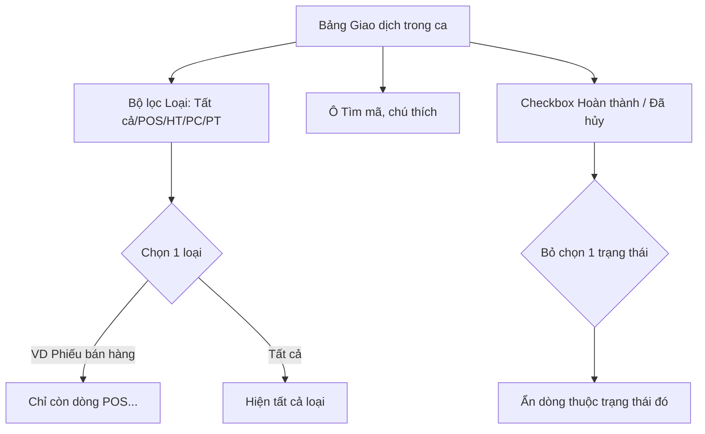
- **Các bước (Happy Path — đã kiểm chứng live):**
  | # | Màn/Trang | Thao tác | Dữ liệu nhập | Kết quả/Chuyển tiếp |
  |---|---|---|---|---|
  | 1 | Bảng giao dịch | Bấm "Tất cả" | — | Mở danh sách 5 loại |
  | 2 | Danh sách loại | Chọn "Phiếu bán hàng" | — | Bảng còn 5 dòng, chỉ mã `POS…` (kiểm chứng live) |
  | 3 | Bảng giao dịch | Chọn lại "Tất cả" | — | Hiển thị lại toàn bộ 22 giao dịch |
- **Nhánh rẽ & ngoại lệ:** Tìm kiếm không khớp → không còn dòng nào (empty — cần xác nhận thông báo, Mục 10). Bỏ chọn cả 2 checkbox trạng thái → hành vi cần xác nhận (Mục 10).
- **Acceptance Criteria (Gherkin):**
```gherkin
Scenario: Lọc giao dịch theo loại "Phiếu bán hàng"
  Given bảng "Giao dịch trong ca" đang hiển thị mọi loại giao dịch
  When tôi mở bộ lọc loại và chọn "Phiếu bán hàng"
  Then bảng chỉ còn các dòng có Loại giao dịch là "Phiếu bán hàng" (mã POS...)

Scenario: Bộ lọc trạng thái mặc định
  Given tôi mở bảng "Giao dịch trong ca"
  Then cả hai checkbox "Hoàn thành" và "Đã hủy" được chọn sẵn
```
- **Phụ thuộc:** Các bộ lọc áp dụng trên tập giao dịch của ca đang chọn.

---

### FLOW-DPC-06: Mở chi tiết một chứng từ giao dịch (điều hướng liên module) · Ưu tiên: Should
- **User Story (INVEST):** Là một **thu ngân**, tôi muốn **bấm vào một dòng giao dịch** để **mở chứng từ/đơn tương ứng nhằm xem chi tiết**.
- **FR liên quan:**
  - `FR-DPC-16`: Bảng giao dịch cho phép bấm vào dòng (con trỏ pointer). Bấm dòng **Phiếu bán hàng** điều hướng sang màn đơn hàng POS (`/order/cashier/menu`, "Danh sách menu").
- **Trang/màn liên quan (đa trang):** Điều phối ca → màn đích theo loại chứng từ.
- **Sơ đồ luồng:**
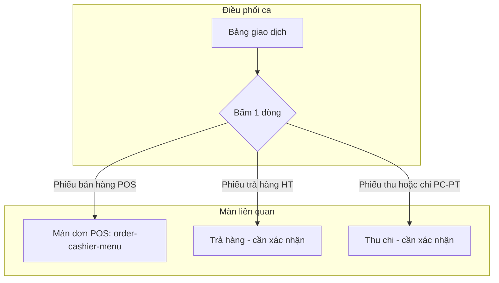
- **Các bước (Happy Path — kiểm chứng live cho Phiếu bán hàng):**
  | # | Màn/Trang | Thao tác | Dữ liệu nhập | Kết quả/Chuyển tiếp |
  |---|---|---|---|---|
  | 1 | Bảng giao dịch | Bấm dòng `POS00000034CN2` | — | Điều hướng `/order/cashier/menu` (màn đơn POS) |
- **Nhánh rẽ & ngoại lệ:** Đích của Phiếu trả hàng/Phiếu thu/Phiếu chi chưa kiểm chứng trực tiếp → Mục 10.
- **Acceptance Criteria (Gherkin):**
```gherkin
Scenario: Mở đơn từ một phiếu bán hàng
  Given bảng giao dịch có dòng loại "Phiếu bán hàng"
  When tôi bấm vào dòng đó
  Then hệ thống điều hướng sang màn đơn hàng POS ("Danh sách menu")
```
- **Phụ thuộc:** Điều hướng rời khỏi module Điều phối ca sang module khác (liên module).

---

### FLOW-DPC-07: Đóng ca · Ưu tiên: Must
- **User Story (INVEST):** Là một **thu ngân**, tôi muốn **đóng ca có nhập số tiền mặt thực đếm** để **hệ thống tính chênh lệch và chốt ca chính xác**.
- **FR liên quan:**
  - `FR-DPC-17`: Nút **"Đóng ca"** mở modal **"Thông tin đóng ca"**.
  - `FR-DPC-18`: Modal hiển thị: người phụ trách, **Tiền mặt trong ca** (dự kiến), ô nhập **"Số tiền thực tế đếm được"**, dòng **Chênh lệch**, ô **Ghi chú** (bộ đếm `x/200`), nút **"Đóng"** (đóng modal) và **"Đóng ca ngay"** (xác nhận).
  - `FR-DPC-19`: Ô số tiền tự động định dạng phân tách hàng nghìn khi nhập.
  - `FR-DPC-20`: Chênh lệch được tính lại tức thời theo số tiền thực đếm.
- **Use Case Spec (UC-DPC-01 — Đóng ca):**
  - **Actor:** Thu ngân.
  - **Tiền điều kiện:** Có một ca đang mở.
  - **Hậu điều kiện (dự kiến, cần xác nhận):** Ca chuyển trạng thái "Đã đóng", ghi Giờ đóng ca, lưu Chênh lệch + Ghi chú.
  - **Luồng chính:** Bấm "Đóng ca" → nhập số tiền thực đếm → xem chênh lệch → (tùy chọn) nhập ghi chú → bấm "Đóng ca ngay".
  - **Luồng thay thế:** Bấm "Đóng" để hủy đóng ca (đóng modal, không thay đổi).
  - **Luồng ngoại lệ:** Ràng buộc bắt buộc/định dạng của ô số tiền (cần xác nhận, Mục 10).
- **Sơ đồ luồng:**
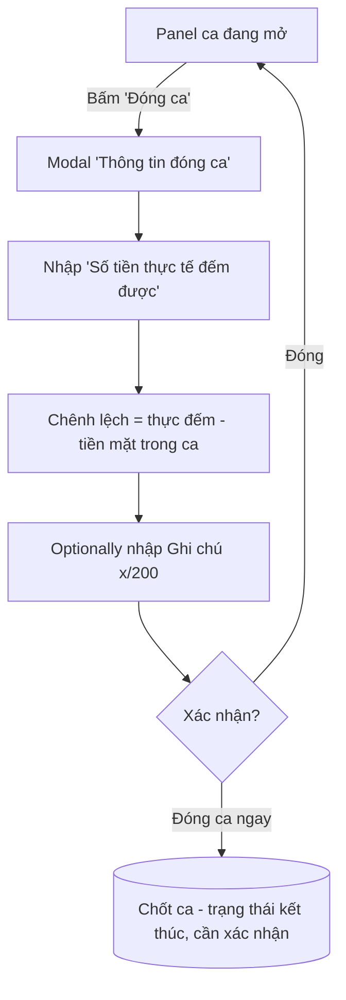
- **Các bước (Happy Path — kiểm chứng tới bước xác nhận, KHÔNG commit):**
  | # | Màn/Trang | Thao tác | Dữ liệu nhập | Kết quả/Chuyển tiếp |
  |---|---|---|---|---|
  | 1 | Panel ca | Bấm "Đóng ca" | — | Mở modal "Thông tin đóng ca"; Tiền mặt trong ca -500,000đ; Chênh lệch 0đ |
  | 2 | Modal | Nhập số tiền thực đếm | 1,000,000 | Ô hiển thị "1,000,000"; Chênh lệch cập nhật **1,500,000đ** |
  | 3 | Modal | (Không xác nhận) | — | Đóng modal, ca vẫn "Đang mở" (bảo toàn môi trường test dùng chung) |
- **Acceptance Criteria (Gherkin):**
```gherkin
Scenario: Tính chênh lệch khi đóng ca
  Given modal "Thông tin đóng ca" hiển thị "Tiền mặt trong ca" là -500,000đ
  When tôi nhập "Số tiền thực tế đếm được" là 1,000,000
  Then trường "Chênh lệch" hiển thị 1,500,000đ
  And số tiền được định dạng phân tách hàng nghìn ("1,000,000")

Scenario: Hủy đóng ca
  Given modal "Thông tin đóng ca" đang mở
  When tôi bấm "Đóng"
  Then modal đóng lại và ca giữ nguyên trạng thái "Đang mở"
```
- **Phụ thuộc:** Chỉ đóng được ca đang mở; giá trị "Tiền mặt trong ca" lấy từ chỉ tiêu ca.
- **Ghi chú kiểm thử:** Trạng thái kết thúc thực (toast thành công/đổi trạng thái/in phiếu) CHƯA được commit trong phiên này để bảo toàn ca đang mở của cửa hàng test dùng chung → xem Mục 10 (Q1).

---

### FLOW-DPC-08: Đóng ca và in phiếu · Ưu tiên: Should
- **User Story (INVEST):** Là một **thu ngân**, tôi muốn **đóng ca kèm in phiếu kết ca** để **có chứng từ giấy đối soát ngay**.
- **FR liên quan:**
  - `FR-DPC-21`: Nút **"Đóng và in phiếu"** thực hiện đóng ca kèm phát hành/in phiếu kết ca.
- **Sơ đồ luồng:**
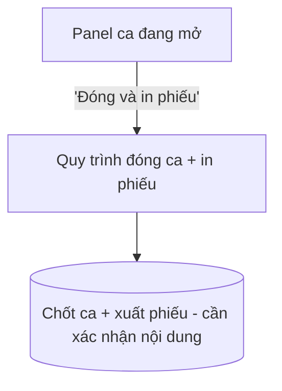
- **Acceptance Criteria (Gherkin):**
```gherkin
Scenario: Đóng ca kèm in phiếu
  Given tôi đang ở panel ca đang mở
  When tôi bấm "Đóng và in phiếu"
  Then hệ thống thực hiện đóng ca và phát hành phiếu kết ca để in
```
- **Phụ thuộc & ghi chú:** Khác biệt chính xác giữa "Đóng ca" và "Đóng và in phiếu" (có/không hộp thoại nhập tiền) cần xác nhận → Mục 10 (Q10).

---

### FLOW-DPC-09: In phiếu / Xem chi tiết một ca đã đóng · Ưu tiên: Should
- **User Story (INVEST):** Là một **quản lý**, tôi muốn **in lại phiếu hoặc mở chi tiết một ca đã đóng** để **đối soát/hậu kiểm**.
- **FR liên quan:**
  - `FR-DPC-22`: Thẻ ca đã đóng cung cấp nút **"In phiếu"** (in lại phiếu kết ca) và **"Chi tiết ca"** (mở chi tiết ca đã đóng).
- **Sơ đồ luồng:**
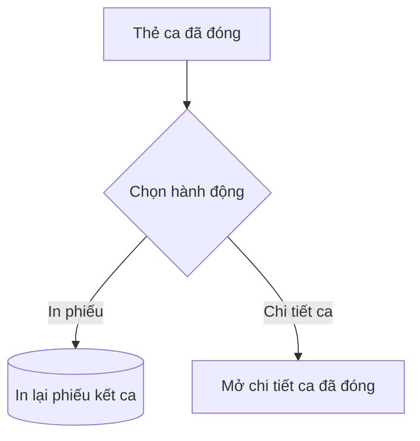
- **Acceptance Criteria (Gherkin):**
```gherkin
Scenario: Mở chi tiết một ca đã đóng
  Given danh sách lịch sử có một thẻ ca đã đóng
  When tôi bấm "Chi tiết ca" trên thẻ đó
  Then hệ thống hiển thị chi tiết của ca đã đóng
```
- **Phụ thuộc & ghi chú:** Bằng chứng từ snapshot phiên trước (cùng UI); nội dung phiếu in và màn "Chi tiết ca" cần xác nhận với dữ liệu hiện tại → Mục 10.

---

### FLOW-DPC-10: Mở màn hình phụ (Secondary screen) · Ưu tiên: Could
- **User Story (INVEST):** Là một **thu ngân**, tôi muốn **mở màn hình phụ theo ca** để **hiển thị thông tin phụ trợ (dự đoán: hướng về khách hàng)**.
- **FR liên quan:**
  - `FR-DPC-23`: Liên kết **"Mở màn hình phụ"** mở đường dẫn `/order/cashier/secondary-screen?shift_id=<id>` theo ca đang mở.
- **Sơ đồ luồng:**
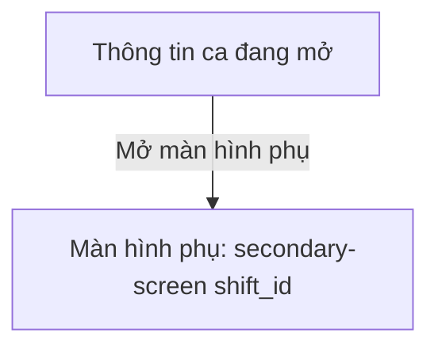
- **Acceptance Criteria (Gherkin):**
```gherkin
Scenario: Mở màn hình phụ theo ca
  Given ca đang mở có shift_id xác định
  When tôi bấm "Mở màn hình phụ"
  Then hệ thống mở màn hình phụ gắn đúng shift_id của ca
```
- **Phụ thuộc & ghi chú:** Mục đích/nội dung màn hình phụ chưa kiểm chứng → Mục 10.

---

## 5. Đặc tả trường dữ liệu (Field Specifications)

### 5.1. Form đăng nhập (`/v2/login`) — điều kiện tiền đề vào module
| Tên trường (Label) | Loại UI | Bắt buộc | Ràng buộc/Ghi chú | Điều kiện hiển thị | Ghi chú |
|---|---|---|---|---|---|
| ID cửa hàng | Textbox | (Có) | Định danh cửa hàng (VD `account1`) | Luôn | — |
| Tên đăng nhập | Textbox | (Có) | VD `admin` | Luôn | — |
| Mật khẩu | Password | (Có) | Có nút hiện/ẩn mật khẩu | Luôn | Mask mặc định |
| Ghi nhớ đăng nhập | Checkbox | Không | — | Luôn | — |
| Quên mật khẩu | Link | — | → `/forgot-password` | Luôn | — |

### 5.2. Bộ lọc "Lịch sử ca"
| Tên trường (Label) | Loại UI | Bắt buộc | Ràng buộc/Ghi chú | Điều kiện hiển thị | Ghi chú |
|---|---|---|---|---|---|
| Thời gian | Date-range + time picker | Không | Khoảng `DD-MM-YYYY HH:mm`; năm 1950–2026; giờ 0–23, phút 00–59; nút Áp dụng/Hủy | Luôn | Mặc định = hôm nay 00:00–23:59 |
| Nhân viên | Select | Không | Tất cả / Admin master / staff / cashier / thien | Luôn | Danh sách thay đổi theo phân công |

### 5.3. Bảng "Giao dịch trong ca" + bộ lọc
| Tên trường (Label) | Loại UI | Bắt buộc | Ràng buộc/Ghi chú | Điều kiện hiển thị | Ghi chú |
|---|---|---|---|---|---|
| Loại giao dịch | Dropdown (nút "Tất cả") | Không | Tất cả/Phiếu bán hàng/Phiếu trả hàng/Phiếu thu/Phiếu chi | Luôn | Lọc client-side theo loại |
| Tìm kiếm | Textbox | Không | Placeholder "Tìm mã, chú thích" | Luôn | — |
| Hoàn thành | Checkbox | Không | Mặc định chọn | Luôn | Lọc theo trạng thái |
| Đã hủy | Checkbox | Không | Mặc định chọn | Luôn | Lọc theo trạng thái |

### 5.4. Modal "Thông tin đóng ca"
| Tên trường (Label) | Loại UI | Bắt buộc | Ràng buộc/Ghi chú | Điều kiện hiển thị | Ghi chú |
|---|---|---|---|---|---|
| Tiền mặt trong ca | Read-only | — | Số tiền dự kiến (có thể âm) | Trong modal | — |
| Số tiền thực tế đếm được | Textbox (số) | (Cần xác nhận) | Tự động định dạng phân tách hàng nghìn | Trong modal | Placeholder "Nhập số tiền thực tế đếm được" |
| Chênh lệch | Read-only | — | = thực đếm − tiền mặt trong ca; cập nhật tức thời | Trong modal | — |
| Ghi chú | Textarea | Không | Bộ đếm `x/200`; placeholder ghi "tối đa 50 ký tự" (không nhất quán) | Trong modal | Xem BR-DPC-06 |

---

## 6. Quy tắc nghiệp vụ & Validation (Business Rules)

| Mã | Điều kiện | Thông báo/Hành vi quan sát được | Nguồn |
|---|---|---|---|
| BR-DPC-01 | Nhập "Số tiền thực tế đếm được" khi đóng ca | **Chênh lệch = Số tiền thực đếm − Tiền mặt trong ca** (VD 1,000,000 − (−500,000) = 1,500,000đ) | Live modal đóng ca |
| BR-DPC-02 | Mở ca mới sau khi đóng ca trước | **Tiền mặt đầu ca của ca mới = Tổng tiền mặt cuối của ca trước** (VD ca mở với 500,000đ = tổng tiền mặt ca trước) | Snapshot phiên trước (`dpc_tmp_scr008/hist`) — cần xác nhận |
| BR-DPC-03 | Sinh mã ca | Mã ca tự sinh dạng `SCR` + số + mã chi nhánh (`SCR00000004CN2`); mỗi chứng từ có tiền tố loại: `POS`/`HT`/`PC`/`PT` | Live |
| BR-DPC-04 | Nhập số tiền vào ô tiền | Tự động định dạng phân tách hàng nghìn ("1,000,000") | Live |
| BR-DPC-05 | Mặc định bộ lọc trạng thái giao dịch | Cả "Hoàn thành" và "Đã hủy" được chọn sẵn (hiển thị mọi trạng thái) | Live |
| BR-DPC-06 | Ô ghi chú đóng ca | Bộ đếm hiển thị `x/200` nhưng placeholder ghi "tối đa 50 ký tự" → **không nhất quán giới hạn** (nghi vấn lỗi) | Live |
| BR-DPC-07 | Chọn một loại giao dịch ở bộ lọc | Bảng chỉ hiển thị dòng thuộc loại đã chọn (VD chọn "Phiếu bán hàng" → chỉ mã `POS…`) | Live |
| BR-DPC-08 | Ca đang mở | "Giờ đóng ca" hiển thị "Đang mở"; có nút "Đóng ca"/"Đóng và in phiếu"; ca đã đóng hiển thị "Tổng tiền mặt" + "In phiếu"/"Chi tiết ca" | Live (mở) + snapshot phiên trước (đóng) |
| BR-DPC-09 | Tổng tiền mặt trong ca | Có thể mang giá trị âm (VD -500,000đ) khi chi > thu | Live |

---

## 7. Yêu cầu phi chức năng (Non-Functional Requirements)

| Mã | Loại | Mô tả quan sát được | Nguồn |
|---|---|---|---|
| NFR-01 | i18n | Hỗ trợ 3 ngôn ngữ: vi / en / kr (chuyển ở trang đăng nhập và header) | Live |
| NFR-02 | Bảo mật | Mật khẩu bị mask mặc định, có nút hiện/ẩn | Live (login) |
| NFR-03 | Định dạng | Tiền tệ VNĐ hậu tố "đ", phân tách hàng nghìn; ngày-giờ `DD-MM-YYYY HH:mm(:ss)` | Live |
| NFR-04 | Khả dụng/Hiệu năng | Lịch sử ca phân trang phía server (`/shift/list?page=N`) | Snapshot phiên trước |
| NFR-05 | Khả dụng | Header có chỉ báo thông báo dạng số (VD "69"); mở panel có các tab Xác nhận/Thanh toán/Bếp-Bar/Khác kèm số lượng và các thao tác Chưa xem/Đã xem tất cả/Xóa tất cả | Live |
| NFR-06 | Ổn định | Trang `/shift` có hiện tượng **tự điều hướng về `/order/cashier/menu`** sau một số thao tác (đặc biệt sau khi bấm dòng "Phiếu bán hàng" — hệ thống dường như "tiếp tục" đơn đang mở) | Live (nghi vấn — Mục 10) |
| NFR-07 | Khả dụng | Có "Màn hình phụ" mở theo `shift_id` (phục vụ hiển thị phụ trợ) | Live |

---

## 8. Ma trận Coverage Thao tác (Action Coverage Matrix)

| # | Màn/Trang | Element (label) | Loại | Thao tác đã thực hiện | Kết quả quan sát | Luồng | Ghi chú |
|---|---|---|---|---|---|---|---|
| 1 | /login | ID cửa hàng, Tên đăng nhập, Mật khẩu | Form | Nhập account1/admin/••• + "Đăng nhập" | Vào `/login-methods` | — | Đăng nhập test |
| 2 | /login-methods | Combobox chi nhánh + nút Thu ngân/… | Nav | Quan sát | CN1–CN4; 4 vai trò | — | — |
| 3 | /shift | Thông tin ca hiện tại | Read | Xem | SCR00000004CN2, Đang mở | FLOW-01 | — |
| 4 | /shift | "Mở màn hình phụ" | Link | Đọc URL | `/secondary-screen?shift_id=4` | FLOW-10 | Không mở tab |
| 5 | /shift | Bộ lọc "Thời gian" | Date picker | Bấm mở | Hiện lịch + giờ:phút + Áp dụng/Hủy | FLOW-02 | Không đổi khoảng |
| 6 | /shift | Bộ lọc "Nhân viên" | Select | Xem options | Tất cả/Admin master/staff/cashier/thien | FLOW-02 | — |
| 7 | /shift | Nút "Tất cả" (loại giao dịch) | Dropdown | Bấm mở | 5 loại: Tất cả/POS/HT/PC/PT | FLOW-05 | — |
| 8 | /shift | Lọc "Phiếu bán hàng" | Filter | Chọn | Bảng còn 5 dòng `POS…` | FLOW-05 | Kiểm chứng lọc client-side |
| 9 | /shift | Khối chỉ tiêu (Bán hàng/Trả hàng/Phiếu thu/Phiếu chi) | Expand | Đọc breakdown | Tiền mặt/Chuyển khoản/Quẹt Thẻ/QR Tự động/Công nợ | FLOW-04 | Giá trị đã ghi Mục 4 |
| 10 | /shift | Dòng giao dịch `POS00000034CN2` | Row | Bấm | Điều hướng `/order/cashier/menu` | FLOW-06 | Điều hướng liên module |
| 11 | /shift | Nút "Đóng ca" | Button | Bấm | Mở modal "Thông tin đóng ca" | FLOW-07 | — |
| 12 | Modal đóng ca | "Số tiền thực tế đếm được" | Input | Nhập 1,000,000 | Chênh lệch → 1,500,000đ; auto-format | FLOW-07 | **KHÔNG commit** (bảo toàn ca) |
| 13 | Modal đóng ca | "Đóng" / "Đóng ca ngay" | Button | Không xác nhận | Modal đóng, ca vẫn mở | FLOW-07 | Không đóng ca thật |
| 14 | /shift | Checkbox "Hoàn thành"/"Đã hủy" | Checkbox | Quan sát trạng thái | Mặc định cùng chọn | FLOW-05 | — |
| 15 | /shift | Header thông báo "69" | Panel | Quan sát nội dung | Tab Xác nhận/Thanh toán/Bếp-Bar/Khác | — | Ngoài phạm vi lõi |
| 16 | /menu | Màn đơn/menu | Nav | Ghi nhận | "Danh sách menu" (module Menu) | FLOW-06 | Out-of-scope |

> **Thao tác phá hủy đã thực hiện:** KHÔNG. Đóng ca chỉ được khám phá tới bước xác nhận rồi hủy — không có dữ liệu nào bị tạo/sửa/xóa (bảo toàn ca đang mở của cửa hàng test dùng chung). Xem Mục 10 Q1 nếu cần chạy trọn.

---

## 9. Ma trận Truy vết Yêu cầu (RTM)

| Mã luồng | FR | BR liên quan | Acceptance Criteria | Bằng chứng |
|---|---|---|---|---|
| FLOW-DPC-01 | FR-DPC-01, 02 | BR-DPC-03, 08 | AC FLOW-01 | Live snapshot `SCR00000004CN2`; `shift-01-overview.png` |
| FLOW-DPC-02 | FR-DPC-03, 04, 05, 06 | — | AC FLOW-02 | Live: mở date picker; options nhân viên; `dpc_tmp_picker.md`, `dpc_tmp_hist.md` |
| FLOW-DPC-03 | FR-DPC-07, 08 | BR-DPC-08 | AC FLOW-03 | `dpc_tmp_hist.md`, `dpc_tmp_scr008.md` (cần xác nhận live) |
| FLOW-DPC-04 | FR-DPC-09, 10, 11 | BR-DPC-09 | AC FLOW-04 | Live: breakdown Bán hàng/Trả hàng/Thu/Chi |
| FLOW-DPC-05 | FR-DPC-12, 13, 14, 15 | BR-DPC-05, 07 | AC FLOW-05 | Live: lọc "Phiếu bán hàng" → 5 dòng POS |
| FLOW-DPC-06 | FR-DPC-16 | — | AC FLOW-06 | Live: bấm `POS00000034CN2` → `/menu` |
| FLOW-DPC-07 | FR-DPC-17, 18, 19, 20 | BR-DPC-01, 04, 06 | AC FLOW-07 | Live: modal đóng ca; chênh lệch 1,500,000đ |
| FLOW-DPC-08 | FR-DPC-21 | — | AC FLOW-08 | Live: nút "Đóng và in phiếu" hiển thị |
| FLOW-DPC-09 | FR-DPC-22 | BR-DPC-08 | AC FLOW-09 | `dpc_tmp_hist.md` (nút In phiếu/Chi tiết ca) |
| FLOW-DPC-10 | FR-DPC-23 | — | AC FLOW-10 | Live: link `/secondary-screen?shift_id=4` |

---

## 10. Câu hỏi làm rõ với PO/User

1. **Trạng thái kết thúc khi đóng ca:** Sau khi bấm "Đóng ca ngay", hệ thống hiển thị gì (toast thành công? chuyển ca sang "Đã đóng"? tự in phiếu?) và có thể mở lại ca đã đóng không? (Chưa commit trong phiên này để bảo toàn ca test.)
2. **Giới hạn ô Ghi chú đóng ca:** Placeholder ghi "tối đa 50 ký tự" nhưng bộ đếm hiển thị `x/200` — giới hạn đúng là 50 hay 200? (nghi vấn lỗi hiển thị).
3. **Số ca mở đồng thời:** Một cửa hàng/nhân viên có được mở nhiều ca cùng lúc không, hay chỉ 1 ca mở tại một thời điểm?
4. **Hiện tượng `/shift` tự chuyển về `/menu`:** Đây là hành vi có chủ đích ("tiếp tục đơn đang mở") hay là lỗi điều hướng? Điều kiện kích hoạt chính xác?
5. **Ràng buộc ô "Số tiền thực tế đếm được":** Có bắt buộc không? Có chặn số âm/ký tự/chuỗi rỗng không? Thông báo lỗi ra sao?
6. **Ý nghĩa "Tổng tiền mặt trong ca" âm (-500,000đ):** Có được phép đóng ca khi tiền mặt âm không, và nghiệp vụ diễn giải thế nào?
7. **Nội dung "In phiếu" và màn "Chi tiết ca" (ca đã đóng):** Gồm những thông tin/bố cục gì?
8. **Phân quyền theo vai trò:** Vai trò nào được "Đóng ca"/"Đóng và in phiếu"/"In phiếu", vai trò nào chỉ xem? (Phiên này chỉ kiểm chứng bằng Admin master.)
9. **Màn hình phụ (Secondary screen):** Mục đích và nội dung (màn hiển thị cho khách? nội dung ca/đơn?).
10. **Khác biệt "Đóng ca" vs "Đóng và in phiếu":** "Đóng và in phiếu" có mở cùng modal nhập tiền thực đếm không, hay đóng ngay và in?
11. **Đích điều hướng của Phiếu trả hàng/Phiếu thu/Phiếu chi:** Bấm các dòng này mở màn nào (Trả hàng? Thu chi? modal chi tiết?).
12. **Hành vi khi bỏ chọn cả hai checkbox trạng thái ("Hoàn thành" + "Đã hủy"):** Bảng rỗng hay giữ nguyên?
13. **Luồng "Mở ca" (khi chưa có ca nào mở):** Màn/nút mở ca và các trường nhập (tiền mặt đầu ca…) — chưa quan sát được vì đang có ca mở.

---

*Tài liệu lập ngày 16-07-2026 qua khám phá tương tác thật (Playwright MCP). Mọi giá trị số/nhãn trích từ quan sát trực tiếp trên UI; phần chưa kiểm chứng được đánh dấu và chuyển vào Mục 10.*
