# Tài liệu Đặc tả Yêu cầu (SRS) — Module Chỉnh sửa Menu / Quản lý hàng hóa (Edit Menu)

> Tài liệu được biên soạn theo phương pháp **khám phá tương tác thật** trên hệ thống (exploratory, BA-grade), tổ chức theo **luồng thao tác**. Mọi yêu cầu đều truy vết được về quan sát thực tế trên UI. Các suy luận chưa kiểm chứng được đưa vào Mục 10 — "Câu hỏi làm rõ", KHÔNG viết như sự thật.

---

## 1. Tổng quan (Overview)

### 1.1. Mục đích module
Module **Chỉnh sửa Menu / Quản lý hàng hóa** (thường gọi tắt là *Edit Menu*, đường dẫn thực tế `…/order/cashier/menu`) thuộc phân hệ **Thu ngân (Cashier)** của hệ thống ERP/POS NASYS ORDER. Module cho phép người quản lý **quản trị toàn bộ danh mục hàng hóa/món bán** của cửa hàng: xem và lọc danh sách hàng hóa, **tạo mới / chỉnh sửa / sao chép / xóa** hàng hóa, bật–tắt trạng thái kinh doanh, sắp xếp thứ tự hiển thị, khai báo công thức chế biến, nhập/xuất dữ liệu hàng loạt, và quản lý các **danh mục phụ trợ** đi kèm (nhóm hàng hóa, thuộc tính, đơn vị tính, thuế suất, danh mục hoa hồng).

> ⚠️ "Menu" ở đây = **danh mục hàng hóa/sản phẩm để bán** (product catalog), KHÔNG phải thực đơn theo nghĩa ẩm thực đơn thuần. Đối tượng dữ liệu trung tâm là **Hàng hóa** (gồm cả Hàng bán, Nguyên phụ liệu, Hàng hóa chế biến và Set Menu/Combo).

### 1.2. Phạm vi
- **In-scope (đã khám phá trực tiếp):** 6 tab con của module — **Danh sách menu**, **Nhóm hàng hóa**, **Thuộc tính**, **Đơn vị**, **Thuế**, **Danh mục hoa hồng**; bộ lọc bên trái (chi nhánh, tìm theo hàng hóa, theo nhóm, theo loại, theo trạng thái); bảng danh sách + các row-action (sửa/công thức/sao chép/xóa/di chuyển lên–xuống, bật–tắt trạng thái); modal **Tạo/Chỉnh sửa hàng hóa** (3 tab Chi tiết / Thuộc tính / Topping); các dropdown **Tạo mới** (Hàng hóa thường, Set Menu/Combo) và **Nâng cao** (Nhập file, Tải file mẫu, Xuất Excel); hộp thoại xác nhận xóa; validation trường bắt buộc.
- **Chạm tới nhưng ngoài phạm vi (chỉ ghi nhận điều hướng):** phân hệ Thu ngân khác — Trang chủ (POS), Lịch sử, Đặt bàn, Điều phối ca (`/shift`), Thu chi, Trả hàng, CRM. Các màn này nằm trên thanh điều hướng chính, không đặc tả trong tài liệu này.
- **Loại trừ (out-of-scope):** không có khu vực bị loại trừ do user chỉ định.

### 1.3. Thông tin phiên khám phá
| Hạng mục | Giá trị |
|---|---|
| URL vào (Flutter POS shell) | `https://order-flutter.nasys.vn/pos-shell-route/menu-edit-list-route` |
| Môi trường | TEST (được user xác nhận, cho phép tạo/sửa/xóa) |
| Tài khoản đăng nhập | ID cửa hàng `admin` / Tên đăng nhập `thientester` / mật khẩu `********`; hiển thị trên thanh nav là **Admin Master** |
| Chi nhánh | CN2 (hậu tố mã ca `CN2`); màn hàng hóa có multi-chi-nhánh **CN1–CN4** |
| Ngày khám phá | 16-07-2026 |
| Công cụ | Playwright MCP (viewport desktop **1920×1080**), `browser_snapshot` + `browser_evaluate` + ảnh chụp làm nguồn chân lý |
| Ngôn ngữ UI | Tiếng Việt (chuyển được **vi / en / kr**; màn login Flutter còn có **zh / ja**) |

### 1.4. Nguồn bằng chứng (live 16-07-2026)
- **Truy cập & đăng nhập:** màn login Flutter (`/auth-route` — Store ID, Username, Password, Remember me, Forgot password, cờ ngôn ngữ), handoff xác thực sang backend ERP → vào màn Thu ngân, hiển thị **Admin Master**.
- **Kích hoạt module:** đã thực hiện thật tổ hợp **Ctrl + F9** trên màn Thu ngân → xuất hiện icon **"Menu"** ở thanh nav; **nhấn giữ ~2s** (press-and-hold) trên icon Menu → mở trang `/order/cashier/menu`.
- **Danh sách menu:** ảnh chụp bảng 10/trang (tổng ~36 hàng hóa, 4 trang), cấu trúc cột, row-action (tooltip), bộ lọc, phân trang, dropdown Tạo mới/Nâng cao.
- **Modal Tạo/Chỉnh sửa hàng hóa:** ảnh chụp đầy đủ + trích DOM field/label/toggle/radio, danh sách option các dropdown (đơn vị, lĩnh vực kinh doanh, chi nhánh, nhóm, thẻ món).
- **Validation:** đã submit form rỗng → thu được thông báo nguyên văn `Vui lòng chọn lĩnh vực kinh doanh` (nút xác nhận `#confirm_create_menu`).
- **Xóa:** đã mở hộp thoại xóa dòng "Test Return" → thu nguyên văn tiêu đề `Xóa ?` / nội dung `Bạn có chắc muốn xóa: Test Return?` (nút **Đóng** / **Xóa**) → **đã bấm Đóng, KHÔNG xóa dữ liệu**.
- **Quy tắc xóa khi đang sử dụng:** tooltip nút xóa các dòng đang dùng: `Không thể xóa, đối tượng muốn xóa đang được sử dụng`.
- **Tab con phụ trợ:** đã điều hướng và đọc cấu trúc bảng của Nhóm hàng hóa, Thuộc tính, Đơn vị, Thuế, Danh mục hoa hồng.

> Ghi chú giới hạn kỹ thuật: trang `/menu` chạy trong phiên POS có xu hướng **tự điều hướng về màn Thu ngân/Lịch sử** sau vài giây khi thao tác bằng công cụ tự động; một số luồng ghi dữ liệu (submit tạo thành công, đổi trạng thái, sao chép, nhập/xuất file) **chưa chạy tới trạng thái kết thúc** — được đánh dấu rõ và đưa vào Mục 10.

### 1.5. Actor & Vai trò
Danh sách nhân viên quan sát được (bộ lọc "Nhân viên" ở màn Điều phối ca cùng cửa hàng): **Admin master**, **staff**, **cashier**, **thien**. Phân hệ chứa module là không gian **Thu ngân (Cashier)**.

| Actor | Mô tả | Quyền quan sát được với module |
|---|---|---|
| Quản lý / Admin master | Tài khoản quản trị (phiên này) | Toàn quyền: xem, tạo, sửa, sao chép, xóa, đổi trạng thái, quản lý danh mục phụ |
| Thu ngân (Cashier) | Nhân viên quầy | Gợi ý nghiệp vụ: **không được vào/thao tác Edit Menu** (chưa kiểm chứng trực tiếp → Mục 10) |
| Nhân viên / Bếp-Bar | Vai trò khác trong POS | Chưa kiểm chứng quyền với module này → Mục 10 |

---

## 2. Thuật ngữ & Từ điển dữ liệu (Glossary & Data Dictionary)

### 2.1. Glossary
| Thuật ngữ | Định nghĩa nghiệp vụ |
|---|---|
| Menu / Danh sách menu | Danh mục hàng hóa/sản phẩm được bán tại cửa hàng. |
| Hàng hóa (Sản phẩm) | Đối tượng bán/quản lý; phân theo loại: Hàng bán, Nguyên phụ liệu, Hàng hóa chế biến. |
| Mã hàng hóa | Định danh hàng hóa (VD `HH0000003701`, `PRO00000036CN2`, `RMT00000001CN2`); có thể tự sinh theo quy tắc hoặc nhập tay. |
| Set Menu / Combo | Hàng hóa dạng gói gồm nhiều thành phần, tạo qua luồng "Tạo mới → Set Menu / Combo". |
| Nhóm hàng hóa | Phân nhóm danh mục hàng hóa (VD `Kim loại`, `nGuyen Lieu`). |
| Loại hàng hóa | Bản chất hàng: `Hàng bán` / `Nguyên phụ liệu` / `Hàng hóa chế biến`. |
| Đơn vị tính (ĐVT) | Đơn vị đo của hàng hóa (VD KG, Kilogam, Gam, LY). |
| Thuế suất / VAT | Tỷ lệ thuế áp cho hàng hóa; cột VAT hiển thị dạng `x% / y%` (hai giá trị). |
| Lĩnh vực kinh doanh | Nhóm lĩnh vực để tính thuế theo quy định (4 nhóm chuẩn — xem 2.2). |
| Giá bán / Giá vốn | Giá bán ra / giá vốn của hàng hóa. |
| Định mức | Khoảng số lượng Thấp nhất ~ Cao nhất (tồn/định mức) của hàng hóa. |
| Hoa hồng sản phẩm | % hoặc số tiền hoa hồng theo vai trò (Staff, cashier) cho mỗi hàng hóa. |
| Công thức chế biến | Định nghĩa nguyên liệu/cấu thành để chế biến ra hàng hóa (BOM/recipe). |
| Topping | Thành phần thêm kèm gắn với hàng hóa (tab trong modal hàng hóa). |
| Quy đổi đơn vị hàng hóa | Khai báo hệ số quy đổi giữa các đơn vị của cùng một hàng hóa. |
| Chi nhánh (CN) | Cửa hàng/điểm bán áp dụng hàng hóa (CN1–CN4). |
| Thẻ của món | Nhãn gắn cho món (VD `Mới`, `Bán chạy`). |
| Trạng thái | Hoạt động (đang bán) / Không hoạt động (ngừng bán). |

### 2.2. Thực thể dữ liệu chính

**Thực thể: Hàng hóa (Product / Menu item)** — thực thể trung tâm
| Trường | Kiểu | Ràng buộc / Ghi chú (quan sát) |
|---|---|---|
| Mã hàng hóa | Chuỗi | **Bắt buộc**; tiền tố theo loại (`HH`/`PRO`/`RMT`…) + hậu tố chi nhánh; tự sinh hoặc nhập tay |
| Bar/Qr Code (Mã vạch) | Chuỗi | Có nút tìm + nút quét/mở rộng |
| Tên hàng hóa | Chuỗi | **Bắt buộc** |
| Nhóm hàng hóa | Tham chiếu | **Bắt buộc**; chọn từ danh mục (VD Kim loại) |
| Loại hàng hóa | Enum | Hàng bán / Nguyên phụ liệu / Hàng hóa chế biến |
| Giá bán | Số tiền (đ) | **Bắt buộc** |
| Giá vốn | Số tiền (đ) | Tùy chọn |
| Đơn vị tính | Tham chiếu | **Bắt buộc**; KG / Kilogam / Gam / 28727 / LY |
| Lĩnh vực kinh doanh | Enum | **Bắt buộc**; 4 nhóm (xem bên dưới) |
| Thuế suất | Tham chiếu | **Bắt buộc**; chọn từ danh mục Thuế |
| Khóa nhóm sử dụng | Enum | Sale / Nhập hàng |
| Chi nhánh | Multi-select | **Bắt buộc**; CN1–CN4 (chip, gỡ được) |
| Thẻ của món | Multi-select | Mới / Bán chạy |
| Định mức | Khoảng số | Thấp nhất ~ Cao nhất |
| Hoa hồng sản phẩm | Số/%/tiền | Theo vai trò Staff & cashier; chọn Phần trăm hoặc Tiền |
| Mô tả | Văn bản | Tối đa **200** ký tự (bộ đếm `0/200`) |
| Ảnh (Hình ảnh) | File ảnh | Tải lên; định dạng/kích thước chưa quan sát → Mục 10 |
| Quy đổi đơn vị hàng hóa | Danh sách | Thêm nhiều dòng quy đổi (nút "Thêm") |
| Cờ Trạng thái | Boolean | Mặc định BẬT |
| Cờ In tem | Boolean | Mặc định BẬT |
| Cờ Trừ kho | Boolean | Mặc định BẬT |
| Cờ Hàng bán chế biến | Boolean | Mặc định TẮT |
| Cờ Báo bếp | Boolean | Mặc định BẬT |
| Cờ In phiếu tổng | Boolean | Mặc định BẬT |
| Cờ Đặt hàng qua mã QR | Boolean | Mặc định BẬT |

*Option "Lĩnh vực kinh doanh" (nguyên văn):* `Phân phối, cung cấp hàng hóa` · `Dịch vụ, xây dựng không bao thầu nguyên vật liệu` · `Vận tải, sản xuất, dịch vụ có gắn với hàng hóa, xây dựng có bao thầu nguyên vật liệu` · `Hoạt động kinh doanh khác`.

**Thực thể phụ trợ** (mỗi thực thể là 1 tab con, đều có cột Trạng thái + Hành động):
| Thực thể | Cột hiển thị (quan sát) | Ghi chú |
|---|---|---|
| Nhóm hàng hóa | STT, Tên, Mã, Trạng thái, Hành động | 2 bản ghi (Kim loại, nGuyen Lieu); có nút Tạo |
| Thuộc tính | STT, Tên, Mã, Giá trị, Trạng thái, Hành động | Rỗng ("Không có dữ liệu"); có Tìm kiếm + Tạo |
| Đơn vị | STT, Tên, Mã, Trạng thái, Hành động | 5 bản ghi (KG, Kilogam, Gam, 28727, LY); có Tạo |
| Thuế | STT, Tên, Giá trị (%), Trạng thái, Hành động | 4 bản ghi; giá trị % chưa trích chính xác → Mục 10 |
| Danh mục hoa hồng | STT, Tên, Trạng thái, Hành động | 2 bản ghi; có Tạo |

---

## 3. Bản đồ luồng thao tác (Flow Map)

| Mã luồng | Tên luồng | Actor | Số bước | Trang/màn liên quan | MoSCoW |
|---|---|---|---|---|---|
| FLOW-MENU-01 | Đăng nhập & truy cập module (Ctrl+F9 → giữ 2s icon Menu) | Quản lý | 4–5 | Đa trang (Flutter → ERP) | Must |
| FLOW-MENU-02 | Xem, lọc, tìm kiếm, sắp xếp & phân trang danh sách menu | Quản lý | 2–4 | 1 | Must |
| FLOW-MENU-03 | Tạo mới Hàng hóa thường | Quản lý | 4–6 | 1 (modal) | Must |
| FLOW-MENU-04 | Tạo Set Menu / Combo | Quản lý | 4–6 | 1 (modal) | Should |
| FLOW-MENU-05 | Chỉnh sửa hàng hóa | Quản lý | 3–5 | 1 (modal) | Must |
| FLOW-MENU-06 | Sao chép (nhân bản) hàng hóa | Quản lý | 2–3 | 1 | Could |
| FLOW-MENU-07 | Xóa hàng hóa (xác nhận + chặn khi đang dùng) | Quản lý | 2–3 | 1 (dialog) | Must |
| FLOW-MENU-08 | Bật/tắt trạng thái kinh doanh của hàng hóa | Quản lý | 1–2 | 1 | Must |
| FLOW-MENU-09 | Sắp xếp thứ tự hiển thị (di chuyển lên/xuống) | Quản lý | 1–2 | 1 | Could |
| FLOW-MENU-10 | Khai báo Công thức chế biến | Quản lý | 3–5 | 1 (modal) | Should |
| FLOW-MENU-11 | Nhập/Xuất dữ liệu (Nhập file, Tải file mẫu, Xuất Excel) | Quản lý | 2–4 | Đa trang | Should |
| FLOW-MENU-12 | Quản lý danh mục phụ trợ (Nhóm/Thuộc tính/Đơn vị/Thuế/Hoa hồng) | Quản lý | 2–4 | 1/tab | Should |

Sơ đồ tổng quan module:

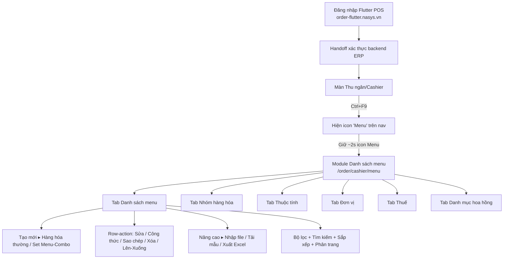

---

## 4. Chi tiết Functional Requirements — theo từng luồng

### FLOW-MENU-01: Đăng nhập & truy cập module Edit Menu · Ưu tiên: **Must**
- **User Story (INVEST):** *Là một Quản lý cửa hàng, tôi muốn mở được module quản lý hàng hóa từ màn Thu ngân bằng phím tắt và thao tác nhấn-giữ, để chỉnh sửa danh mục mà không lo mở nhầm khi đang bán hàng.*
- **FR liên quan:**
  - `FR-MENU-01-01`: Hệ thống cho đăng nhập bằng bộ ba **ID cửa hàng + Tên đăng nhập + Mật khẩu**; mật khẩu được che, có nút hiện/ẩn; có "Ghi nhớ đăng nhập" (mặc định bật) và liên kết "Quên mật khẩu".
  - `FR-MENU-01-02`: Sau đăng nhập ở front-end Flutter (`order-flutter.nasys.vn`), hệ thống **chuyển tiếp xác thực** sang backend ERP và đưa người dùng vào màn Thu ngân.
  - `FR-MENU-01-03`: Trên màn Thu ngân, tổ hợp **Ctrl + F9** làm hiện mục **"Menu"** trên thanh điều hướng chính.
  - `FR-MENU-01-04`: Mục "Menu" **chỉ mở trang** khi người dùng **nhấn giữ (~2s)**; nhấp thường không mở (cơ chế chống mở nhầm). Trang đích: `…/order/cashier/menu`.
- **Trang/màn liên quan:** Login Flutter → Login/redirect ERP → Thu ngân → Module Danh sách menu (**đa trang**).
- **Sơ đồ luồng:**
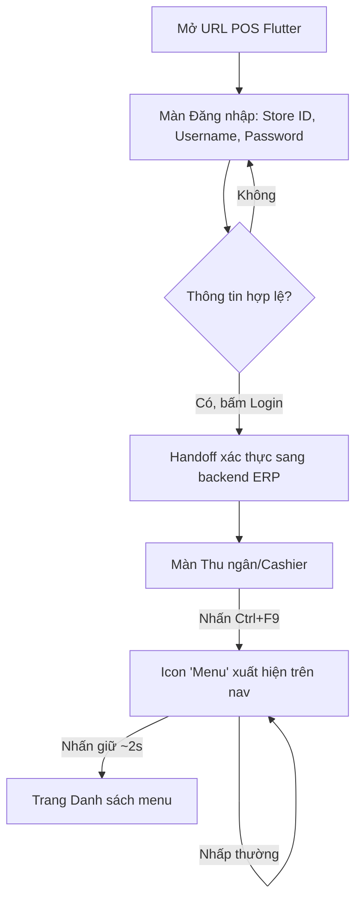
- **Use Case Spec (đa trang):**
  - *Tiền điều kiện:* có tài khoản hợp lệ có quyền quản lý; đang ở môi trường có phân hệ Thu ngân.
  - *Hậu điều kiện:* trang `/order/cashier/menu` hiển thị bảng danh sách hàng hóa.
  - *Luồng chính:* nhập Store ID/Username/Password → Login → (handoff) → Thu ngân → Ctrl+F9 → nhấn giữ icon Menu ~2s → vào module.
  - *Luồng thay thế:* icon Menu chưa hiện → nhấn lại Ctrl+F9.
  - *Luồng ngoại lệ:* nhấp thường vào Menu (không đủ 2s) → trang không mở.
- **Các bước (Happy Path):**

  | # | Màn/Trang | Thao tác | Dữ liệu nhập | Kết quả/Chuyển tiếp |
  |---|---|---|---|---|
  | 1 | Login Flutter | Nhập & bấm Login | Store ID `admin`, User `thientester`, Pass `********` | Handoff xác thực |
  | 2 | ERP | (tự động) | — | Vào màn Thu ngân, hiển thị "Admin Master" |
  | 3 | Thu ngân | Nhấn phím | `Ctrl + F9` | Icon "Menu" hiện trên nav |
  | 4 | Thu ngân | **Nhấn giữ ~2s** icon Menu | — | Mở trang Danh sách menu |
- **Nhánh rẽ & ngoại lệ:** sai thông tin đăng nhập → ở lại màn login; nhấp thường icon Menu → không mở trang.
- **Acceptance Criteria (Gherkin):**
```gherkin
Scenario: Mở module Edit Menu bằng phím tắt và nhấn giữ
  Given tôi đã đăng nhập và đang ở màn Thu ngân
  When tôi nhấn tổ hợp phím "Ctrl + F9"
  Then mục "Menu" xuất hiện trên thanh điều hướng
  When tôi nhấn giữ icon "Menu" khoảng 2 giây
  Then hệ thống mở trang "Danh sách menu" tại đường dẫn "/order/cashier/menu"

Scenario: Nhấp thường không mở được module (chống mở nhầm)
  Given mục "Menu" đã hiển thị trên thanh điều hướng
  When tôi nhấp chuột thường (không giữ) vào icon "Menu"
  Then trang "Danh sách menu" không được mở
```
- **Phụ thuộc:** icon "Menu" chỉ xuất hiện sau khi kích hoạt Ctrl+F9; module yêu cầu phiên đăng nhập hợp lệ (điều hướng trực tiếp bằng URL khi mất phiên sẽ bị đưa về màn đăng nhập).

---

### FLOW-MENU-02: Xem, lọc, tìm kiếm, sắp xếp & phân trang danh sách menu · Ưu tiên: **Must**
- **User Story:** *Là một Quản lý, tôi muốn lọc và tìm nhanh hàng hóa theo chi nhánh/nhóm/loại/trạng thái và sắp xếp cột, để nhanh chóng định vị đúng món cần chỉnh sửa trong danh mục lớn.*
- **FR liên quan:**
  - `FR-MENU-02-01`: Bảng danh sách hiển thị các cột: checkbox chọn, **STT, Mã hàng hóa, Tên hàng hóa, Nhóm hàng hóa, Loại hàng hóa, VAT, ĐVT, Giá bán, Định mức, Trạng thái, Hành động**.
  - `FR-MENU-02-02`: Cho **sắp xếp** theo các cột **Tên hàng hóa, Nhóm hàng hóa, Loại hàng hóa, Giá bán** (có chỉ báo sort trên header).
  - `FR-MENU-02-03`: Bộ lọc bên trái gồm: **Chi nhánh** (mặc định "Tất cả"), **Theo hàng hóa** (ô tìm "Nhập tên, mã"), **Theo nhóm hàng hóa** (dropdown), **Theo loại hàng hóa** (3 checkbox: Hàng bán, Nguyên phụ liệu, Hàng hóa chế biến — mặc định chọn hết), **Trạng thái** (2 checkbox: Hoạt động, Không hoạt động — mặc định chọn hết).
  - `FR-MENU-02-04`: **Phân trang**; số dòng/trang chọn được **10/20/30/40/50** (mặc định 10). Phiên quan sát: ~36 hàng hóa / 4 trang.
  - `FR-MENU-02-05`: Nút **cấu hình cột** (setting) cho ẩn/hiện cột (Mã hàng hóa, Trạng thái, Tên hàng hóa, Nhóm hàng hóa, Loại hàng hóa, Giá bán…).
  - `FR-MENU-02-06`: Cột **Mã hàng hóa** là liên kết (mở chi tiết/sửa — xem FLOW-MENU-05).
- **Trang/màn liên quan:** Tab "Danh sách menu".
- **Sơ đồ luồng:**
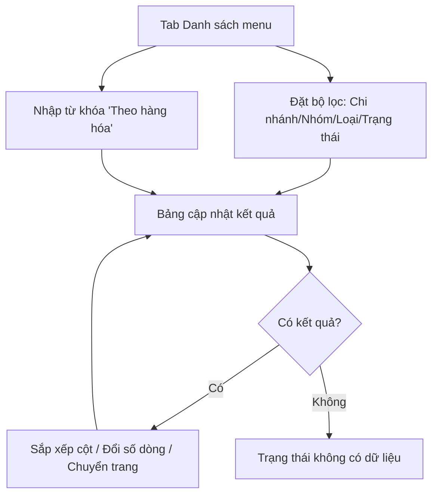
- **Các bước (Happy Path):**

  | # | Màn/Trang | Thao tác | Dữ liệu nhập | Kết quả/Chuyển tiếp |
  |---|---|---|---|---|
  | 1 | Danh sách menu | Nhập từ khóa vào "Theo hàng hóa" | VD `Nước` | Danh sách lọc theo tên/mã |
  | 2 | Danh sách menu | Tích/bỏ tích "Theo loại" / "Trạng thái" | — | Danh sách cập nhật theo bộ lọc |
  | 3 | Danh sách menu | Bấm header cột (VD Giá bán) | — | Sắp xếp tăng/giảm |
  | 4 | Danh sách menu | Đổi "Hiển thị 10 → 20/30…" hoặc chuyển trang | — | Số dòng/trang thay đổi |
- **Nhánh rẽ & ngoại lệ:** không có kết quả → hiển thị trạng thái rỗng (quan sát ở tab Thuộc tính: "Không có dữ liệu").
- **Acceptance Criteria (Gherkin):**
```gherkin
Scenario: Lọc theo trạng thái kinh doanh
  Given tôi đang ở tab "Danh sách menu"
  When tôi bỏ chọn "Không hoạt động" ở mục "Trạng thái"
  Then bảng chỉ còn hiển thị các hàng hóa đang "Hoạt động"

Scenario: Đổi số dòng mỗi trang
  Given danh sách đang hiển thị "Hiển thị 10"
  When tôi chọn "Hiển thị 50"
  Then bảng hiển thị tối đa 50 dòng mỗi trang và số trang được tính lại

Scenario: Sắp xếp theo Giá bán
  Given bảng có nhiều hàng hóa
  When tôi bấm vào tiêu đề cột "Giá bán"
  Then danh sách được sắp xếp theo Giá bán
```
- **Phụ thuộc:** kết quả bảng phụ thuộc đồng thời tất cả bộ lọc đang áp dụng (chi nhánh + nhóm + loại + trạng thái + từ khóa).
- *Ghi chú kiểm chứng:* hành vi thực tế của tìm/lọc/sắp xếp/phân trang **được suy từ cấu trúc UI**; do trang tự điều hướng khi thao tác tự động nên **chưa chạy tới kết quả cuối** — xem Mục 10 (Q4).

---

### FLOW-MENU-03: Tạo mới Hàng hóa thường · Ưu tiên: **Must**
- **User Story:** *Là một Quản lý, tôi muốn tạo một hàng hóa mới với đầy đủ thông tin bán hàng (mã, tên, nhóm, giá, đơn vị, thuế, chi nhánh…), để đưa món vào danh mục bán tại quầy.*
- **FR liên quan:**
  - `FR-MENU-03-01`: Nút **"Tạo mới"** là dropdown gồm **"Hàng hóa thường"** và **"Set Menu / Combo"**.
  - `FR-MENU-03-02`: Chọn "Hàng hóa thường" mở modal **"Tạo/Chỉnh sửa"** với 3 tab: **Chi tiết**, **Thuộc tính**, **Topping**.
  - `FR-MENU-03-03`: Tab Chi tiết gồm khối trái (ảnh + radio loại + 7 cờ) và các trường (xem Mục 5). Các trường **bắt buộc** (dấu *): Mã hàng hóa, Tên hàng hóa, Nhóm hàng hóa, Giá bán, Đơn vị tính, Lĩnh vực kinh doanh, Thuế suất, Chi nhánh.
  - `FR-MENU-03-04`: Khi bấm **Xác nhận** thiếu trường bắt buộc, hệ thống **chặn lưu** và hiển thị thông báo cho trường thiếu (VD nguyên văn: `Vui lòng chọn lĩnh vực kinh doanh`).
  - `FR-MENU-03-05`: Nút **"Đóng"** đóng modal; nút **"Xác nhận"** lưu hàng hóa.
- **Trang/màn liên quan:** Tab Danh sách menu → modal Tạo/Chỉnh sửa (1 màn, nhiều tab).
- **Sơ đồ luồng:**
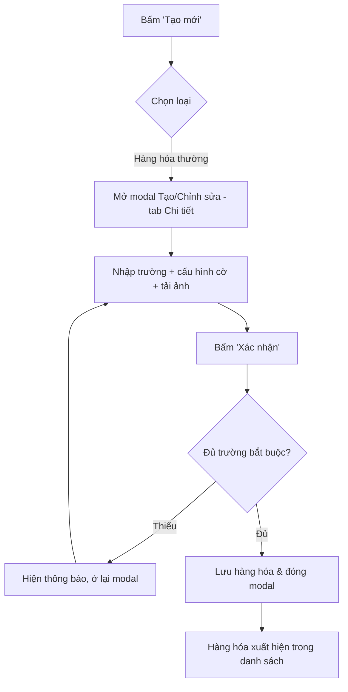
- **Use Case Spec:**
  - *Tiền điều kiện:* đang ở tab Danh sách menu; đã có sẵn danh mục Nhóm/Đơn vị/Thuế/Chi nhánh để chọn.
  - *Hậu điều kiện (kỳ vọng):* hàng hóa mới xuất hiện trong danh sách với mã tương ứng.
  - *Luồng chính:* Tạo mới → Hàng hóa thường → điền → Xác nhận → lưu.
  - *Luồng thay thế:* để mã trống → hệ thống tự sinh mã (theo gợi ý nghiệp vụ — chưa kiểm chứng, Mục 10).
  - *Luồng ngoại lệ:* thiếu trường bắt buộc → chặn + thông báo; mã trùng → chặn (chưa thu được thông báo nguyên văn, Mục 10).
- **Các bước (Happy Path):**

  | # | Màn/Trang | Thao tác | Dữ liệu nhập | Kết quả/Chuyển tiếp |
  |---|---|---|---|---|
  | 1 | Danh sách menu | Bấm "Tạo mới" ▸ "Hàng hóa thường" | — | Mở modal Tạo/Chỉnh sửa |
  | 2 | Modal · Chi tiết | Nhập trường bắt buộc + tùy chọn | Mã, Tên, Nhóm, Giá bán, ĐVT, Lĩnh vực KD, Thuế, Chi nhánh | Form sẵn sàng lưu |
  | 3 | Modal · Chi tiết | Bật/tắt cờ, tải ảnh, thêm quy đổi đơn vị | — | Cấu hình hàng hóa |
  | 4 | Modal | Bấm "Xác nhận" | — | Lưu & đóng modal (kỳ vọng) |
- **Nhánh rẽ & ngoại lệ (Negative/Alternate):**
  - Thiếu **Lĩnh vực kinh doanh** → thông báo `Vui lòng chọn lĩnh vực kinh doanh` (đã thu nguyên văn).
  - Thiếu các trường bắt buộc khác (Mã, Tên, Nhóm, Giá bán, ĐVT, Thuế, Chi nhánh) → kỳ vọng có thông báo tương tự (chưa thu đủ nguyên văn → Mục 10).
  - Bấm "Đóng" → hủy tạo, đóng modal.
- **Acceptance Criteria (Gherkin):**
```gherkin
Scenario: Chặn lưu khi thiếu trường bắt buộc
  Given tôi đang ở modal "Tạo/Chỉnh sửa" của Hàng hóa thường
  And tôi chưa chọn "Lĩnh vực kinh doanh"
  When tôi bấm "Xác nhận"
  Then hệ thống không lưu và hiển thị thông báo "Vui lòng chọn lĩnh vực kinh doanh"

Scenario: Tạo hàng hóa hợp lệ
  Given tôi đã nhập đủ Mã, Tên, Nhóm hàng hóa, Giá bán, Đơn vị tính, Lĩnh vực kinh doanh, Thuế suất và chọn Chi nhánh
  When tôi bấm "Xác nhận"
  Then hệ thống lưu hàng hóa và hàng hóa mới xuất hiện trong danh sách
```
- **Phụ thuộc:** cần tồn tại dữ liệu danh mục Nhóm hàng hóa, Đơn vị, Thuế (các tab con) trước khi tạo hàng hóa.

---

### FLOW-MENU-04: Tạo Set Menu / Combo · Ưu tiên: **Should**
- **User Story:** *Là một Quản lý, tôi muốn tạo một Set Menu/Combo gồm nhiều thành phần, để bán gói sản phẩm theo combo.*
- **FR liên quan:**
  - `FR-MENU-04-01`: "Tạo mới" ▸ **"Set Menu / Combo"** mở luồng tạo hàng hóa dạng combo (modal riêng cho combo — tồn tại nút xác nhận combo trong DOM).
  - `FR-MENU-04-02`: Kỳ vọng cho phép chọn/nhập các thành phần cấu thành combo (chi tiết trường **chưa quan sát** → Mục 10).
- **Trang/màn liên quan:** Tab Danh sách menu → modal Set Menu/Combo.
- **Sơ đồ luồng:**
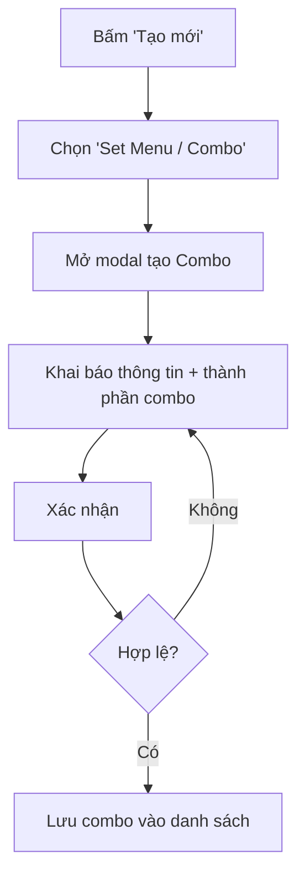
- **Acceptance Criteria (Gherkin):**
```gherkin
Scenario: Mở luồng tạo Set Menu/Combo
  Given tôi đang ở tab "Danh sách menu"
  When tôi bấm "Tạo mới" và chọn "Set Menu / Combo"
  Then hệ thống mở modal tạo Set Menu/Combo
```
- **Phụ thuộc:** cần có sẵn các hàng hóa thành phần để đưa vào combo (giả định nghiệp vụ — Mục 10).
- *Ghi chú:* chi tiết trường của combo **chưa khám phá** (ưu tiên thấp hơn hàng hóa thường).

---

### FLOW-MENU-05: Chỉnh sửa hàng hóa · Ưu tiên: **Must**
- **User Story:** *Là một Quản lý, tôi muốn mở và sửa thông tin một hàng hóa hiện có (giá, nhóm, cờ, ảnh…), để cập nhật danh mục khi có thay đổi.*
- **FR liên quan:**
  - `FR-MENU-05-01`: Mỗi dòng có nút **"Chỉnh sửa"** (biểu tượng bút chì) mở modal **"Tạo/Chỉnh sửa"** với dữ liệu hàng hóa được nạp sẵn.
  - `FR-MENU-05-02`: Cột **Mã hàng hóa** là liên kết, cũng dẫn tới xem/sửa hàng hóa.
  - `FR-MENU-05-03`: Modal chỉnh sửa dùng **cùng cấu trúc trường** như tạo mới (Mục 5) và cùng bộ validation.
- **Trang/màn liên quan:** Tab Danh sách menu → modal Tạo/Chỉnh sửa (chế độ sửa).
- **Sơ đồ luồng:**
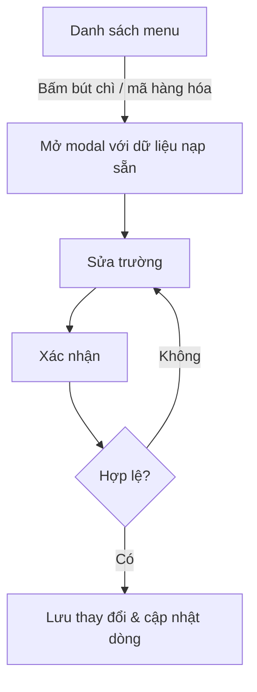
- **Acceptance Criteria (Gherkin):**
```gherkin
Scenario: Mở form chỉnh sửa với dữ liệu nạp sẵn
  Given tôi đang ở tab "Danh sách menu"
  When tôi bấm nút "Chỉnh sửa" trên một dòng hàng hóa
  Then hệ thống mở modal "Tạo/Chỉnh sửa" với thông tin của hàng hóa đó

Scenario: Lưu thay đổi hợp lệ
  Given tôi đang chỉnh sửa một hàng hóa và đã sửa trường hợp lệ
  When tôi bấm "Xác nhận"
  Then hệ thống lưu và cập nhật thông tin trên danh sách
```
- **Phụ thuộc:** dùng chung modal & validation với FLOW-MENU-03.
- *Ghi chú kiểm chứng:* đã xác nhận modal Tạo/Chỉnh sửa tồn tại và mở được; thao tác lưu chỉnh sửa thành công **chưa chạy tới trạng thái cuối** → Mục 10.

---

### FLOW-MENU-06: Sao chép (nhân bản) hàng hóa · Ưu tiên: **Could**
- **User Story:** *Là một Quản lý, tôi muốn nhân bản một hàng hóa có sẵn, để tạo nhanh món tương tự mà không nhập lại từ đầu.*
- **FR liên quan:**
  - `FR-MENU-06-01`: Mỗi dòng có nút **"Sao chép"** tạo bản sao của hàng hóa. Bằng chứng dữ liệu: tồn tại các hàng hóa hậu tố "- Copy" (VD `Bug warehouse 6 - Copy`, `comboo return - Copy`, `test bug - Copy`).
- **Trang/màn liên quan:** Tab Danh sách menu.
- **Sơ đồ luồng:**
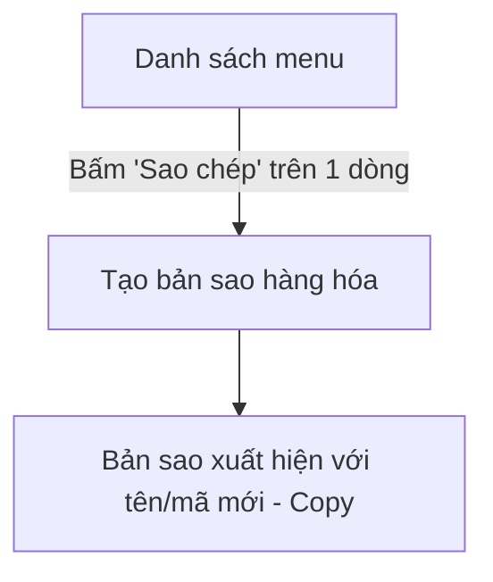
- **Acceptance Criteria (Gherkin):**
```gherkin
Scenario: Nhân bản một hàng hóa
  Given tôi đang ở tab "Danh sách menu"
  When tôi bấm nút "Sao chép" trên một hàng hóa
  Then hệ thống tạo một bản sao của hàng hóa đó trong danh sách
```
- **Phụ thuộc:** không.
- *Ghi chú:* hành vi sau khi bấm (mở modal chỉnh sửa bản sao hay tạo ngay) **chưa kiểm chứng** → Mục 10.

---

### FLOW-MENU-07: Xóa hàng hóa (xác nhận + chặn khi đang dùng) · Ưu tiên: **Must**
- **User Story:** *Là một Quản lý, tôi muốn xóa hàng hóa không còn dùng, và được hệ thống bảo vệ để không xóa nhầm món đang được sử dụng.*
- **FR liên quan:**
  - `FR-MENU-07-01`: Mỗi dòng có nút **"Xóa"** (dấu ✕). Bấm xóa mở **hộp thoại xác nhận** với tiêu đề **"Xóa ?"**, nội dung **"Bạn có chắc muốn xóa: <tên hàng hóa>?"** và hai nút **"Đóng"** (hủy) / **"Xóa"** (đồng ý).
  - `FR-MENU-07-02`: Với hàng hóa **đang được sử dụng**, nút Xóa **bị vô hiệu**; hover hiển thị tooltip **"Không thể xóa, đối tượng muốn xóa đang được sử dụng"**.
  - `FR-MENU-07-03`: Chỉ hàng hóa **không bị ràng buộc sử dụng** mới có nút Xóa kích hoạt (nút ✕ màu đỏ — VD dòng "Test Return").
- **Trang/màn liên quan:** Tab Danh sách menu → hộp thoại xác nhận (dialog).
- **Sơ đồ luồng:**
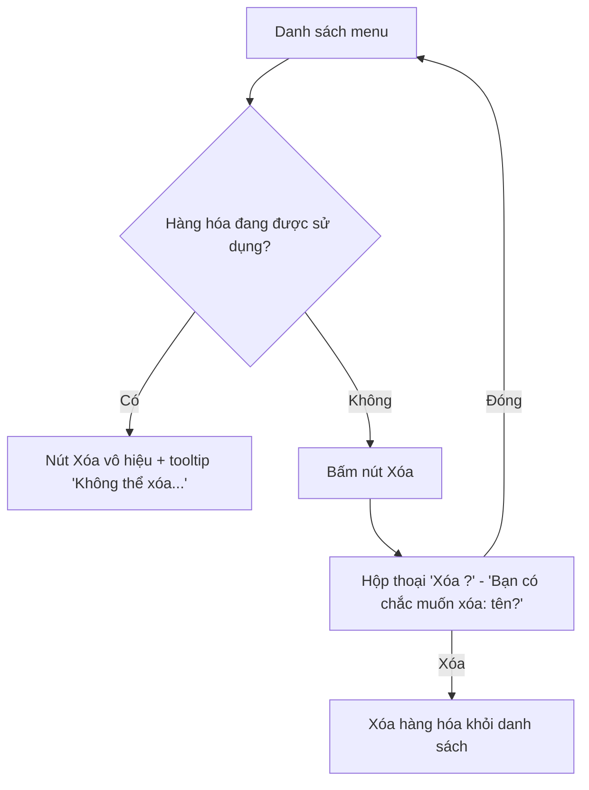
- **Use Case Spec:**
  - *Tiền điều kiện:* hàng hóa cần xóa không nằm trong ràng buộc sử dụng.
  - *Hậu điều kiện:* hàng hóa bị loại khỏi danh sách sau khi xác nhận.
  - *Luồng chính:* bấm Xóa → hộp thoại → Xóa → xóa thành công.
  - *Luồng thay thế:* bấm Xóa → hộp thoại → Đóng → giữ nguyên.
  - *Luồng ngoại lệ:* hàng hóa đang dùng → không cho bấm Xóa (tooltip cảnh báo).
- **Acceptance Criteria (Gherkin):**
```gherkin
Scenario: Xác nhận trước khi xóa
  Given tôi đang ở tab "Danh sách menu"
  When tôi bấm nút "Xóa" trên một hàng hóa có thể xóa
  Then hệ thống hiển thị hộp thoại tiêu đề "Xóa ?" với nội dung "Bạn có chắc muốn xóa: <tên>?"
  And có hai lựa chọn "Đóng" và "Xóa"

Scenario: Hủy thao tác xóa
  Given hộp thoại xác nhận xóa đang hiển thị
  When tôi bấm "Đóng"
  Then hàng hóa không bị xóa và vẫn còn trong danh sách

Scenario: Không cho xóa hàng hóa đang được sử dụng
  Given một hàng hóa đang được sử dụng
  When tôi trỏ vào nút "Xóa" của hàng hóa đó
  Then nút "Xóa" bị vô hiệu và hiển thị "Không thể xóa, đối tượng muốn xóa đang được sử dụng"
```
- **Phụ thuộc:** trạng thái "đang được sử dụng" phụ thuộc quan hệ dữ liệu (đơn hàng, combo, công thức… tham chiếu tới hàng hóa).
- *Ghi chú kiểm chứng (thao tác phá hủy):* đã mở hộp thoại xóa cho dòng **"Test Return"** để thu nguyên văn, sau đó **bấm "Đóng" — KHÔNG xóa dữ liệu thật**. Thông báo thành công sau khi xóa **chưa quan sát** → Mục 10.

---

### FLOW-MENU-08: Bật/tắt trạng thái kinh doanh của hàng hóa · Ưu tiên: **Must**
- **User Story:** *Là một Quản lý, tôi muốn bật/tắt nhanh trạng thái bán của một món ngay trên danh sách, để tạm ngừng bán hoặc mở bán lại mà không cần vào form.*
- **FR liên quan:**
  - `FR-MENU-08-01`: Cột **Trạng thái** có công tắc (toggle) cho mỗi dòng, thể hiện Hoạt động (BẬT, xanh) / Không hoạt động (TẮT).
  - `FR-MENU-08-02`: Bộ lọc "Trạng thái" (Hoạt động / Không hoạt động) cho lọc danh sách theo giá trị này (xem FLOW-MENU-02).
- **Trang/màn liên quan:** Tab Danh sách menu.
- **Sơ đồ luồng:**
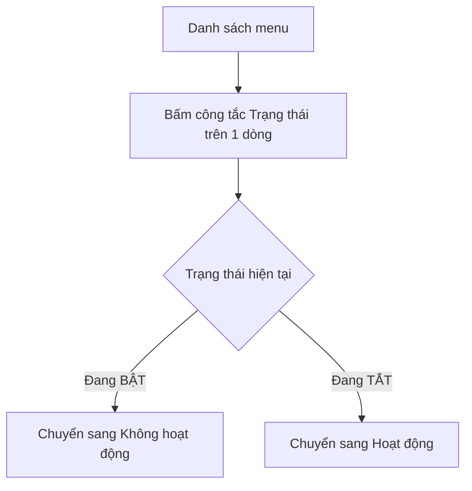
- **Acceptance Criteria (Gherkin):**
```gherkin
Scenario: Tắt trạng thái bán của một hàng hóa
  Given một hàng hóa đang ở trạng thái "Hoạt động"
  When tôi bấm công tắc trạng thái của hàng hóa đó
  Then hàng hóa chuyển sang "Không hoạt động"
```
- **Phụ thuộc:** không.
- *Ghi chú:* có xác nhận khi đổi trạng thái hay áp dụng ngay **chưa kiểm chứng** → Mục 10.

---

### FLOW-MENU-09: Sắp xếp thứ tự hiển thị (di chuyển lên/xuống) · Ưu tiên: **Could**
- **User Story:** *Là một Quản lý, tôi muốn thay đổi thứ tự hiển thị của hàng hóa, để ưu tiên các món bán chạy lên đầu danh sách/menu.*
- **FR liên quan:**
  - `FR-MENU-09-01`: Mỗi dòng có nút **di chuyển lên** và **di chuyển xuống** (mũi tên ↑ ↓) để đổi thứ tự hiển thị.
- **Trang/màn liên quan:** Tab Danh sách menu.
- **Sơ đồ luồng:**
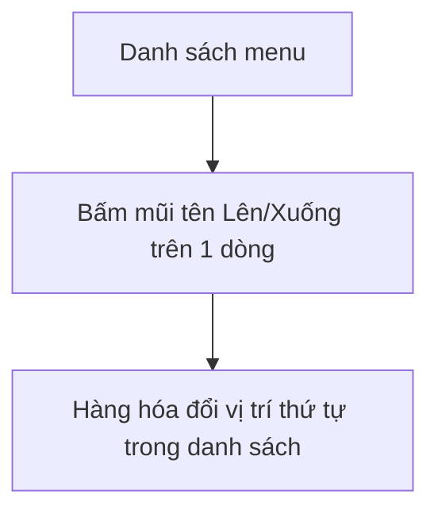
- **Acceptance Criteria (Gherkin):**
```gherkin
Scenario: Đưa một hàng hóa lên trên
  Given một hàng hóa không nằm ở đầu danh sách
  When tôi bấm mũi tên "lên" trên dòng của nó
  Then hàng hóa được đổi vị trí lên trước dòng liền trên
```
- **Phụ thuộc:** thứ tự chịu ảnh hưởng của sắp xếp cột đang áp dụng (Mục 10 — cần làm rõ tương tác giữa reorder thủ công và sort cột).

---

### FLOW-MENU-10: Khai báo Công thức chế biến · Ưu tiên: **Should**
- **User Story:** *Là một Quản lý, tôi muốn khai báo công thức chế biến cho món, để hệ thống trừ kho nguyên liệu đúng khi bán món chế biến.*
- **FR liên quan:**
  - `FR-MENU-10-01`: Mỗi dòng có nút **"Công thức chế biến"** mở màn/khối khai báo công thức (recipe/BOM) cho hàng hóa.
  - `FR-MENU-10-02`: Liên quan tới cờ **"Trừ kho"**, **"Hàng bán chế biến"** và loại **"Hàng hóa chế biến"** trên hàng hóa.
- **Trang/màn liên quan:** Tab Danh sách menu → modal công thức.
- **Sơ đồ luồng:**
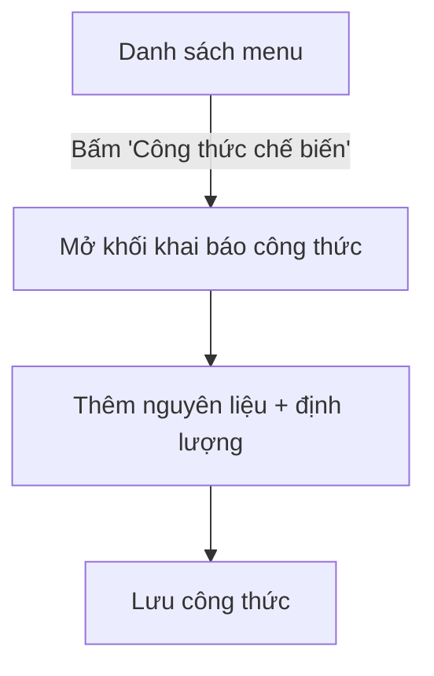
- **Acceptance Criteria (Gherkin):**
```gherkin
Scenario: Mở khai báo công thức chế biến
  Given tôi đang ở tab "Danh sách menu"
  When tôi bấm nút "Công thức chế biến" trên một hàng hóa
  Then hệ thống mở khối khai báo công thức chế biến cho hàng hóa đó
```
- **Phụ thuộc:** cần tồn tại các Nguyên phụ liệu để đưa vào công thức.
- *Ghi chú:* chi tiết trường công thức **chưa khám phá** → Mục 10.

---

### FLOW-MENU-11: Nhập/Xuất dữ liệu (Nhập file, Tải file mẫu, Xuất Excel) · Ưu tiên: **Should**
- **User Story:** *Là một Quản lý, tôi muốn nhập hàng loạt hàng hóa từ file và xuất danh mục ra Excel, để thao tác nhanh trên dữ liệu lớn.*
- **FR liên quan:**
  - `FR-MENU-11-01`: Nút **"Nâng cao"** là dropdown gồm: **"Nhập file"**, **"Tải file mẫu"**, **"Xuất Excel"**.
  - `FR-MENU-11-02`: "Tải file mẫu" cung cấp mẫu chuẩn để nhập; "Nhập file" cho tải lên dữ liệu; "Xuất Excel" xuất danh sách hiện tại.
- **Trang/màn liên quan:** Tab Danh sách menu (đa trang/tải file).
- **Sơ đồ luồng:**
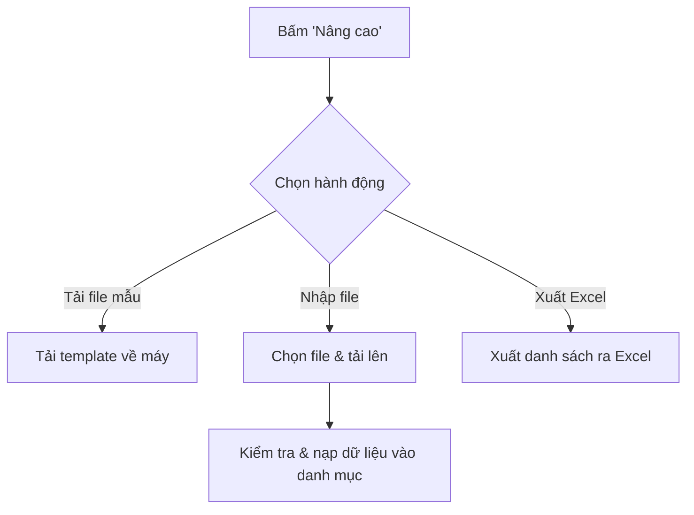
- **Acceptance Criteria (Gherkin):**
```gherkin
Scenario: Xuất danh sách hàng hóa ra Excel
  Given tôi đang ở tab "Danh sách menu"
  When tôi bấm "Nâng cao" và chọn "Xuất Excel"
  Then hệ thống xuất danh sách hàng hóa ra tệp Excel

Scenario: Tải file mẫu nhập liệu
  Given tôi đang ở tab "Danh sách menu"
  When tôi bấm "Nâng cao" và chọn "Tải file mẫu"
  Then hệ thống tải về tệp mẫu để nhập hàng hóa
```
- **Phụ thuộc:** định dạng file nhập phải khớp template.
- *Ghi chú:* định dạng/cột của file mẫu, quy tắc kiểm tra khi nhập, kết quả xuất **chưa khám phá** → Mục 10.

---

### FLOW-MENU-12: Quản lý danh mục phụ trợ (Nhóm/Thuộc tính/Đơn vị/Thuế/Hoa hồng) · Ưu tiên: **Should**
- **User Story:** *Là một Quản lý, tôi muốn quản lý các danh mục nền (nhóm hàng hóa, thuộc tính, đơn vị, thuế, hoa hồng), để có dữ liệu chuẩn dùng khi khai báo hàng hóa.*
- **FR liên quan:**
  - `FR-MENU-12-01`: Module có 5 tab con danh mục phụ, mỗi tab là một bảng có cột **Trạng thái** + **Hành động** và (đa số) nút **"Tạo"**:
    - **Nhóm hàng hóa** — cột STT, Tên, Mã, Trạng thái, Hành động (2 bản ghi).
    - **Thuộc tính** — cột STT, Tên, Mã, Giá trị, Trạng thái, Hành động (rỗng; có Tìm kiếm + Tạo).
    - **Đơn vị** — cột STT, Tên, Mã, Trạng thái, Hành động (5 bản ghi: KG, Kilogam, Gam, 28727, LY).
    - **Thuế** — cột STT, Tên, Giá trị (%), Trạng thái, Hành động (4 bản ghi).
    - **Danh mục hoa hồng** — cột STT, Tên, Trạng thái, Hành động (2 bản ghi).
  - `FR-MENU-12-02`: Các danh mục này cung cấp option cho các dropdown trong modal hàng hóa (Nhóm, Đơn vị, Thuế, Hoa hồng).
- **Trang/màn liên quan:** 5 tab con của module.
- **Sơ đồ luồng:**
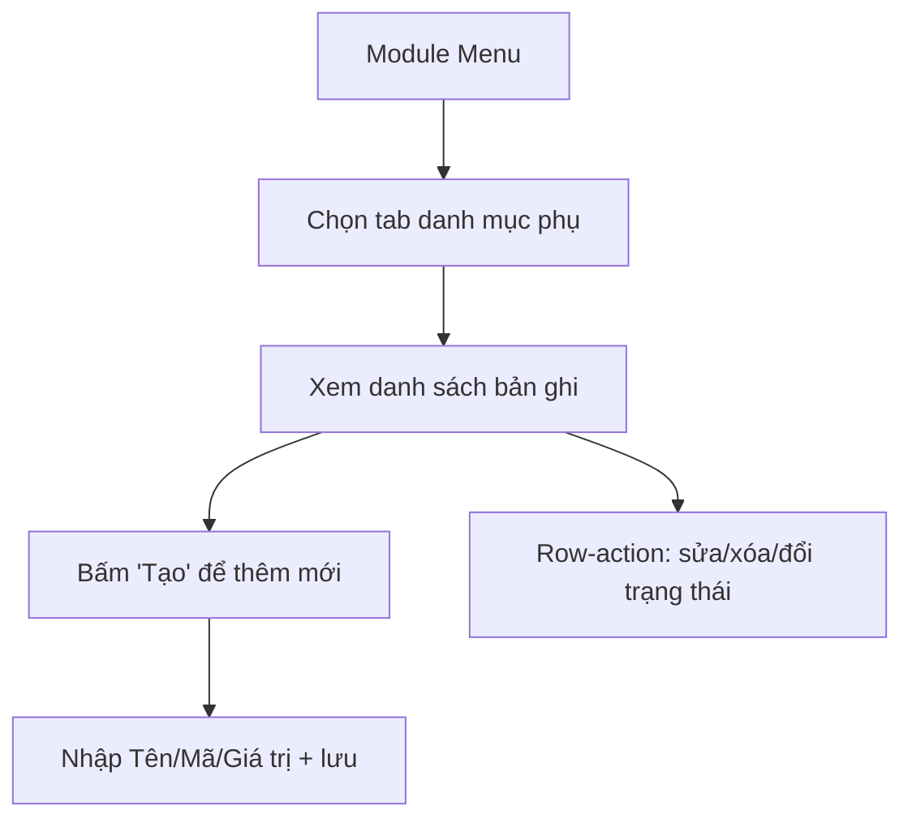
- **Acceptance Criteria (Gherkin):**
```gherkin
Scenario: Xem danh mục Đơn vị
  Given tôi đang ở module Menu
  When tôi mở tab "Đơn vị"
  Then hệ thống hiển thị bảng đơn vị với các cột STT, Tên, Mã, Trạng thái, Hành động

Scenario: Trạng thái rỗng của Thuộc tính
  Given danh mục "Thuộc tính" chưa có bản ghi
  When tôi mở tab "Thuộc tính"
  Then bảng hiển thị "Không có dữ liệu"
```
- **Phụ thuộc:** hàng hóa (FLOW-MENU-03) phụ thuộc dữ liệu các danh mục này.
- *Ghi chú:* chi tiết form Tạo của từng danh mục phụ **chưa khám phá sâu** → Mục 10.

---

## 5. Đặc tả trường dữ liệu (Field Specifications)

### 5.1. Modal "Tạo/Chỉnh sửa" hàng hóa — tab **Chi tiết**
| Tên trường (Label) | Loại UI | Bắt buộc | Ràng buộc / Giá trị (quan sát) | Điều kiện hiển thị/enable | Ghi chú |
|---|---|:--:|---|---|---|
| Hình ảnh | Upload ảnh | Không | Định dạng/kích thước chưa rõ (Mục 10) | Luôn | Nút "Tải lên" |
| Loại hàng hóa | Radio | — | Hàng bán / Nguyên phụ liệu | Luôn | Mặc định "Hàng bán" |
| Trạng thái | Toggle | — | BẬT/TẮT | Luôn | Mặc định **BẬT** |
| In tem | Toggle | — | BẬT/TẮT | Luôn | Mặc định **BẬT** |
| Trừ kho | Toggle | — | BẬT/TẮT | Luôn | Mặc định **BẬT** |
| Hàng bán chế biến | Toggle | — | BẬT/TẮT | Luôn | Mặc định **TẮT** |
| Báo bếp | Toggle | — | BẬT/TẮT | Luôn | Mặc định **BẬT** |
| In phiếu tổng | Toggle | — | BẬT/TẮT | Luôn | Mặc định **BẬT** |
| Đặt hàng qua mã QR | Toggle | — | BẬT/TẮT | Luôn | Mặc định **BẬT** |
| Mã hàng hóa | Text | **Có** | Placeholder "Mã hàng hóa"; tự sinh hoặc nhập tay | Luôn | Duy nhất (kỳ vọng — Mục 10) |
| Bar/Qr Code | Text | Không | Placeholder "Mã vạch"; có nút tìm + quét | Luôn | — |
| Nhóm hàng hóa | Select | **Có** | "Chọn nhóm danh mục"; option: Kim loại | Luôn | Lấy từ tab Nhóm hàng hóa |
| Tên hàng hóa | Text | **Có** | Placeholder "Tên hàng hóa" | Luôn | — |
| Giá bán | Số tiền | **Có** | Placeholder "Giá bán" | Luôn | Đơn vị đ |
| Giá vốn | Số tiền | Không | Placeholder "Giá vốn" | Luôn | — |
| Đơn vị tính | Select | **Có** | "Chọn đơn vị hàng hóa"; KG/Kilogam/Gam/28727/LY | Luôn | Lấy từ tab Đơn vị |
| Lĩnh vực kinh doanh | Select | **Có** | 4 nhóm (xem 2.2) | Luôn | Thiếu → "Vui lòng chọn lĩnh vực kinh doanh" |
| Thuế suất | Select | **Có** | Chọn từ danh mục Thuế | Luôn | Lấy từ tab Thuế |
| Khóa nhóm sử dụng | Select | Không | Sale / Nhập hàng | Luôn | — |
| Chi nhánh | Multi-select | **Có** | Chip: CN1, CN2, CN3, CN4 (gỡ được) | Luôn | Mặc định chọn cả 4 |
| Thẻ của món | Multi-select | Không | Mới / Bán chạy | Luôn | — |
| Định mức — Thấp nhất | Số | Không | Placeholder "Thấp nhất" | Luôn | Cận dưới |
| Định mức — Cao nhất | Số | Không | Placeholder "Cao nhất" | Luôn | Cận trên |
| Hoa hồng — Staff | Checkbox + số | Không | Kèm chọn Phần trăm / Tiền | Khi tích Staff | — |
| Hoa hồng — cashier | Checkbox + số | Không | Kèm chọn Phần trăm / Tiền | Khi tích cashier | — |
| Mô tả | Textarea | Không | **Tối đa 200 ký tự** (đếm 0/200) | Luôn | — |
| Quy đổi đơn vị hàng hóa | Nhóm động | Không | Nút "Thêm" để thêm dòng quy đổi | Luôn | Mở rộng được |

### 5.2. Các tab khác của modal
- **Thuộc tính:** gán thuộc tính cho hàng hóa (dùng chung khối thông tin cơ bản; chi tiết trường gán thuộc tính chưa khám phá sâu → Mục 10).
- **Topping:** có ô **"Tìm kiếm"** để gắn topping cho hàng hóa (chi tiết chưa khám phá sâu → Mục 10).

### 5.3. Form danh mục phụ (tab con)
| Danh mục | Trường nhập (suy từ cột hiển thị) | Ghi chú |
|---|---|---|
| Nhóm hàng hóa | Tên, Mã, Trạng thái | Nút "Tạo" |
| Thuộc tính | Tên, Mã, Giá trị, Trạng thái | Có Tìm kiếm; đang rỗng |
| Đơn vị | Tên, Mã, Trạng thái | Nút "Tạo" |
| Thuế | Tên, Giá trị (%), Trạng thái | — |
| Danh mục hoa hồng | Tên, Trạng thái | Nút "Tạo" |

> Cấu trúc form Tạo thực tế của các danh mục phụ chưa mở → xem Mục 10.

---

## 6. Quy tắc nghiệp vụ & Validation (Business Rules)

| Mã | Điều kiện | Thông báo/Hành vi quan sát được (nguyên văn) | Nguồn (bằng chứng) |
|---|---|---|---|
| **BR-MENU-01** | Bấm "Xác nhận" khi chưa chọn Lĩnh vực kinh doanh | `Vui lòng chọn lĩnh vực kinh doanh` (trường bị highlight đỏ, chặn lưu) | Modal tạo hàng hóa, submit form rỗng (nút `#confirm_create_menu`) |
| **BR-MENU-02** | Hàng hóa **đang được sử dụng** | Nút "Xóa" **vô hiệu** + tooltip `Không thể xóa, đối tượng muốn xóa đang được sử dụng` | Row-action bảng Danh sách menu |
| **BR-MENU-03** | Bấm "Xóa" một hàng hóa có thể xóa | Hộp thoại `Xóa ?` — `Bạn có chắc muốn xóa: <tên>?` — nút **Đóng** / **Xóa** | Dialog xóa dòng "Test Return" |
| **BR-MENU-04** | Các trường có dấu (*) để trống | Chặn lưu; hiển thị thông báo cho trường thiếu | Modal (Mã, Tên, Nhóm, Giá bán, ĐVT, Lĩnh vực KD, Thuế suất, Chi nhánh) |
| **BR-MENU-05** | Mở module Edit Menu | Phải **nhấn giữ ~2s** icon "Menu"; nhấp thường không mở (chống mở nhầm) | Prompt + hành vi truy cập đã thực hiện |
| **BR-MENU-06** | Nhập Mô tả | Giới hạn **200 ký tự** (bộ đếm 0/200) | Modal tạo hàng hóa |
| **BR-MENU-07** | Chọn Lĩnh vực kinh doanh | Chỉ 4 nhóm chuẩn: Phân phối cung cấp hàng hóa / Dịch vụ, xây dựng không bao thầu NVL / Vận tải, sản xuất, dịch vụ gắn hàng hóa, xây dựng bao thầu NVL / Hoạt động kinh doanh khác | Dropdown option (đúng khung thuế VN) |
| **BR-MENU-08** | Điều hướng trực tiếp URL module khi mất phiên | Bị đưa về màn đăng nhập | Quan sát khi navigate `/menu` lúc chưa/đã mất phiên |
| **BR-MENU-09** | Icon "Menu" trên nav | Chỉ xuất hiện sau khi nhấn **Ctrl + F9** | Hành vi đã thực hiện |

> **Chưa thu được nguyên văn (đưa vào Mục 10):** thông báo khi **mã hàng hóa trùng**; ràng buộc **định dạng/kích thước ảnh**; thông báo lỗi cho từng trường bắt buộc còn lại; xác nhận khi **đổi trạng thái**.

---

## 7. Yêu cầu phi chức năng (Non-Functional Requirements)

| Mã | Loại | Mô tả quan sát được | Nguồn |
|---|---|---|---|
| **NFR-01** | Đa ngôn ngữ (i18n) | Chuyển ngôn ngữ **vi / en / kr** trong ERP; màn login Flutter có thêm **zh / ja** | Thanh nav + màn login |
| **NFR-02** | Bảo mật | Mật khẩu được **che**, có nút hiện/ẩn; tùy chọn "Ghi nhớ đăng nhập" | Màn đăng nhập |
| **NFR-03** | Kiến trúc/Bảo mật | Xác thực **handoff (SSO)** giữa front-end Flutter `order-flutter.nasys.vn` và backend ERP `table1.klkim.com` | Luồng đăng nhập |
| **NFR-04** | Chống lỗi thao tác | Cơ chế **nhấn-giữ 2s** để mở Edit Menu, tránh mở nhầm khi đang bán hàng | Truy cập module |
| **NFR-05** | Định dạng/i18n | Tiền tệ **đ** có phân tách hàng nghìn; VAT dạng **%**; ngày **DD-MM-YYYY** | Bảng danh sách/POS |
| **NFR-06** | Khả dụng | **Phân trang**; số dòng/trang **10/20/30/40/50** (mặc định 10) | Bảng danh sách |
| **NFR-07** | Responsive | Tồn tại cấu trúc `inner-modal-in-mobile` (hỗ trợ giao diện mobile); khám phá ở 1920×1080 | DOM modal |
| **NFR-08** | Khả dụng | Ẩn/hiện cột danh sách qua nút cấu hình cột | Bảng danh sách |
| **NFR-09** | Phân quyền | Module nằm trong không gian có quyền quản lý (phiên Admin Master); gợi ý Cashier bị chặn — **chưa kiểm chứng** | Prompt / Mục 10 |

---

## 8. Ma trận Coverage Thao tác (Action Coverage Matrix)

| # | Màn/Trang | Element (label) | Loại | Thao tác đã thực hiện | Kết quả quan sát | Luồng | Ghi chú |
|---|---|---|---|---|---|---|---|
| 1 | Login Flutter | Store ID / Username / Password / Login | Form | Nhập & submit | Handoff → ERP, vào Thu ngân (Admin Master) | FLOW-01 | Store ID `admin`, User `thientester` |
| 2 | Thu ngân | Bàn phím | Phím tắt | Nhấn **Ctrl+F9** | Icon "Menu" xuất hiện trên nav | FLOW-01 | — |
| 3 | Thu ngân | Icon "Menu" | Nav item | **Nhấn giữ ~2s** | Mở trang `/order/cashier/menu` | FLOW-01 | Nhấp thường không mở |
| 4 | Danh sách menu | Bảng danh sách | Table | Xem | 10 dòng/trang, tổng ~36, 4 trang | FLOW-02 | Cột & sort đã ghi nhận |
| 5 | Danh sách menu | "Tạo mới" | Dropdown | Mở | Hiện "Hàng hóa thường", "Set Menu / Combo" | FLOW-03/04 | — |
| 6 | Danh sách menu | "Hàng hóa thường" | Menu item | Bấm | Mở modal "Tạo/Chỉnh sửa" (3 tab) | FLOW-03 | — |
| 7 | Modal tạo | Toàn bộ trường | Form | Đọc cấu trúc | Ghi nhận trường/cờ/option | FLOW-03 | Xem Mục 5 |
| 8 | Modal tạo | "Xác nhận" (rỗng) | Button | Submit rỗng | Thông báo `Vui lòng chọn lĩnh vực kinh doanh` | FLOW-03 | BR-MENU-01 |
| 9 | Modal tạo | Tab Chi tiết/Thuộc tính/Topping | Tabs | Chuyển tab | Xác nhận 3 tab; Topping có ô Tìm kiếm | FLOW-03 | — |
| 10 | Modal tạo | "Đóng" | Button | Đóng modal | Modal đóng | FLOW-03 | Không tạo dữ liệu |
| 11 | Danh sách menu | Nút "Xóa" (dòng "Test Return") | Row-action | Bấm Xóa → đọc dialog → **Đóng** | Dialog `Xóa ?` / `Bạn có chắc muốn xóa: Test Return?`; **đã hủy, không xóa** | FLOW-07 | Thao tác phá hủy — đã hoàn tác |
| 12 | Danh sách menu | Nút "Xóa" (dòng đang dùng) | Row-action | Hover tooltip | `Không thể xóa, đối tượng muốn xóa đang được sử dụng` | FLOW-07 | BR-MENU-02 |
| 13 | Danh sách menu | Row-action (đọc tooltip) | Icons | Đọc | up / down / Chỉnh sửa / Công thức chế biến / Sao chép / Xóa | FLOW-05/06/09/10 | — |
| 14 | Danh sách menu | "Nâng cao" | Dropdown | Đọc | Nhập file / Tải file mẫu / Xuất Excel | FLOW-11 | — |
| 15 | Danh sách menu | Bộ lọc bên trái | Sidebar | Đọc | Chi nhánh/Theo hàng hóa/Theo nhóm/Theo loại(3)/Trạng thái(2) | FLOW-02 | — |
| 16 | Danh sách menu | "Hiển thị 10" | Dropdown | Đọc | 10/20/30/40/50 | FLOW-02 | — |
| 17 | Module | Tab "Thuộc tính" | Tab | Mở | Bảng rỗng "Không có dữ liệu" (STT/Tên/Mã/Giá trị/TT/HĐ) | FLOW-12 | — |
| 18 | Module | Tab "Nhóm hàng hóa" | Tab | Mở | 2 bản ghi (STT/Tên/Mã/TT/HĐ) | FLOW-12 | — |
| 19 | Module | Tab "Đơn vị" | Tab | Mở | 5 bản ghi (KG/Kilogam/Gam/28727/LY) | FLOW-12 | — |
| 20 | Module | Tab "Thuế" | Tab | Mở | 4 bản ghi (STT/Tên/Giá trị %/TT/HĐ) | FLOW-12 | — |
| 21 | Module | Tab "Danh mục hoa hồng" | Tab | Mở | 2 bản ghi (STT/Tên/TT/HĐ) | FLOW-12 | — |

**Thao tác phá hủy đã ghi nhận:** mở hộp thoại xóa "Test Return" → **hủy (Đóng)**; không có bản ghi nào bị tạo/sửa/xóa thật trong phiên khám phá.

---

## 9. Ma trận Truy vết Yêu cầu (RTM)

| Mã luồng | FR | BR liên quan | Acceptance Criteria (tóm tắt) | Bằng chứng |
|---|---|---|---|---|
| FLOW-MENU-01 | FR-MENU-01-01..04 | BR-MENU-05, 09 | Ctrl+F9 hiện Menu; giữ 2s mở trang; nhấp thường không mở | Đã thực hiện login + Ctrl+F9 + long-press |
| FLOW-MENU-02 | FR-MENU-02-01..06 | — | Lọc trạng thái/loại; đổi page size; sort cột | Ảnh danh sách + trích DOM cột/sort/filter/pagination |
| FLOW-MENU-03 | FR-MENU-03-01..05 | BR-MENU-01, 04, 06, 07 | Chặn lưu thiếu Lĩnh vực KD; tạo hợp lệ | Ảnh modal + thông báo validation nguyên văn |
| FLOW-MENU-04 | FR-MENU-04-01..02 | — | Mở modal Set Menu/Combo | Dropdown "Tạo mới" có "Set Menu / Combo" |
| FLOW-MENU-05 | FR-MENU-05-01..03 | BR-MENU-04 | Mở form sửa nạp sẵn; lưu thay đổi | Nút "Chỉnh sửa" + cột mã là link |
| FLOW-MENU-06 | FR-MENU-06-01 | — | Nhân bản hàng hóa | Dữ liệu "… - Copy" trong danh sách |
| FLOW-MENU-07 | FR-MENU-07-01..03 | BR-MENU-02, 03 | Xác nhận trước khi xóa; chặn khi đang dùng | Dialog "Xóa ?" + tooltip "Không thể xóa…" |
| FLOW-MENU-08 | FR-MENU-08-01..02 | — | Bật/tắt trạng thái | Cột Trạng thái có toggle; bộ lọc trạng thái |
| FLOW-MENU-09 | FR-MENU-09-01 | — | Di chuyển lên/xuống | Row-action up/down |
| FLOW-MENU-10 | FR-MENU-10-01..02 | — | Mở khai báo công thức | Row-action "Công thức chế biến" |
| FLOW-MENU-11 | FR-MENU-11-01..02 | — | Xuất Excel; tải file mẫu; nhập file | Dropdown "Nâng cao" |
| FLOW-MENU-12 | FR-MENU-12-01..02 | — | Xem/tạo danh mục phụ; trạng thái rỗng | Đã mở 5 tab con |

*Không có requirement "mồ côi": mọi FR/BR đều gắn với ít nhất một luồng và một bằng chứng quan sát.*

---

## 10. Câu hỏi làm rõ với PO/User

Các điểm logic **không suy ra được** hoặc **chưa chạy tới trạng thái cuối** do giới hạn kỹ thuật (trang tự điều hướng khi thao tác tự động) — cần PO xác nhận nghiệp vụ:

1. **Mã hàng hóa:** quy tắc tự sinh mã cụ thể? Khi để trống có tự sinh không? Thông báo nguyên văn khi **mã trùng** là gì?
2. **Ảnh hàng hóa:** định dạng cho phép (jpg/png/…), **kích thước/tỷ lệ tối đa**, số lượng ảnh?
3. **Validation trường bắt buộc còn lại** (Mã, Tên, Nhóm, Giá bán, ĐVT, Thuế suất, Chi nhánh): thông báo nguyên văn và thứ tự kiểm tra?
4. **Tìm/lọc/sắp xếp/phân trang:** hành vi thực tế của bộ lọc kết hợp, tìm kiếm (khớp một phần? không phân biệt hoa thường? debounce?), và tương tác giữa **sắp xếp cột** với **di chuyển thủ công lên/xuống**?
5. **Đổi trạng thái (toggle):** có hộp xác nhận không? Áp dụng ngay hay cần lưu? Ràng buộc khi tắt món đang có trong đơn?
6. **Set Menu / Combo:** cấu trúc trường, cách chọn thành phần, quy tắc giá combo?
7. **Công thức chế biến (BOM):** trường khai báo, quan hệ với "Trừ kho"/"Nguyên phụ liệu"?
8. **Topping & Thuộc tính (trong modal):** cách gán, giới hạn số lượng?
9. **Nhập/Xuất file:** cột & định dạng file mẫu, quy tắc kiểm tra khi nhập, xử lý dòng lỗi, nội dung file xuất?
10. **Phân quyền:** vai trò **Cashier có bị chặn** vào/ thao tác Edit Menu không (prompt gợi ý có)? Quyền của Nhân viên/Bếp-Bar? Mức phân quyền theo từng hành động (tạo/sửa/xóa/nhập/xuất)?
11. **Kiến trúc:** quan hệ giữa `order-flutter.nasys.vn` (Flutter POS) và `table1.klkim.com` (ERP) — vì sao truy cập module lại hiển thị qua ERP; "Store ID = admin" là mã cửa hàng thật hay tài khoản demo?
12. **Danh mục phụ (Nhóm/Thuộc tính/Đơn vị/Thuế/Hoa hồng):** cấu trúc form Tạo, ràng buộc unique mã, quy tắc không cho xóa khi đang dùng có áp dụng tương tự hàng hóa không?
13. **Định mức & Hoa hồng:** ý nghĩa nghiệp vụ của "Định mức Thấp nhất ~ Cao nhất"; hoa hồng theo vai trò áp dụng khi nào?
14. **Ổn định phiên module:** trang `/menu` có yêu cầu điều kiện phiên đặc biệt (mở qua Ctrl+F9) để không tự thoát về màn Thu ngân không?

---

> **Ghi chú tổng kết chất lượng:** Tài liệu bám sát nguyên tắc "không bịa" — mọi FR/BR/NFR đều có bằng chứng quan sát trực tiếp (ảnh chụp/trích DOM/thông báo nguyên văn). Các phần chưa kiểm chứng được tách bạch ở Mục 10 thay vì khẳng định. Mã định danh (FR/BR/NFR/UC/FLOW) là duy nhất và được truy vết chéo trong RTM (Mục 9) và Coverage (Mục 8).


