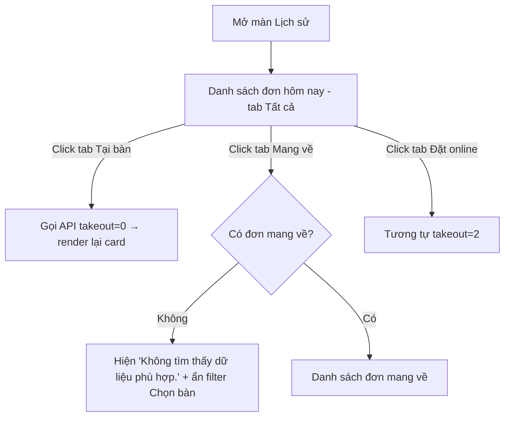
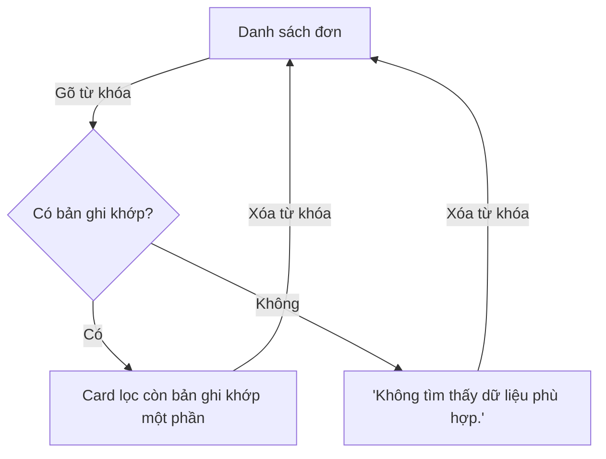
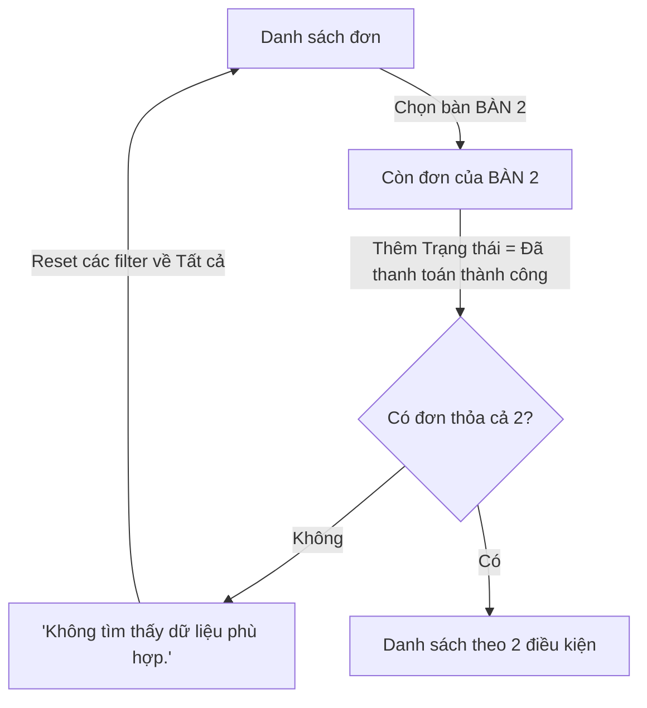
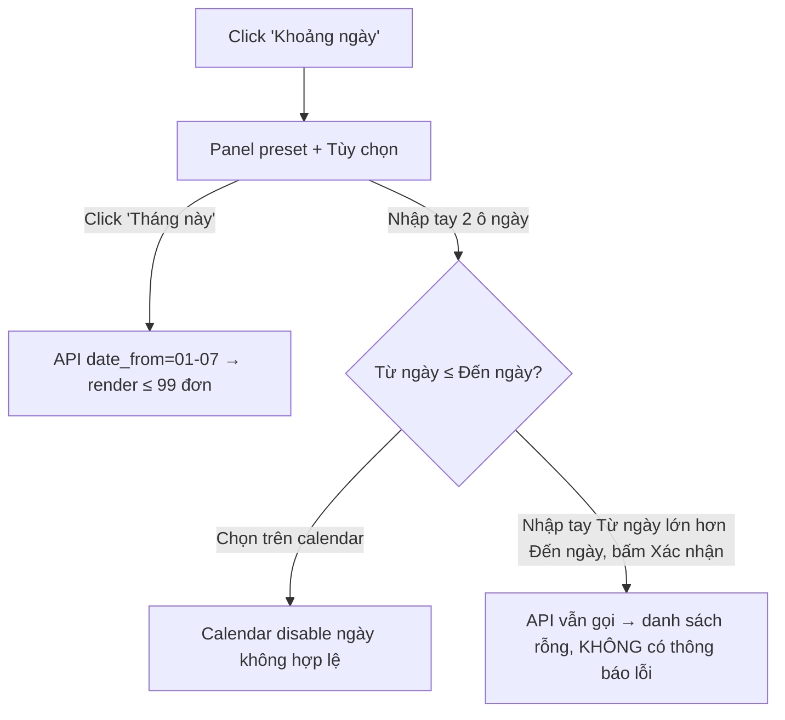
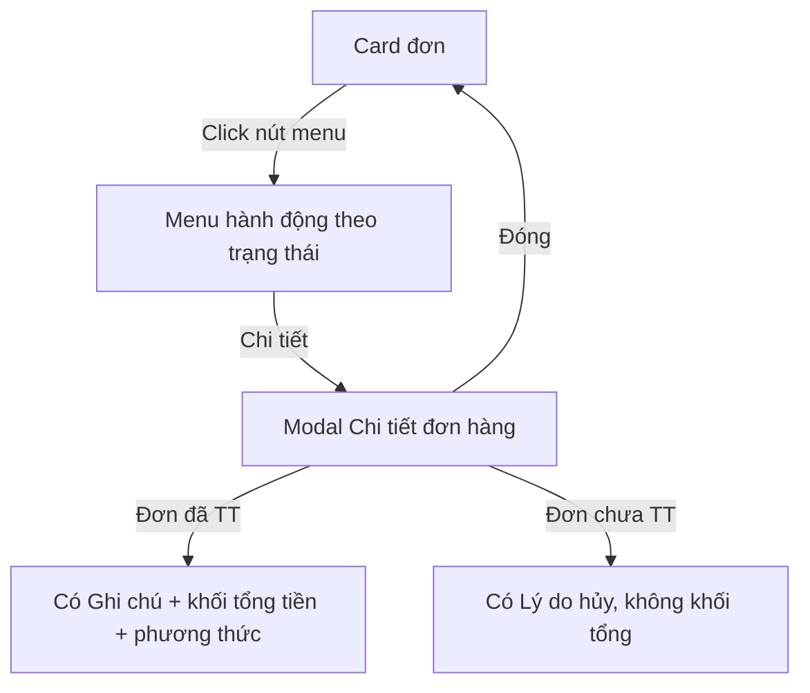
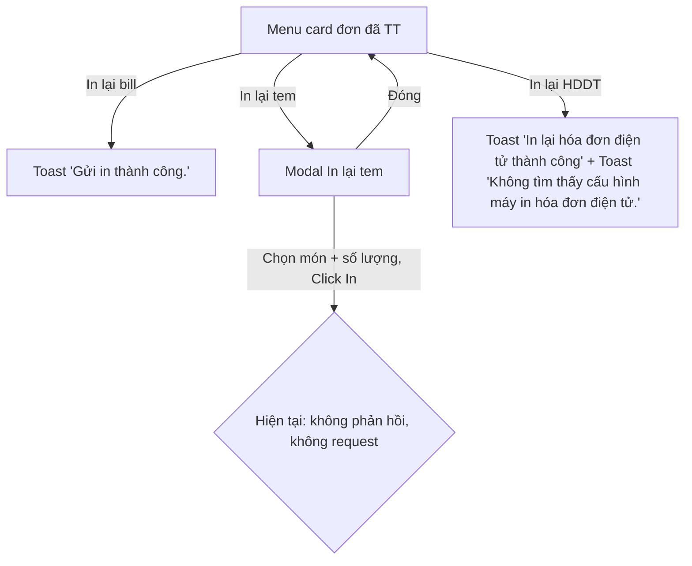
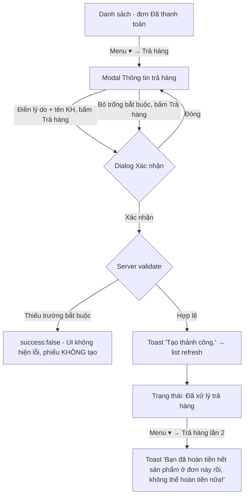
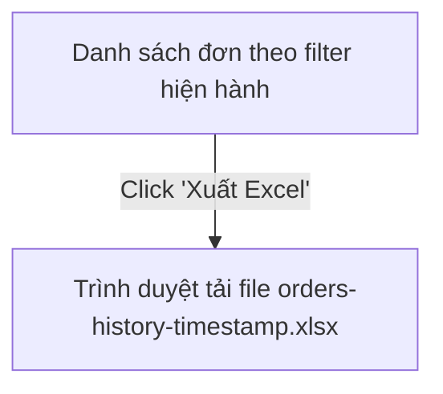

# Tài liệu Đặc tả Yêu cầu (SRS) — Module Lịch sử (Cashier)

> Sinh bởi pipeline `/explore-website-requirements-by-flow` + `/generate-requirements-from-website` (khám phá tương tác thật trên browser, không suy diễn).

## 1. Tổng quan (Overview)

- **Mục đích module:** Màn "Lịch sử" cho phép thu ngân/quản lý tra cứu toàn bộ đơn hàng đã phát sinh (tại bàn, mang về, đặt online), xem chi tiết, in lại chứng từ (bill, tem, hóa đơn điện tử), trả hàng từ đơn đã thanh toán và xuất danh sách ra Excel.
- **URL:** `https://table1.klkim.com/v2/order/cashier/history`
- **Đường đi:** Đăng nhập Cashier → menu ngang "Lịch sử".
- **Môi trường:** STAGING (table1.klkim.com) — xác nhận của user trước khi chạy.
- **Tài khoản đã dùng:** ID cửa hàng `Thientester` / tài khoản `admin` / hiển thị "Admin master" (role Admin — không giới hạn thao tác).
- **Ngày khám phá:** 18-07-2026. **Viewport:** desktop 1920x1080 (Playwright MCP).
- **In-scope:** Toàn bộ màn Lịch sử: tab, tìm kiếm, bộ lọc, khoảng ngày, danh sách đơn, menu hành động từng đơn, modal Chi tiết, modal In lại tem, luồng Trả hàng, Xuất Excel.
- **Out-of-scope:** Shell dùng chung (thanh menu, chuông thông báo, hồ sơ, đổi mật khẩu, fullscreen), các module khác (Trang chủ, Đặt bàn, Điều phối ca, Thu chi, Trả hàng, CRM), giao diện Flutter.
- **Actor & Vai trò:**
  | Actor | Quyền quan sát được |
  |---|---|
  | Admin (Admin master) | Toàn bộ chức năng màn Lịch sử (đã kiểm chứng) |
  | Thu ngân (cashier), Nhân viên khác | Xuất hiện trong filter "Tài khoản" với vai trò người tạo đơn; quyền truy cập màn Lịch sử theo role **chưa kiểm chứng** (xem mục 10) |

## 2. Thuật ngữ & Từ điển dữ liệu (Glossary & Data Dictionary)

### 2.1 Glossary

| Thuật ngữ | Định nghĩa nghiệp vụ |
|---|---|
| Đơn hàng (Order) | Giao dịch bán hàng phát sinh từ POS, mã dạng `POS########CN#` |
| HDDT | Hóa đơn điện tử |
| Trả hàng (Return) | Hoàn tiền một phần/toàn bộ món trong đơn **đã thanh toán**, tạo phiếu trả |
| Tem | Nhãn dán từng món (in lại theo món + số lượng) |
| Bill | Hóa đơn giấy in cho khách |
| Tại bàn / Mang về / Đặt online | 3 hình thức đơn, API phân biệt bằng `takeout=0/1/2` |

### 2.2 Thực thể dữ liệu chính

| Thực thể | Trường chính | Kiểu | Ràng buộc quan sát được | Ghi chú |
|---|---|---|---|---|
| Đơn hàng (card danh sách) | Bàn | text | Tên bàn (BÀN 1..35, bàn đặt tên riêng) | Tiêu đề card |
| | Người tạo | text | Tài khoản nhân viên tạo đơn | VD: Admin master, cashier |
| | Thời gian tạo | datetime | `dd-mm-yyyy HH:mm` | 18-07-2026 09:28 |
| | Mã đơn | text | `POS` + 8 số + `CN` + số chi nhánh | POS00000172CN2 |
| | Tổng tiền | money | Định dạng `#,### đ` | 35,000 đ |
| | Trạng thái | enum | Đã thanh toán / Chưa thanh toán / Đã xử lý trả hàng (kèm icon giỏ hàng) / Đã hủy / Công nợ | Filter dùng nhãn "Đã thanh toán thành công" |
| | Trạng thái HDDT | enum | Không xác định / Từ chối / (khác chưa gặp) | |
| Chi tiết đơn (modal) | Khách hàng, Ngày tạo, Người tạo, Hình thức, Bàn, Số lượng khách, Lý do hủy (đơn chưa TT), Ghi chú (đơn đã TT) | | "Hình thức" chỉ có giá trị khi đã thanh toán | + bảng món: Tên món/Số lượng/Đơn giá/Thành tiền |
| | Khối tổng (chỉ đơn đã TT) | money | Tổng tiền hàng, Phụ thu, Giảm giá, Tích điểm, VAT, Tổng tiền thanh toán, <Phương thức> | |
| Phiếu trả hàng | Lý do trả hàng | text | **Bắt buộc** (server) | |
| | Tên khách hàng | text | **Bắt buộc** (server); tự điền nếu đơn có khách đích danh | |
| | Số điện thoại | text | Không bắt buộc | |
| | Phương thức hoàn | enum | Tiền mặt (mặc định) / Chuyển khoản / Quẹt Thẻ | |
| | SL trả lại / món | number | 1 ≤ SL ≤ SL đã mua (nút `+` disabled tại max, nút `−` không giảm dưới 1) | |
| | Tổng tiền trả lại | money | = Tổng tiền hàng + VAT (± Phụ thu/Giảm giá/Tích điểm nhập tay) | 37,800 đ (đơn có VAT 2,800 đ) |

### 2.3 Tham số API danh sách (quan sát network)

`GET /v2/order/cashier/history/list` — `limit=99` (cố định), `ip_search`, `select_table` (id bàn), `status` (vd `paymented`), `select_employee` (id nhân viên), `date_from`, `date_to` (`dd-mm-yyyy`, mặc định = hôm nay), `takeout` (0 Tại bàn / 1 Mang về / 2 Đặt online / vắng = Tất cả).

## 3. Bản đồ luồng thao tác (Flow Map)

| Mã luồng | Tên luồng | Actor | Số bước | Số trang/màn | MoSCoW |
|---|---|---|---|---|---|
| FLOW-LS-01 | Xem danh sách đơn theo tab | Thu ngân/Admin | 2 | 1 | Must |
| FLOW-LS-02 | Tìm kiếm đơn (mã đơn/SĐT) | Thu ngân/Admin | 2 | 1 | Must |
| FLOW-LS-03 | Lọc theo Bàn / Trạng thái / Tài khoản (kết hợp) | Thu ngân/Admin | 2–4 | 1 | Must |
| FLOW-LS-04 | Lọc theo Khoảng ngày (preset + tùy chọn) | Thu ngân/Admin | 3 | 1 | Must |
| FLOW-LS-05 | Xem chi tiết đơn hàng | Thu ngân/Admin | 3 | 1 (+1 modal) | Must |
| FLOW-LS-06 | In lại chứng từ (bill / tem / HDDT) | Thu ngân/Admin | 2–4 | 1 (+1 modal với tem) | Should |
| FLOW-LS-07 | Trả hàng từ Lịch sử (đa bước) | Thu ngân/Admin | 6 | 1 (+2 modal nối tiếp) | Must |
| FLOW-LS-08 | Xuất Excel danh sách | Thu ngân/Admin | 1 | 1 | Should |

## 4. Chi tiết Functional Requirements — THEO TỪNG LUỒNG

### FLOW-LS-01: Xem danh sách đơn theo tab · Ưu tiên: Must

- **User Story:** Là một thu ngân, tôi muốn xem danh sách đơn hàng theo từng hình thức bán (Tất cả/Tại bàn/Mang về/Đặt online) để nắm giao dịch trong ngày.
- **FR liên quan:**
  - `FR-LS-01`: Hệ thống hiển thị danh sách đơn dạng card, mỗi card gồm: tên bàn, người tạo, thời gian, mã đơn, tổng tiền, trạng thái, trạng thái HDDT và nút menu hành động.
  - `FR-LS-02`: 4 tab lọc theo hình thức: Tất cả (mặc định), Tại bàn (`takeout=0`), Mang về (`takeout=1`), Đặt online (`takeout=2`).
  - `FR-LS-03`: Mặc định danh sách lọc theo ngày hiện tại (`date_from = date_to = hôm nay`).
  - `FR-LS-04`: Khi không có dữ liệu phù hợp, hiển thị đúng thông báo "Không tìm thấy dữ liệu phù hợp.".
  - `FR-LS-05`: Ở tab Mang về/Đặt online, bộ lọc "Chọn bàn" bị ẩn (không áp dụng cho đơn không có bàn).
- **Sơ đồ luồng:**

- **Các bước (Happy Path):**
  | # | Màn/Trang | Thao tác | Dữ liệu | Kết quả |
  |---|---|---|---|---|
  | 1 | Cashier | Click "Lịch sử" trên menu ngang | — | Mở `/order/cashier/history`, hiện đơn hôm nay (3 đơn) |
  | 2 | Lịch sử | Click từng tab | — | API gọi lại với `takeout` tương ứng, card render lại |
- **Nhánh rẽ:** tab không có dữ liệu → empty state; card body **không** click được (chỉ tương tác qua nút menu ▾).
- **Acceptance Criteria:**
```gherkin
Scenario: Xem danh sách mặc định hôm nay
  Given tôi đã đăng nhập Cashier và mở màn "Lịch sử"
  When màn hình tải xong
  Then danh sách hiển thị các đơn của ngày hiện tại dạng card
  And mỗi card có: bàn, người tạo, thời gian, mã đơn, tổng tiền, Trạng thái, Trạng thái HDDT

Scenario: Tab không có dữ liệu
  Given tôi đang ở màn "Lịch sử" ngày không có đơn mang về
  When tôi click tab "Mang về"
  Then hiển thị thông báo "Không tìm thấy dữ liệu phù hợp."
  And bộ lọc "Chọn bàn" không hiển thị trên thanh công cụ
```
- **Phụ thuộc:** Đã đăng nhập; socket.io cập nhật realtime chạy nền.

### FLOW-LS-02: Tìm kiếm đơn · Ưu tiên: Must

- **User Story:** Là một thu ngân, tôi muốn tìm nhanh đơn theo mã đơn hoặc số điện thoại để tra cứu/xử lý cho khách.
- **FR liên quan:**
  - `FR-LS-06`: Ô tìm kiếm placeholder "Tìm mã đơn, số điện thoại,..." lọc **live** (debounce, không cần Enter), khớp **một phần** chuỗi (VD nhập `170` → ra `POS00000170CN2`), gửi param `ip_search`.
  - `FR-LS-07`: Từ khóa không khớp (kể cả ký tự đặc biệt `zzz@#$%9999`) → hiển thị "Không tìm thấy dữ liệu phù hợp.", không lỗi hệ thống.
  - `FR-LS-08`: Xóa từ khóa → danh sách trở về theo filter hiện hành.
- **Sơ đồ luồng:**

- **Acceptance Criteria:**
```gherkin
Scenario: Tìm theo một phần mã đơn
  Given danh sách có đơn POS00000170CN2
  When tôi gõ "170" vào ô tìm kiếm (không nhấn Enter)
  Then danh sách tự lọc còn đơn POS00000170CN2

Scenario: Từ khóa không tồn tại
  When tôi gõ "zzz@#$%9999"
  Then hiển thị "Không tìm thấy dữ liệu phù hợp." và không có lỗi console
```

### FLOW-LS-03: Lọc theo Bàn / Trạng thái / Tài khoản · Ưu tiên: Must

- **User Story:** Là một quản lý, tôi muốn lọc đơn theo bàn, trạng thái thanh toán và nhân viên tạo đơn để kiểm soát giao dịch.
- **FR liên quan:**
  - `FR-LS-09`: Dropdown "Chọn bàn": Tất cả + danh sách bàn (BÀN 1..35 và bàn đặt tên riêng: 8386, LỘC PHÁT, Anh Tuấn, Anh Phú, Anh Đức). Chọn giá trị → label dropdown đổi theo, gửi `select_table=<id>`.
  - `FR-LS-10`: Dropdown "Trạng thái": Tất cả / Đã thanh toán thành công (`status=paymented`) / Chưa thanh toán / Đã hủy / Đã xử lý trả hàng / Công nợ.
  - `FR-LS-11`: Dropdown "Tài khoản": Tất cả + danh sách nhân viên (10 tài khoản quan sát được), gửi `select_employee=<id>`.
  - `FR-LS-12`: Các filter kết hợp theo **AND**; không có bản ghi thỏa → empty state; chọn lại "Tất cả" từng filter để reset.
- **Sơ đồ luồng:**

- **Acceptance Criteria:**
```gherkin
Scenario: Lọc theo bàn
  When tôi chọn "BÀN 2" trong dropdown "Chọn bàn"
  Then chỉ còn các đơn của BÀN 2 và label dropdown hiển thị "BÀN 2"

Scenario: Kết hợp filter cho kết quả rỗng
  Given BÀN 2 chỉ có đơn "Chưa thanh toán"
  When tôi chọn thêm Trạng thái = "Đã thanh toán thành công"
  Then hiển thị "Không tìm thấy dữ liệu phù hợp."
```

### FLOW-LS-04: Lọc theo Khoảng ngày · Ưu tiên: Must

- **User Story:** Là một quản lý, tôi muốn xem đơn theo hôm nay/hôm qua/tuần/tháng hoặc khoảng ngày tùy chọn để đối soát.
- **FR liên quan:**
  - `FR-LS-13`: Nút "Khoảng ngày" mở panel gồm preset: Hôm nay / Hôm qua / Tuần này / Tháng này và mục "Tùy chọn" (2 ô ngày `dd-mm-yyyy` + nút Đóng/Xác nhận).
  - `FR-LS-14`: Preset "Tháng này" → `date_from=01-<tháng>` đến hôm nay; áp dụng ngay khi click.
  - `FR-LS-15`: Ô ngày tùy chọn mở calendar; calendar **chặn** chọn "từ ngày" > "đến ngày" (disable ngày) và giới hạn năm chọn được (từ: 1926–2026; đến: 2026–2126).
  - `FR-LS-16`: Danh sách render tối đa **99 đơn** (`limit=99`, không phân trang, không lazy-load).
- **Sơ đồ luồng:**

- **Acceptance Criteria:**
```gherkin
Scenario: Preset Tháng này
  When tôi mở "Khoảng ngày" và click "Tháng này"
  Then API được gọi với date_from = ngày 01 tháng hiện tại, date_to = hôm nay
  And danh sách hiển thị tối đa 99 đơn

Scenario: Khoảng ngày ngược nhập tay (hành vi hiện tại — cần PO xác nhận)
  When tôi nhập tay Từ ngày 20-07-2026, Đến ngày 18-07-2026 và bấm "Xác nhận"
  Then hệ thống vẫn gọi API với khoảng ngày ngược và hiển thị danh sách rỗng
  And không có thông báo lỗi nào cho người dùng
```
- **Ghi chú:** Sau khi áp dụng, label nút vẫn là "Khoảng ngày" — không hiển thị khoảng đang chọn (xem mục 10).

### FLOW-LS-05: Xem chi tiết đơn hàng · Ưu tiên: Must

- **User Story:** Là một thu ngân, tôi muốn xem chi tiết món và tiền của một đơn để đối chiếu với khách.
- **FR liên quan:**
  - `FR-LS-17`: Mỗi card có nút menu (▾) mở danh sách hành động **tùy trạng thái đơn** (BR-LS-01).
  - `FR-LS-18`: "Chi tiết" mở modal "Chi tiết đơn hàng" (API `GET /order/cashier/edit/<id>`): trạng thái, mã đơn, Khách hàng, Ngày tạo (kèm AM/PM), Người tạo, Hình thức, Bàn, Số lượng khách + bảng món (Tên món/Số lượng/Đơn giá/Thành tiền).
  - `FR-LS-19`: Đơn **đã thanh toán** hiển thị thêm: Ghi chú + khối tổng (Tổng tiền hàng, Phụ thu, Giảm giá, Tích điểm, VAT, Tổng tiền thanh toán, số tiền theo phương thức); đơn **chưa thanh toán** hiển thị trường "Lý do hủy" và không có khối tổng.
  - `FR-LS-20`: Nút "Đóng" đóng modal, trở về danh sách nguyên trạng.
- **Sơ đồ luồng:**

- **Acceptance Criteria:**
```gherkin
Scenario: Chi tiết đơn đã thanh toán
  Given đơn POS00000170CN2 trạng thái "Đã thanh toán"
  When tôi mở menu card và chọn "Chi tiết"
  Then modal hiển thị "Hình thức: Chuyển khoản" và khối tổng: Tổng tiền hàng 25,000 đ, VAT 0 đ, Tổng tiền thanh toán 25,000 đ, Chuyển khoản 25,000 đ

Scenario: Chi tiết đơn chưa thanh toán
  Given đơn POS00000172CN2 trạng thái "Chưa thanh toán"
  When tôi mở "Chi tiết"
  Then modal hiển thị trạng thái "Chưa thanh toán", trường "Lý do hủy" trống và không có khối tổng tiền
```

### FLOW-LS-06: In lại chứng từ (bill / tem / HDDT) · Ưu tiên: Should

- **User Story:** Là một thu ngân, tôi muốn in lại bill/tem/hóa đơn điện tử của đơn đã thanh toán khi khách yêu cầu.
- **FR liên quan:**
  - `FR-LS-21`: "In lại bill" (chỉ đơn đã thanh toán): gửi lệnh in ngay (API `print-provisional` + `print-center/html2db-proxy`), toast "Gửi in thành công.".
  - `FR-LS-22`: "In lại tem": mở modal chọn món (checkbox từng món + checkbox chọn tất cả ở header, cột Tên hàng hóa + đơn giá, stepper số lượng `− / ô số / +`), nút Đóng/In. Số lượng tối thiểu 1 (nút `−` không giảm dưới 1).
  - `FR-LS-23`: "In lại HDDT": gửi in lại hóa đơn điện tử, có toast phản hồi (hiện trả về đồng thời toast thành công + toast lỗi cấu hình — xem mục 10).
- **Sơ đồ luồng:**

- **Acceptance Criteria:**
```gherkin
Scenario: In lại bill thành công
  Given đơn POS00000170CN2 "Đã thanh toán"
  When tôi chọn "In lại bill" trong menu card
  Then hiển thị toast "Gửi in thành công."

Scenario: Modal In lại tem
  When tôi chọn "In lại tem"
  Then modal liệt kê món kèm checkbox (mặc định chọn tất cả) và stepper số lượng mặc định = 1
  And bấm "−" khi số lượng = 1 thì giá trị giữ nguyên 1
```

### FLOW-LS-07: Trả hàng từ Lịch sử (đa bước, end-to-end) · Ưu tiên: Must

- **User Story:** Là một thu ngân, tôi muốn tạo phiếu trả hàng cho đơn đã thanh toán ngay từ màn Lịch sử để hoàn tiền cho khách nhanh chóng.
- **Trang/màn liên quan:** Danh sách → Modal "Thông tin trả hàng" → Dialog "Xác nhận" → quay lại danh sách (luồng đa màn trong 1 trang).
- **Use Case Spec (UC-LS-01):**
  - **Actor:** Thu ngân/Admin.
  - **Tiền điều kiện:** Đơn ở trạng thái "Đã thanh toán"; menu card có mục "Trả hàng".
  - **Hậu điều kiện (thành công):** Phiếu trả được tạo (API `POST /order/cashier/return-order/create`), toast "Tạo thành công.", modal đóng, danh sách tự refresh, trạng thái đơn → "Đã xử lý trả hàng" kèm icon giỏ hàng.
  - **Luồng chính:**
    | # | Màn | Thao tác | Dữ liệu | Kết quả |
    |---|---|---|---|---|
    | 1 | Danh sách | Mở menu ▾ của đơn đã thanh toán → "Trả hàng" | POS00000170CN2 | Mở modal "Thông tin trả hàng" (API `information-return-order`) |
    | 2 | Modal | Xem thông tin đơn + bảng món (cột Trả lại là stepper) | — | SL trả mặc định = SL mua; `+` disabled tại max |
    | 3 | Modal | (Tùy chọn) chỉnh Phụ thu/Giảm giá/Tích điểm, chọn Phương thức hoàn | Mặc định Tiền mặt | "Tổng tiền trả lại" = Tổng tiền hàng + VAT |
    | 4 | Modal | Nhập "Lý do trả hàng*", "Tên khách hàng*" (tự điền nếu đơn có khách), SĐT | `auto_lichsu_20260718 - test luồng trả hàng` / `Khach Test Auto 20260718` / `0900000001` | — |
    | 5 | Modal | Bấm "Trả hàng" | — | Mở dialog "Xác nhận": "**Bạn có chắc muốn trả hàng ?**" (Đóng/Xác nhận) |
    | 6 | Dialog | Bấm "Xác nhận" | — | Toast "Tạo thành công.", modal đóng, list refresh, trạng thái "Đã xử lý trả hàng" |
  - **Luồng thay thế A1 — thiếu trường bắt buộc:** bỏ trống Lý do/Tên KH → dialog Xác nhận **vẫn mở**; bấm Xác nhận → server trả `success:false` với message: "Trường Tên khách hàng là bắt buộc." và "Trường Lí do trả hàng là bắt buộc." — **UI hiện KHÔNG hiển thị các lỗi này** (silent fail, xem mục 10); phiếu trả không được tạo.
  - **Luồng thay thế A2 — trả lần 2:** đơn "Đã xử lý trả hàng" vẫn còn mục "Trả hàng"; chọn lại → toast lỗi "**Bạn đã hoàn tiền hết sản phẩm ở đơn này rồi, không thể hoàn tiền nữa!**", không mở modal.
  - **Luồng ngoại lệ:** Đóng modal/dialog bằng nút Đóng/X → không tạo phiếu, không cảnh báo mất dữ liệu đã nhập.
- **Sơ đồ luồng:**

- **Acceptance Criteria:**
```gherkin
Scenario: Trả hàng hợp lệ toàn phần
  Given đơn POS00000170CN2 "Đã thanh toán" 25,000 đ
  When tôi mở menu card → "Trả hàng", nhập Lý do trả hàng và Tên khách hàng, bấm "Trả hàng" rồi "Xác nhận"
  Then hiển thị toast "Tạo thành công."
  And danh sách tự refresh và trạng thái đơn chuyển thành "Đã xử lý trả hàng"

Scenario: Thiếu trường bắt buộc
  When tôi bấm "Trả hàng" và "Xác nhận" khi chưa nhập Lý do trả hàng và Tên khách hàng
  Then hệ thống không tạo phiếu trả
  And server trả về lỗi "Trường Tên khách hàng là bắt buộc." và "Trường Lí do trả hàng là bắt buộc."
  And (kỳ vọng) các lỗi này phải được hiển thị cho người dùng — hiện tại CHƯA hiển thị

Scenario: Chặn trả hàng lần hai
  Given đơn đã ở trạng thái "Đã xử lý trả hàng" (đã hoàn hết SL)
  When tôi chọn lại "Trả hàng" trong menu card
  Then hiển thị toast "Bạn đã hoàn tiền hết sản phẩm ở đơn này rồi, không thể hoàn tiền nữa!"

Scenario: Số lượng trả bị giới hạn theo số lượng mua
  Given món trong đơn có Số lượng = 1
  When modal "Thông tin trả hàng" mở
  Then ô "Trả lại" = 1, nút "+" bị disabled và nút "−" không giảm xuống dưới 1
```
- **Phụ thuộc:** Chỉ đơn "Đã thanh toán" có mục "Trả hàng"; đơn có khách đích danh thì "Tên khách hàng*" tự điền (VD "bjjnj"); đơn khách lẻ ("Bán cho người tiêu dùng") thì trống.

### FLOW-LS-08: Xuất Excel · Ưu tiên: Should

- **User Story:** Là một quản lý, tôi muốn xuất danh sách đơn ra Excel để lưu trữ/đối soát ngoài hệ thống.
- **FR liên quan:**
  - `FR-LS-24`: Nút "Xuất Excel" tải ngay file `orders-history-<yyyymmddHHMMSS>.xlsx` theo bộ lọc hiện hành, không có dialog xác nhận hay toast.
- **Sơ đồ luồng:**

- **Acceptance Criteria:**
```gherkin
Scenario: Xuất Excel
  Given danh sách đang lọc theo hôm nay
  When tôi click "Xuất Excel"
  Then trình duyệt tải về file có tên dạng "orders-history-<timestamp>.xlsx"
```

## 5. Đặc tả trường dữ liệu (Field Specifications)

### 5.1 Thanh công cụ màn Lịch sử

| Tên trường (Label) | Loại UI | Bắt buộc | Ràng buộc | Điều kiện hiển thị/enable | Ghi chú |
|---|---|---|---|---|---|
| Tìm mã đơn, số điện thoại,... | Textbox + icon search | Không | Khớp một phần, live filter (debounce), gửi `ip_search` | Luôn hiển thị | Ký tự đặc biệt không gây lỗi |
| Chọn bàn | Dropdown | Không | Tất cả + BÀN 1..35 + bàn tên riêng | **Ẩn** ở tab Mang về/Đặt online | Label đổi theo giá trị chọn |
| Trạng thái | Dropdown | Không | 6 giá trị (mục 2.2) | Luôn hiển thị | `status=paymented`... |
| Tài khoản | Dropdown | Không | Tất cả + 10 nhân viên | Luôn hiển thị | `select_employee=<id>` |
| Khoảng ngày | Button mở panel | Không | Preset 4 + Tùy chọn 2 ô `dd-mm-yyyy` | Luôn hiển thị | Label KHÔNG cập nhật theo khoảng đã chọn |
| Từ ngày / Đến ngày (Tùy chọn) | Textbox + calendar | Không | Calendar disable ngày không hợp lệ; năm 1926–2026 / 2026–2126; nhập tay không được validate chéo | Trong panel Khoảng ngày | Nút Đóng/Xác nhận |
| Xuất Excel | Button | — | — | Luôn hiển thị | Tải file ngay |

### 5.2 Modal "Thông tin trả hàng"

| Tên trường (Label) | Loại UI | Bắt buộc | Ràng buộc | Điều kiện hiển thị/enable | Ghi chú |
|---|---|---|---|---|---|
| Trả lại (mỗi món) | Stepper `−`/số/`+` | — | 1 ≤ SL ≤ SL mua; `+` disabled tại max; `−` không giảm dưới 1 | Mỗi dòng món | Class `format-quantity` |
| Phụ thu | Textbox (format-money) | Không | Mặc định 0 | Khối "Số tiền trả hàng" | Class `returnSurcharge` |
| Giảm giá | Textbox (format-money) | Không | Mặc định 0 | Khối "Số tiền trả hàng" | Class `returnDiscount`; hành vi cập nhật tổng khi nhập tay chưa kiểm chứng được bằng script (mục 10) |
| Tích điểm | Textbox (format-money) | Không | Mặc định 0 | Khối "Số tiền trả hàng" | Class `returnAccumulatePoints` |
| Phương thức thanh toán (hoàn tiền) | Select | Có (mặc định sẵn) | Tiền mặt (mặc định) / Chuyển khoản / Quẹt Thẻ | Luôn trong modal | Không tự theo phương thức thanh toán gốc |
| Lý do trả hàng | Textbox | **Có** (server) | Message: "Trường Lí do trả hàng là bắt buộc." | Luôn trong modal | Có dấu `*` đỏ |
| Tên khách hàng | Textbox | **Có** (server) | Message: "Trường Tên khách hàng là bắt buộc."; tự điền nếu đơn có khách đích danh | Luôn trong modal | Class `returnCustomerName` |
| Số điện thoại | Textbox | Không | — | Luôn trong modal | Class `returnPhoneNumber` |
| Danh sách mặc định | Button toggle | — | Không thấy thay đổi UI khi bấm | Trên bảng món | Chức năng chưa rõ (mục 10) |

### 5.3 Modal "In lại tem"

| Tên trường | Loại UI | Bắt buộc | Ràng buộc | Ghi chú |
|---|---|---|---|---|
| Checkbox chọn tất cả (header) | Checkbox | — | Hiện KHÔNG đồng bộ khi bỏ chọn dòng con (mục 10) | |
| Checkbox từng món | Checkbox | — | Mặc định checked | |
| Số lượng tem | Stepper `−`/spinbutton/`+` | — | Min = 1; nút `+` và nhập tay hiện KHÔNG thay đổi giá trị (mục 10) | Với món SL mua = 1 |
| In / Đóng | Button | — | "In" hiện không phản hồi, không gửi request (mục 10) | |

## 6. Quy tắc nghiệp vụ & Validation (Business Rules)

| Mã | Điều kiện | Thông báo/Hành vi quan sát được (nguyên văn) | Nguồn |
|---|---|---|---|
| BR-LS-01 | Menu hành động phụ thuộc trạng thái đơn | Chưa thanh toán → chỉ "Chi tiết" · Đã thanh toán → "Chi tiết / In lại bill / In lại tem / In lại HDDT / Trả hàng" · Đã xử lý trả hàng → "Chi tiết / In lại HDDT / Trả hàng" | FLOW-LS-05/06/07; lichsu_01, lichsu_09 |
| BR-LS-02 | Mở màn Lịch sử | Mặc định lọc đơn của ngày hiện tại (`date_from=date_to=hôm nay`) | Network #80 |
| BR-LS-03 | Submit trả hàng thiếu Tên khách hàng | Server: "Trường Tên khách hàng là bắt buộc." (phiếu không được tạo) | Response `return-order/create`; lichsu_08 |
| BR-LS-04 | Submit trả hàng thiếu Lý do trả hàng | Server: "Trường Lí do trả hàng là bắt buộc." | Response `return-order/create` |
| BR-LS-05 | Trả hàng đơn đã hoàn hết SL | Toast: "Bạn đã hoàn tiền hết sản phẩm ở đơn này rồi, không thể hoàn tiền nữa!" — không mở modal | FLOW-LS-07 A2; lichsu_10 |
| BR-LS-06 | Số lượng trả lại | Tối đa = SL đã mua (nút `+` disabled); tối thiểu 1 (nút `−` không giảm dưới 1) | Modal trả hàng; lichsu_07 |
| BR-LS-07 | Đơn có khách đích danh | "Tên khách hàng*" tự điền tên khách của đơn (VD "bjjnj"); đơn "Bán cho người tiêu dùng" → trống | Modal trả hàng POS168 vs POS170 |
| BR-LS-08 | Tổng tiền trả lại | = Tổng tiền hàng + VAT của phần trả (VD 35,000 + 2,800 = 37,800 đ) | Modal trả hàng POS168 |
| BR-LS-09 | Tab Mang về / Đặt online | Ẩn bộ lọc "Chọn bàn" | Snapshot tab Mang về |
| BR-LS-10 | Không có bản ghi thỏa filter/tìm kiếm | "Không tìm thấy dữ liệu phù hợp." | Nhiều luồng |
| BR-LS-11 | Chọn khoảng ngày trên calendar | Ngày làm "từ" > "đến" bị disable; năm giới hạn (từ: ≤2026, đến: ≥2026) | Panel Khoảng ngày |
| BR-LS-12 | Trước khi tạo phiếu trả | Dialog xác nhận: "Bạn có chắc muốn trả hàng ?" (Đóng/Xác nhận) | lichsu_08 |
| BR-LS-13 | Tạo phiếu trả thành công | Toast "Tạo thành công."; modal đóng; danh sách tự refresh; trạng thái đơn → "Đã xử lý trả hàng" + icon giỏ hàng | lichsu_09 |
| BR-LS-14 | In lại bill | Gửi in ngay (không hỏi lại), toast "Gửi in thành công." | lichsu_04 |
| BR-LS-15 | In lại HDDT khi chưa cấu hình máy in HDDT | Đồng thời: "In lại hóa đơn điện tử thành công" + "Không tìm thấy cấu hình máy in hóa đơn điện tử." | lichsu_06 |
| BR-LS-16 | Card đơn | Thân card không có hành vi click; mọi hành động qua nút menu ▾ | Thử click trực tiếp |
| BR-LS-17 | Danh sách | Tối đa 99 đơn được trả về/render (`limit=99`), không phân trang | Network preset Tháng này |

## 7. Yêu cầu phi chức năng (Non-Functional Requirements)

| Mã | Loại | Mô tả quan sát được | Nguồn |
|---|---|---|---|
| NFR-01 | Hiệu năng/Giới hạn tải | API list giới hạn cứng `limit=99`; 99 card render 1 lần, không lazy-load/phân trang | Network + DOM |
| NFR-02 | Khả dụng | Tìm kiếm live (debounce) không cần nhấn Enter; filter áp dụng ngay khi chọn | FLOW-LS-02/03 |
| NFR-03 | Realtime | Kết nối socket.io (`io.table1.klkim.com`) chạy nền cập nhật thông báo đơn mới | Network |
| NFR-04 | i18n/Định dạng | Giao diện tiếng Việt, nút chọn ngôn ngữ (cờ "vi") trên header; ngày `dd-mm-yyyy`; giờ có AM/PM ở modal chi tiết; tiền `#,### đ` | UI |
| NFR-05 | Bảo mật phiên | Yêu cầu đăng nhập; module nằm sau auth `/v2/order/cashier/*` | Điều hướng |
| NFR-06 | Chất lượng mã (quan sát) | Console còn `console.log` debug lộ object đơn hàng (order_id, invoice_code, total_amount...) khi thao tác | Console log |

## 8. Ma trận Coverage Thao tác (Action Coverage Matrix)

> Ghi chú cột cuối: các thao tác GHI/PHÁ HỦY dữ liệu thật được đánh dấu **[GHI DỮ LIỆU]**.

| # | Màn/Trang | Element (label) | Loại | Thao tác | Kết quả quan sát | Luồng | Ghi chú |
|---|---|---|---|---|---|---|---|
| 1 | Lịch sử | Link "Lịch sử" (menu ngang) | link | click | Mở màn, 3 đơn hôm nay | LS-01 | |
| 2 | Lịch sử | Tab "Tất cả" | tab | click | Danh sách không có `takeout` | LS-01 | mặc định |
| 3 | Lịch sử | Tab "Tại bàn" | tab | click | API `takeout=0`, 3 đơn | LS-01 | |
| 4 | Lịch sử | Tab "Mang về" | tab | click | `takeout=1`, empty state, ẩn Chọn bàn | LS-01 | |
| 5 | Lịch sử | Tab "Đặt online" | tab | click | `takeout=2`, empty state | LS-01 | |
| 6 | Lịch sử | Ô tìm kiếm | textbox | gõ "170" | Lọc live còn POS00000170CN2 | LS-02 | `ip_search=170` |
| 7 | Lịch sử | Ô tìm kiếm | textbox | gõ "zzz@#$%9999" | "Không tìm thấy dữ liệu phù hợp." | LS-02 | không lỗi |
| 8 | Lịch sử | Ô tìm kiếm | textbox | xóa trắng | Danh sách trở lại | LS-02 | |
| 9 | Lịch sử | Dropdown "Chọn bàn" | dropdown | mở | 41 lựa chọn (Tất cả + 35 bàn + 5 bàn tên riêng) | LS-03 | |
| 10 | Lịch sử | Option "BÀN 2" | option | click | Còn 1 đơn BÀN 2; label = "BÀN 2"; `select_table=157` | LS-03 | |
| 11 | Lịch sử | Dropdown "Trạng thái" | dropdown | mở | 6 lựa chọn | LS-03 | |
| 12 | Lịch sử | Option "Đã thanh toán thành công" | option | click | Kết hợp BÀN 2 → empty state; `status=paymented` | LS-03 | AND filter |
| 13 | Lịch sử | Dropdown "Tài khoản" | dropdown | mở | Tất cả + 10 nhân viên | LS-03 | |
| 14 | Lịch sử | Option "cashier" | option | click | `select_employee=42` | LS-03 | |
| 15 | Lịch sử | 3 dropdown filter | option | chọn lại "Tất cả" | Danh sách 3 đơn trở lại | LS-03 | reset |
| 16 | Lịch sử | Nút "Khoảng ngày" | button | click | Panel preset + Tùy chọn | LS-04 | |
| 17 | Panel ngày | Preset "Tháng này" | listitem | click | `date_from=01-07-2026`; render 99 đơn (limit) | LS-04 | |
| 18 | Panel ngày | Ô "Từ ngày"/"Đến ngày" | textbox | nhập tay 20-07 / 18-07 | Calendar hiện, disable ngày không hợp lệ | LS-04 | |
| 19 | Panel ngày | Nút "Xác nhận" | button | click (from > to) | API gọi khoảng ngược → danh sách rỗng, không báo lỗi | LS-04 | nghi vấn (mục 10) |
| 20 | Panel ngày | Preset "Hôm nay" | listitem | click | Về 3 đơn hôm nay | LS-04 | reset |
| 21 | Lịch sử | Nút "Xuất Excel" | button | click | Tải `orders-history-20260718221048.xlsx` | LS-08 | không toast |
| 22 | Card POS172 (Chưa TT) | Nút menu ▾ | button | click | Menu chỉ có "Chi tiết" | LS-05 | BR-LS-01 |
| 23 | Card POS172 | "Chi tiết" | menu item | click | Modal chi tiết: Hình thức trống, có "Lý do hủy", không khối tổng | LS-05 | lichsu_02 |
| 24 | Modal chi tiết | Nút "Đóng" | button | click | Đóng modal | LS-05 | |
| 25 | Card POS170 (Đã TT) | Nút menu ▾ | button | click | Menu 5 hành động | LS-05/06/07 | BR-LS-01 |
| 26 | Card POS170 | "Chi tiết" | menu item | click | Modal có khối tổng + "Chuyển khoản 25,000 đ" | LS-05 | lichsu_03 |
| 27 | Card POS170 | "In lại bill" | menu item | click | Toast "Gửi in thành công."; API print-provisional 200 | LS-06 | lichsu_04 |
| 28 | Card POS170 | "In lại tem" | menu item | click | Modal In lại tem (1 món, checked, SL 1) | LS-06 | |
| 29 | Modal tem | Nút "−" | button | click (SL=1) | Giữ nguyên 1 | LS-06 | BR min |
| 30 | Modal tem | Nút "+" | button | click | **Không tăng** (vẫn 1) | LS-06 | nghi vấn (mục 10) |
| 31 | Modal tem | Spinbutton SL | input | nhập "3" | **Không đổi** (vẫn 1) | LS-06 | nghi vấn (mục 10) |
| 32 | Modal tem | Checkbox món | checkbox | bỏ chọn | Dòng bỏ chọn nhưng checkbox header vẫn checked | LS-06 | nghi vấn (mục 10) |
| 33 | Modal tem | Nút "In" | button | click (đã chọn món) | **Không phản hồi**: không toast, không request, modal không đóng | LS-06 | lichsu_05 |
| 34 | Modal tem | Nút "Đóng" | button | click | Đóng modal | LS-06 | |
| 35 | Card POS170 | "In lại HDDT" | menu item | click | 2 toast đồng thời (thành công + lỗi cấu hình) | LS-06 | lichsu_06 |
| 36 | Card POS170 | "Trả hàng" | menu item | click | Modal "Thông tin trả hàng" | LS-07 | lichsu_07 |
| 37 | Modal trả | Nút "Trả hàng" (form trống) | button | click | Dialog "Bạn có chắc muốn trả hàng ?" vẫn mở | LS-07 | lichsu_08 |
| 38 | Dialog xác nhận | "Xác nhận" (form trống) | button | click | API `success:false` 2 message bắt buộc; **UI không hiển thị lỗi**; phiếu không tạo | LS-07 | nghi vấn (mục 10) |
| 39 | Modal trả | Lý do/Tên KH/SĐT | textbox | nhập data test | Nhận giá trị | LS-07 | data traceable |
| 40 | Dialog xác nhận | "Xác nhận" (form hợp lệ) | button | click | Toast "Tạo thành công."; trạng thái → "Đã xử lý trả hàng" | LS-07 | **[GHI DỮ LIỆU]** phiếu trả POS00000170CN2, 25.000 đ, hoàn Tiền mặt, lý do `auto_lichsu_20260718 - test luồng trả hàng`; lichsu_09 |
| 41 | Card POS170 (Đã trả) | Nút menu ▾ | button | click | Menu còn "Chi tiết / In lại HDDT / Trả hàng" | LS-07 | BR-LS-01 |
| 42 | Card POS170 | "Trả hàng" lần 2 | menu item | click | Toast "Bạn đã hoàn tiền hết sản phẩm ở đơn này rồi, không thể hoàn tiền nữa!" | LS-07 | lichsu_10 |
| 43 | Card POS168 (Đã TT, có VAT) | "Trả hàng" | menu item | click | Modal: Tên KH tự điền "bjjnj"; Tổng trả 37,800 đ (gồm VAT 2,800) | LS-07 | đóng không submit |
| 44 | Modal trả (POS168) | Nút "Danh sách mặc định" | button | click | Không thấy thay đổi UI | LS-07 | chưa rõ chức năng (mục 10) |
| 45 | Modal trả (POS168) | Ô Giảm giá | input | fill script 5000/999999 | Giá trị bị mask reset về 0 (script); cần test tay | LS-07 | limitation (mục 10) |
| 46 | Modal trả (POS168) | Nút "Đóng" | button | click | Đóng, không tạo phiếu, không cảnh báo mất dữ liệu | LS-07 | |
| 47 | Card đơn | Thân card (mã đơn) | region | click | Không có phản ứng (không navigate/modal) | LS-01 | BR-LS-16 |
| 48 | Header | Menu tài khoản "Admin master" | dropdown | click | Hồ sơ của tôi / Đổi mật khẩu / Đăng xuất | — | shell dùng chung, out-of-scope |

**Đối chiếu độ phủ:** Mọi element tương tác phát hiện được trên màn Lịch sử (tab, search, 3 dropdown, khoảng ngày, xuất Excel, menu card theo 3 trạng thái, 2 modal + 1 dialog) đã được thao tác thật. Phần tử ngoài scope (menu shell, chuông thông báo, nút fullscreen/ngôn ngữ) chỉ ghi nhận, không khai thác sâu.

## 9. Ma trận Truy vết Yêu cầu (RTM)

| Mã luồng | FR | BR liên quan | Acceptance Criteria | Bằng chứng |
|---|---|---|---|---|
| FLOW-LS-01 | FR-LS-01..05 | BR-LS-02, BR-LS-09, BR-LS-10, BR-LS-16 | LS-01 (2 scenario) | run/evidence/lichsu_01_list_view.png; network #80/110/111/112; snapshot tab Mang về |
| FLOW-LS-02 | FR-LS-06..08 | BR-LS-10 | LS-02 (2 scenario) | network #114/#115; snapshot search "170" |
| FLOW-LS-03 | FR-LS-09..12 | BR-LS-10 | LS-03 (2 scenario) | network #117/118/119; snapshot dropdown |
| FLOW-LS-04 | FR-LS-13..16 | BR-LS-11, BR-LS-17 | LS-04 (2 scenario) | network #124/#125; snapshot calendar |
| FLOW-LS-05 | FR-LS-17..20 | BR-LS-01 | LS-05 (2 scenario) | lichsu_02, lichsu_03; API edit/172, edit/170 |
| FLOW-LS-06 | FR-LS-21..23 | BR-LS-01, BR-LS-14, BR-LS-15 | LS-06 (2 scenario) | lichsu_04, lichsu_05, lichsu_06; network #98/#99/#101 |
| FLOW-LS-07 | FR-LS-17, UC-LS-01 | BR-LS-03..08, BR-LS-12, BR-LS-13, BR-LS-05 | LS-07 (4 scenario) | lichsu_07..10; API information-return-order, return-order/create (#103/#106) |
| FLOW-LS-08 | FR-LS-24 | — | LS-08 (1 scenario) | File orders-history-20260718221048.xlsx tải về |

## 10. Câu hỏi làm rõ với PO/User

**A. Nghi vấn lỗi (đã tái hiện, kèm bằng chứng — đề nghị xác nhận & xử lý):**

1. **Modal "In lại tem" — nút "In" không hoạt động:** đã chọn món, bấm "In" → không có request mạng, không toast, modal không đóng (lichsu_05). Kỳ vọng: gửi lệnh in như "In lại bill"?
2. **Modal "In lại tem" — không đổi được số lượng tem:** nút "+" và nhập tay đều giữ nguyên 1 (với món SL mua = 1). Số lượng tem có bị giới hạn = SL mua không, hay stepper lỗi?
3. **Modal "In lại tem" — checkbox header không đồng bộ:** bỏ chọn dòng duy nhất nhưng checkbox "chọn tất cả" vẫn checked.
4. **Trả hàng — lỗi bắt buộc không hiển thị:** server trả "Trường Tên khách hàng là bắt buộc." / "Trường Lí do trả hàng là bắt buộc." nhưng UI im lặng (không toast/inline), user không biết vì sao phiếu không được tạo (lichsu_08 + response #106). Ngoài ra dialog "Xác nhận" vẫn mở dù form trống — có nên chặn ngay từ client?
5. **In lại HDDT — 2 toast mâu thuẫn:** "In lại hóa đơn điện tử thành công" + "Không tìm thấy cấu hình máy in hóa đơn điện tử." xuất hiện cùng lúc (lichsu_06). Nên chỉ báo lỗi khi chưa cấu hình?
6. **Khoảng ngày nhập tay không validate:** gõ Từ ngày > Đến ngày rồi Xác nhận → API vẫn gọi, kết quả rỗng im lặng (network #125). Calendar chặn nhưng nhập tay lách được.
7. **Giới hạn 99 đơn:** `limit=99` cố định, không phân trang — khoảng lọc có >99 đơn sẽ bị cắt mà không có cảnh báo. Đây là giới hạn chủ đích?

**B. Logic chưa quan sát được / cần xác nhận nghiệp vụ:**

8. Nút **"Danh sách mặc định"** trong modal trả hàng không tạo thay đổi UI nhìn thấy được — chức năng là gì?
9. Trường **"Hình thức"** trống ở chi tiết đơn chưa thanh toán và **"Số lượng khách"** trống ở một đơn đã thanh toán — giá trị kỳ vọng?
10. Nhãn trạng thái không nhất quán: card hiển thị "Đã thanh toán" nhưng filter là "Đã thanh toán thành công" — chuẩn hóa nhãn nào?
11. Đơn "Đã xử lý trả hàng" vẫn còn mục "Trả hàng" trong menu (dù bấm sẽ bị chặn) — có nên ẩn/disable mục này?
12. Trả hàng **một phần** (đơn nhiều món/SL > 1): chưa kiểm chứng được với dữ liệu hiện có (các đơn hôm nay đều 1 món SL 1) — hành vi trạng thái đơn sau trả một phần là gì ("Đã xử lý trả hàng" hay trạng thái khác)?
13. Hành vi các ô **Phụ thu/Giảm giá/Tích điểm** trong modal trả hàng khi nhập tay (mask `format-money` chặn script tự động điền): giới hạn giá trị? Giảm giá > tổng tiền có bị chặn?
14. **Phân quyền theo role:** khám phá chạy bằng tài khoản Admin; tài khoản Thu ngân/staff có bị giới hạn hành động nào trên màn Lịch sử không (VD không được Trả hàng)?
15. Trạng thái **"Đã hủy"** và **"Công nợ"**: hôm nay không có đơn thuộc 2 trạng thái này — menu hành động tương ứng chưa kiểm chứng.
16. Console còn **`console.log` debug** lộ thông tin đơn hàng — đề nghị dọn trước khi release.

---

*Evidence: `run/evidence/lichsu_01..10*.png` · Log thao tác ghi dữ liệu: xem Ma trận Coverage #40 (phiếu trả POS00000170CN2 tạo lúc ~22:02 18-07-2026, môi trường STAGING).*
